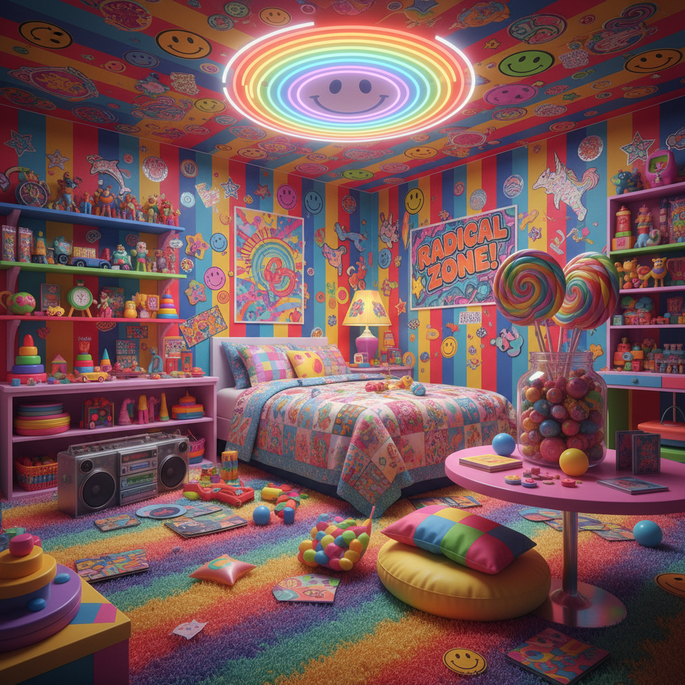
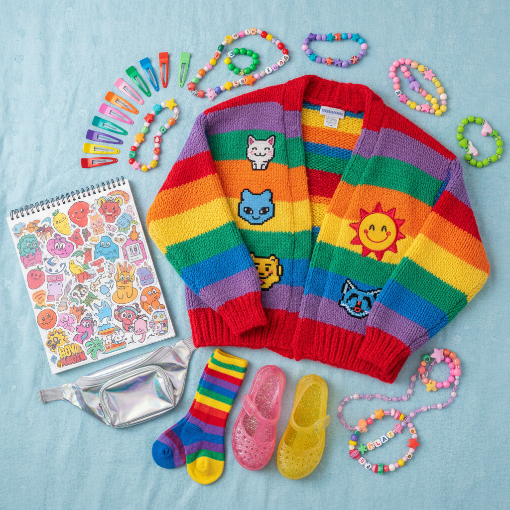

# Kidcore 童核





> **"彩虹、积木、贴纸——拒绝长大的视觉宣言。"**

## 概述

| 维度 | 描述 |
|------|------|
| 时期 | 2019–至今 |
| 别名 | Kidcore, Toycore, Rainbow Aesthetic, Playful Nostalgia |
| 核心色彩 | 彩虹全色（红橙黄绿蓝紫）、高饱和 |
| 关键元素 | 积木、贴纸、彩虹、卡通角色、玩具 |
| 代表人物 | GOLF le FLEUR (Tyler the Creator)、Teletubbies |
| 关联风格 | Dopamine Dressing, Y2K, Fairycore, Indie Kid |

---

## 历史脉络

### 2019：TikTok/Instagram 的童年回归

Kidcore 在 2019 年作为一种美学标签出现，核心是**对 90s/2000s 童年视觉的刻意回归**：

**怀念的对象**：
- 90s/2000s 的儿童节目（Teletubbies、天线宝宝、花园宝宝）
- Fisher-Price 玩具的原色设计
- Lisa Frank 的彩虹文具
- 麦当劳开心乐园餐玩具
- 幼儿园的彩色积木和贴纸

### 文化背景

| 来源 | 贡献 |
|------|------|
| Lisa Frank | 彩虹+闪光+动物的极致可爱 |
| Fisher-Price | 原色+圆润造型的玩具设计 |
| 90s 儿童节目 | 高饱和色彩+简单形状 |
| Tyler the Creator | GOLF le FLEUR 的彩色美学 |
| 日本 Kawaii | 可爱文化的全球传播 |

### 核心哲学

Kidcore 的吸引力在于它是一种**对成人世界的温和反抗**：
- 成人世界 = 灰色、极简、"成熟"、无聊
- Kidcore = 彩色、过剩、"幼稚"、快乐
- 选择"幼稚"本身就是一种态度
- "我拒绝假装对颜色不感兴趣"

---

## 视觉语法

### 色彩系统

```
主色（彩虹全色，全部高饱和）：
  红色 (#FF0000)
  橙色 (#FF8C00)
  黄色 (#FFFF00)
  绿色 (#00FF00)
  蓝色 (#0000FF)
  紫色 (#800080)

规则：
  - 所有颜色同时使用
  - 饱和度拉满
  - 没有"主色"——彩虹本身就是主题
  - 白色作为背景让颜色更跳

质感：
  塑料 — 玩具质感
  贴纸 — 光面、可撕
  蜡笔/彩笔 — 手绘感
  闪光 — Lisa Frank 式
  圆润 — 没有尖角
```

### 标志性元素

| 类别 | 元素 |
|------|------|
| 玩具 | 积木、弹珠、万花筒、橡皮泥 |
| 文具 | 彩色贴纸、蜡笔、彩虹笔记本 |
| 食物 | 棒棒糖、彩虹蛋糕、果冻、糖果 |
| 角色 | 卡通熊、恐龙、独角兽、笑脸 |
| 图案 | 彩虹、星星、心形、花朵、云朵 |
| 服装 | 彩色针织、卡通T恤、彩珠项链 |

---

## 与千禧怀旧的关系

### 90s/2000s 童年的直接怀念
- Kidcore 怀念的就是千禧一代/Z世代的童年
- Lisa Frank 文具、麦当劳玩具、儿童节目
- 这是最"字面意义"的千禧怀旧

### 与 Dopamine Dressing 的交叉
- 两者都使用高饱和彩虹色
- Kidcore 更偏向"童年"和"玩具"
- Dopamine Dressing 更偏向"时尚"和"心理学"

---

## 中国语境

- "彩虹穿搭"/"童趣风"
- 90后/00后对童年动画/玩具的怀旧
- 泡泡玛特等潮玩文化
- "拒绝长大"/"永远18岁"的社交媒体态度
- 与"少女心"标签的交叉

---

## 设计应用

| 场景 | 应用方式 |
|------|----------|
| 品牌 | 彩虹色+圆润字体+卡通插画 |
| 包装 | 高饱和+贴纸质感+玩具造型 |
| 空间 | 彩色家具+圆润造型+互动装置 |
| 数字 | 像素风+彩虹渐变+弹跳动效 |

---

## 延伸阅读

- Lisa Frank 品牌视觉史
- Tyler the Creator / GOLF le FLEUR 美学分析
- "Why Adults Are Embracing Kidcore" (Vogue, 2021)

---

## 相关风格

← [Dopamine Dressing 多巴胺穿搭](dopamine-dressing.md) | [Indie Kid 独立小孩](indie-kid.md) →

↑ [返回千禧怀旧目录](README.md) | [返回总目录](../README.md)
