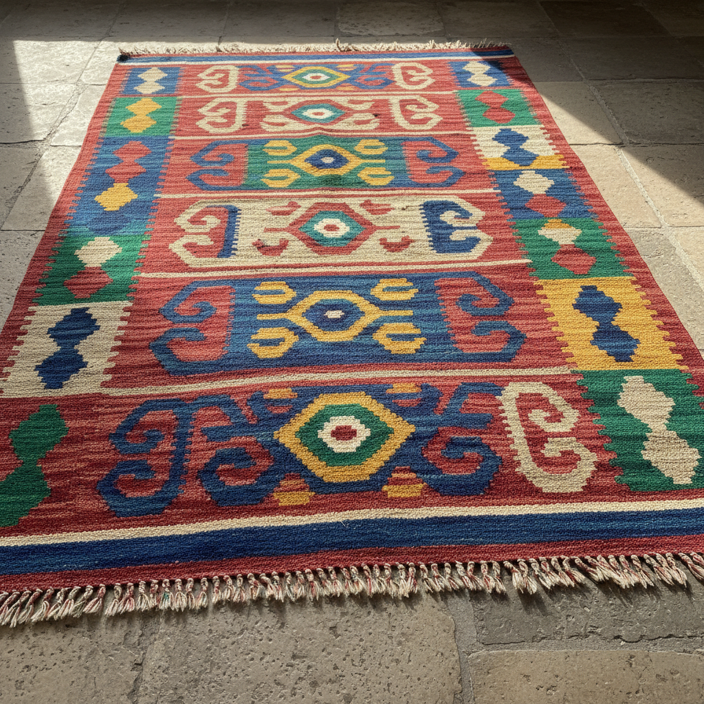

# Kilim 基里姆 | Kilim / قالیچه

> **"经线即图案——游牧民族用平织技法在毯上编织宇宙的密码。"**

## 概述

基里姆（Kilim / قالیچه）是中东和中亚游牧民族的传统平织地毯/挂毯艺术，分布于土耳其、伊朗、阿富汗、高加索和中亚地区。与打结地毯（carpet）不同，Kilim是平织（flatweave）——没有绒毛，经纬线直接交织形成图案。"Kilim"源自土耳其语，波斯语称"gelim"（گلیم）。Kilim由游牧女性在便携式织机上织造，图案承载着部落身份、宇宙观和保护性符号。每个部落、每个地区都有独特的图案语言。

## 主要产地

| 地区 | 特征 |
|------|------|
| 安纳托利亚（土耳其） | 大胆几何，鲜艳色彩 |
| 伊朗 | 精细花卉和几何混合 |
| 高加索 | 强烈对比，大胆图案 |
| 阿富汗 | 深红色为主，几何化 |
| 中亚（土库曼） | 八角形"gul"图案 |

## 核心特征

- **平织技法**：无绒毛，经纬直接交织
- **狭缝技法**：色块交界处的特征性狭缝
- **游牧制作**：便携式织机上织造
- **天然染料**：传统使用植物和矿物染料
- **部落身份**：图案标识部落归属
- **双面可用**：正反面图案相同

## 常见符号

| 符号 | 含义 |
|------|------|
| 羊角 Ram's Horn | 男性力量、丰饶 |
| 手叉 Hands on Hips | 母性、生育 |
| 眼睛 Evil Eye | 驱邪保护 |
| 生命之树 | 天地连接 |
| 星形 | 幸福、丰饶 |
| 钩形 | 保护、驱邪 |

## 视觉特征

- 大胆的几何图案
- 鲜艳的红、蓝、黄、绿色彩
- 平织的薄而坚韧质感
- 色块交界的狭缝特征
- 对称的构图
- 重复的图案单元

## 与其他风格的关系

| 风格 | 关系 |
|------|------|
| 纳瓦霍织毯 | 共享平织几何传统 |
| Suzani刺绣 | 共享中亚纺织传统 |
| 安第斯纺织 | 共享游牧织造传统 |
| 包豪斯纺织 | 受Kilim几何影响 |
| 当代室内设计 | Kilim是流行的装饰元素 |

## 概念图

---

*浮光艺志 | Chronicle of Artistry*
