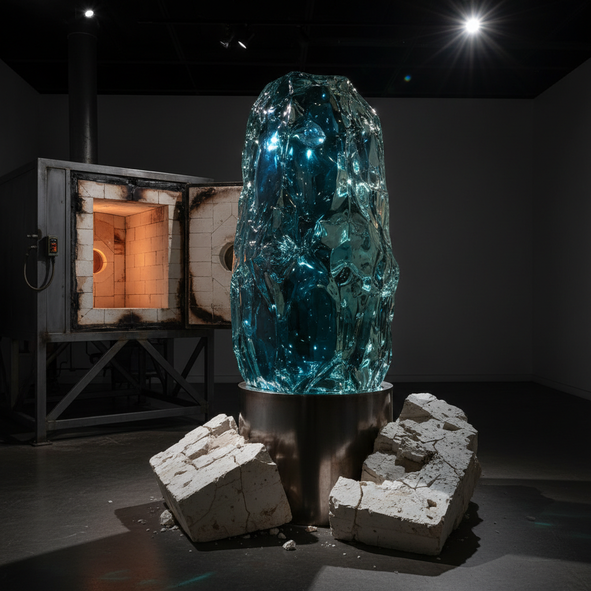

# Kiln Casting 窑铸玻璃

> "Kiln casting is glass sculpture's slow meditation — days of patient heating and cooling to reveal what fire has shaped." — Unknown

## 概述

窑铸玻璃（Kiln Casting）是将玻璃放入耐火模具中，在窑炉中加热至完全熔融（通常800-900°C），使玻璃流入模具填满空间，然后经过极其缓慢的退火冷却过程（可能持续数天到数周），最终获得实心或空心玻璃雕塑的技法。窑铸玻璃是玻璃艺术中最接近雕塑的技法——它可以创造厚重、实心、具有内部光学深度的作品。

窑铸玻璃的独特之处在于：时间的凝固——光线进入厚实的玻璃体，在内部折射、散射，创造出如同凝固的光的效果。

## 核心特征

| 特征 | 描述 |
|------|------|
| 模具 | 使用耐火模具 |
| 实心 | 可创造实心玻璃 |
| 缓慢 | 极慢的退火过程 |
| 雕塑 | 接近雕塑的表现 |
| 光学 | 内部光学效果 |
| 厚重 | 厚重的体量感 |

## 视觉特征

- **深度**：内部的光学深度
- **厚重**：实心的体量感
- **光线**：光线在内部的折射
- **色彩**：内部的色彩变化
- **透明**：从透明到半透明
- **雕塑**：三维雕塑形态

## 代表作品

| 作品 | 艺术家 | 年代 | 意义 |
|------|--------|------|------|
| *Pâte de verre vessels* | Various | 19世纪末 | 法国玻璃膏技法 |
| *Stanislav Libenský works* | Libenský & Brychtová | 1960s-2000s | 捷克窑铸大师 |
| *Karen LaMonte figures* | Karen LaMonte | 2000s+ | 窑铸玻璃人体 |
| *Clifford Rainey sculptures* | Clifford Rainey | 1990s+ | 窑铸玻璃雕塑 |
| *Contemporary kiln cast art* | Various | 当代 | 当代窑铸艺术 |

## 历史时间线

| 时期 | 事件 |
|------|------|
| 古埃及 | 最早的模具铸造玻璃 |
| 古罗马 | 罗马铸造玻璃器 |
| 19世纪末 | 法国Pâte de verre复兴 |
| 1950s-60s | 捷克窑铸玻璃学派 |
| 1970s+ | 国际工作室玻璃运动 |
| 当代 | 窑铸玻璃雕塑的繁荣 |

## 中国语境

中国的琉璃传统与窑铸玻璃有深厚渊源——中国古代的琉璃（铅钡玻璃）就是通过模具铸造的。当代中国的琉璃品牌如琉璃工房（Liuli Gongfang）将传统脱蜡铸造技法与现代设计结合，创造了具有中国文化特色的窑铸玻璃艺术品。中国美术学院等院校也设有玻璃艺术专业，培养窑铸玻璃艺术家。

## AI生成概念图

## 与其他风格的关系

- **Pâte de Verre** → 玻璃膏铸造
- **Lost-Wax Casting** → 脱蜡铸造（共享技法）
- **Fused Glass** → 熔融玻璃
- **Slumping** → 塌陷成型
- **Sculpture** → 雕塑
- **Glass Blowing** → 吹制玻璃

---

*浮光艺志 | Chronicle of Artistry*
