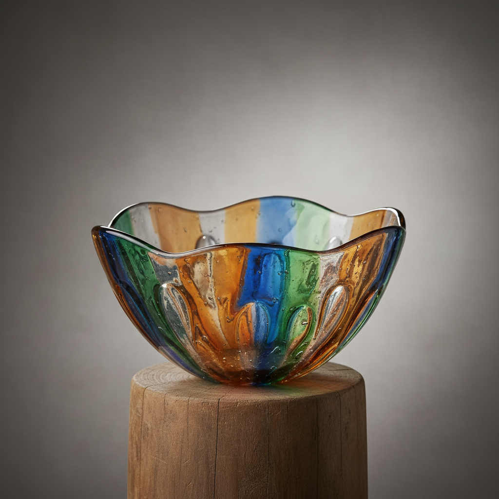

# Kiln-formed Glass Art 窑制玻璃艺术

> "Kiln-formed glass is patience made visible — sheets, powders, and fragments of glass are arranged cold on a mold or shelf, then placed in a kiln where hours of carefully programmed heat soften them into new forms: slumped into curves, fused into panels, cast into sculptures, or pâte de verre'd into translucent shells, each piece bearing the memory of gravity and time recorded in its flowing contours." — Unknown

## 概述

窑制玻璃艺术（Kiln-formed Glass Art）是一种在窑炉中通过控制温度使玻璃软化、熔合或成型的技法总称——包括熔合（fusing）、塌陷（slumping）、铸造（casting）和粉末烧结（pâte de verre）等多种子技法。与吹制玻璃不同，窑制玻璃在冷态下进行设计和排列，然后在窑中通过精确的温度控制实现最终形态。

窑制玻璃艺术的实践包括：1）熔合——将多片玻璃在高温下熔合为一体；2）塌陷——将玻璃在模具上加热使其塌陷成型；3）铸造——将玻璃熔化后铸入模具；4）粉末烧结——将玻璃粉末在模具中烧结；5）温度控制——精确的升温和退火程序；6）冷加工——烧制后的切割和打磨；7）当代窑制——将传统技法与现代创作结合。

## 核心特征

| 特征 | 描述 |
|------|------|
| 窑炉 | 在窑炉中成型 |
| 温度 | 精确的温度控制 |
| 冷排 | 冷态下的设计排列 |
| 多技 | 多种子技法的总称 |
| 耐心 | 需要长时间的烧制 |
| 重力 | 利用重力成型 |

## 视觉特征

- **流动**：玻璃流动的痕迹
- **层次**：多层熔合的色彩层次
- **质感**：丰富的表面质感
- **透光**：透光和半透光的效果
- **有机**：有机的流动形态
- **厚重**：相对厚重的质感

## 代表作品

| 作品 | 艺术家/文化 | 年代 | 意义 |
|------|-------------|------|------|
| *Bullseye Glass panels* | 美国 | 1970年代起 | 牛眼玻璃面板 |
| *Klaus Moje kilnwork* | 澳大利亚 | 20世纪 | 克劳斯·莫耶窑制作品 |
| *Richard Whiteley cast glass* | 澳大利亚 | 当代 | 理查德·怀特利铸造玻璃 |
| *Kirstie Rea kilnwork* | 澳大利亚 | 当代 | 柯斯蒂·雷窑制作品 |
| *Contemporary kiln-formed* | 国际 | 当代 | 当代窑制玻璃 |

## 历史时间线

| 时期 | 事件 |
|------|------|
| 古代 | 早期的玻璃铸造和熔合 |
| 中世纪 | 彩色玻璃窗的熔合技术 |
| 20世纪中 | 现代窑制玻璃的发展 |
| 1970年代 | 牛眼玻璃等专用材料的出现 |
| 当代 | 窑制玻璃的广泛实践 |

## 中国语境

窑制玻璃在中国有快速发展的趋势。中国的琉璃铸造——传统的脱蜡铸造琉璃有悠久的历史。中国的琉璃工房——是中国当代琉璃铸造的代表品牌。中国当代的玻璃艺术教育中，窑制玻璃作为重要的技法方向——在各大美术院校中教授。中国的玻璃艺术家——在窑制玻璃领域有越来越多的创作。中国的工艺美术展览中，窑制玻璃作品——是重要的参展类别。中国的玻璃工作室——越来越多地配备窑制设备。

## AI生成概念图

## 与其他风格的关系

- **Fused Glass** → 熔合玻璃
- **Slumped Glass** → 塌陷玻璃
- **Cast Glass** → 铸造玻璃
- **Pâte de Verre** → 粉末烧结玻璃
- **Studio Glass** → 工作室玻璃
- **Warm Glass** → 温玻璃

---

*浮光艺志 | Chronicle of Artistry*
