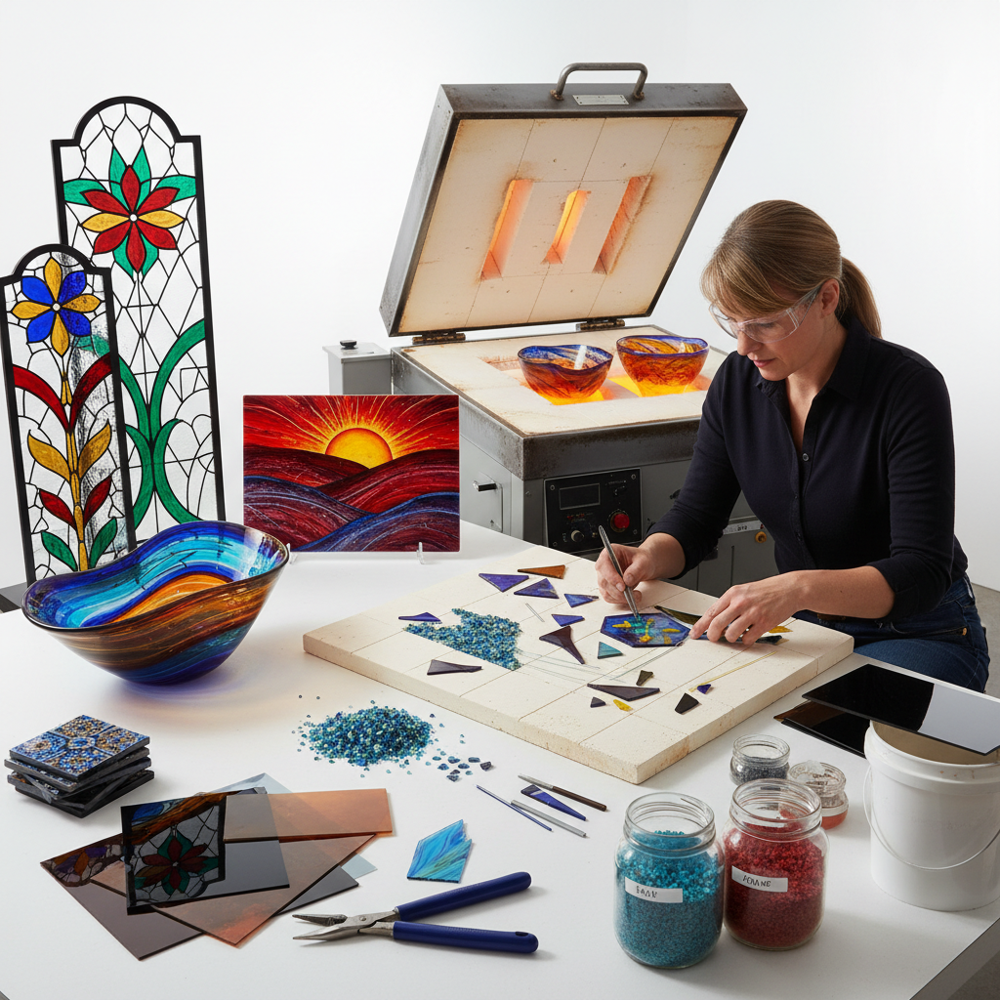

# Kiln-formed Glass 窑制玻璃

> "Kiln-formed glass is time made visible — flat sheets of glass stacked, cut, and arranged, then surrendered to the kiln's heat where gravity and temperature conspire to fuse, slump, and flow into new forms." — Unknown

## 概述

窑制玻璃（Kiln-formed Glass）是在窑炉中通过加热使玻璃软化、熔合或变形的一系列技法的总称。主要技法包括：Fusing（熔合，将多片玻璃叠放后加热使其熔合为一体）、Slumping（塌陷，将玻璃片加热使其在重力作用下塌入或覆盖模具）、Casting（铸造）、和Combing（梳理，在玻璃软化时用工具拉出纹理）。

窑制玻璃的独特之处在于：艺术家在室温下设计和组装作品（切割、排列玻璃片和粉末），然后将其放入窑中——加热过程中玻璃的行为（流动、气泡、颜色反应）部分超出控制。这种"设计-烧制-发现"的过程使每件作品都有惊喜元素。

## 核心特征

| 特征 | 描述 |
|------|------|
| 窑炉 | 在窑中加热成型 |
| 熔合 | 多片玻璃熔合 |
| 重力 | 利用重力塌陷 |
| 平面 | 常从平面玻璃开始 |
| 色彩 | 丰富的色彩组合 |
| 层次 | 多层玻璃的深度 |

## 视觉特征

- **色彩**：丰富的色彩层次
- **透明**：不同透明度的层叠
- **纹理**：熔合产生的纹理
- **流动**：玻璃流动的痕迹
- **平面**：常为平面或浅浮雕
- **光**：透光时的色彩效果

## 代表作品

| 作品 | 艺术家 | 年代 | 意义 |
|------|--------|------|------|
| *Fused glass panels* | Klaus Moje | 当代 | 熔合玻璃大师 |
| *Kilnformed landscapes* | Richard Parrish | 当代 | 窑制玻璃风景 |
| *Fused glass jewelry* | Various | 当代 | 熔合玻璃首饰 |
| *Architectural fused glass* | Various | 当代 | 建筑熔合玻璃 |
| *Contemporary kilnwork* | Bullseye Glass artists | 当代 | 当代窑制玻璃 |

## 历史时间线

| 时期 | 事件 |
|------|------|
| 古埃及 | 最早的玻璃熔合技术 |
| 古罗马 | 罗马马赛克玻璃（millefiori） |
| 中世纪 | 技术的失传 |
| 1960s | Studio Glass运动的复兴 |
| 1980s+ | Bullseye Glass等兼容玻璃的开发 |
| 当代 | 窑制玻璃的全球普及 |

## 中国语境

窑制玻璃在中国是一个相对新兴但快速发展的领域。中国的玻璃艺术教育机构（如中国美术学院、上海大学美术学院等）设有窑制玻璃课程。一些中国当代玻璃艺术家在窑制玻璃领域进行了创新探索。中国的建筑装饰市场对熔合玻璃有着巨大的需求——酒店、商业空间和公共建筑中越来越多地使用熔合玻璃作为装饰元素。一些中国的玻璃工作室提供窑制玻璃体验课程，推动了公众对这一艺术形式的认知。

## AI生成概念图

## 与其他风格的关系

- **Blown Glass** → 吹制玻璃
- **Cast Glass** → 铸造玻璃
- **Stained Glass** → 彩色玻璃
- **Mosaic** → 马赛克
- **Fusing** → 熔合
- **Lampwork** → 灯工玻璃

---

*浮光艺志 | Chronicle of Artistry*
