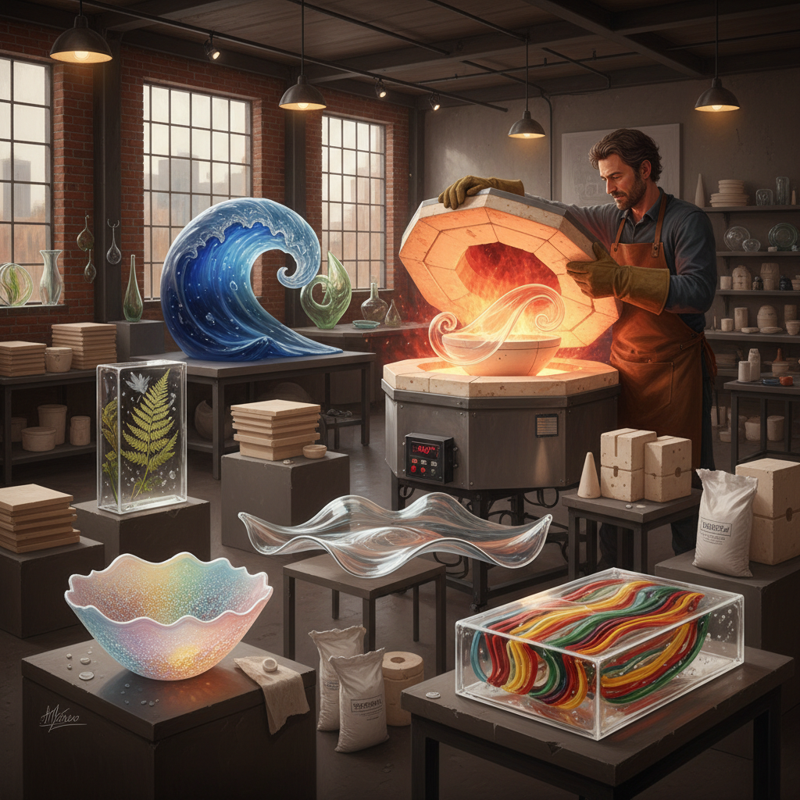

# Kiln Forming 窑制玻璃

> "Kiln forming is the art of patience and temperature — glass placed in a kiln becomes liquid memory, flowing over molds and into shapes that gravity and heat conspire to create, each firing a collaboration between the artist's vision and the physics of molten silica." — Unknown

## 概述

窑制玻璃（Kiln Forming）是一个涵盖所有在窑炉中通过加热来塑造玻璃的技法的总称——包括熔合（fusing）、弯曲成型（slumping）、铸造（casting）、熔流（combing/raking）、窑铸（pâte de verre）等。窑制玻璃的核心是利用玻璃在不同温度下的物理特性：玻璃在约500°C开始软化，600°C开始变形，700-850°C可以熔合和流动，900°C以上完全液化。

窑制玻璃与吹制玻璃的最大区别在于：窑制是"冷加工+热处理"——艺术家在室温下设计和组装玻璃，然后放入窑炉中加热；而吹制是在玻璃处于熔融状态时直接操作。窑制玻璃允许更精确的设计控制和更复杂的色彩组合，适合创作从小型首饰到大型建筑装饰的各种作品。

## 核心特征

| 特征 | 描述 |
|------|------|
| 窑炉 | 使用窑炉加热 |
| 温度 | 精确温度控制 |
| 冷加工 | 室温下设计组装 |
| 多技法 | 包含多种子技法 |
| 模具 | 使用各种模具 |
| 退火 | 缓慢冷却防裂 |

## 视觉特征

- **流动**：玻璃的流动感
- **透明**：透明和半透明
- **色彩**：丰富的色彩层次
- **质感**：多样的表面质感
- **光线**：光线穿透效果
- **有机**：有机的形态

## 代表作品

| 作品 | 艺术家 | 年代 | 意义 |
|------|--------|------|------|
| *Cast glass sculptures* | Various | 当代 | 铸造玻璃雕塑 |
| *Pâte de verre vessels* | Various | 当代 | 窑铸玻璃器皿 |
| *Slumped glass installations* | Various | 当代 | 弯曲成型装置 |
| *Kiln-cast panels* | Various | 当代 | 窑铸玻璃面板 |
| *Combed glass art* | Various | 当代 | 熔流玻璃艺术 |

## 历史时间线

| 时期 | 事件 |
|------|------|
| 古代 | 早期窑制玻璃技术 |
| 古埃及 | 埃及的铸造玻璃 |
| 罗马时期 | 罗马的窑制技术 |
| 19世纪 | 法国pâte de verre复兴 |
| 1960年代 | 工作室玻璃运动 |
| 当代 | 窑制玻璃的全球发展 |

## 中国语境

窑制玻璃在中国的当代玻璃艺术教育和创作中占有重要地位。中国的清华大学美术学院、中国美术学院等高校的玻璃艺术工作室都配备了专业的玻璃窑炉。中国的琉璃工房（Liuli Gongfang）等品牌使用窑铸技法（pâte de verre）创作琉璃艺术品，将中国传统琉璃文化与现代窑制技术结合。中国的当代玻璃艺术家在国际玻璃艺术展览中展示窑制作品。

## AI生成概念图

## 与其他风格的关系

- **Glass Fusing** → 玻璃熔合
- **Glass Blowing** → 吹制玻璃
- **Glass Casting** → 铸造玻璃
- **Pâte de Verre** → 窑铸玻璃
- **Stained Glass** → 彩色玻璃
- **Ceramic Firing** → 陶瓷烧制

---

*浮光艺志 | Chronicle of Artistry*
