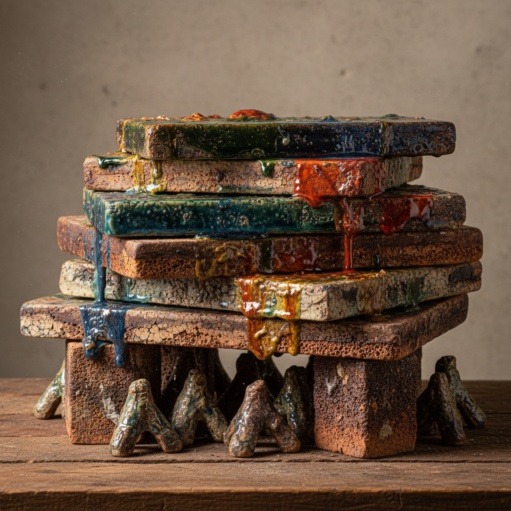

# Kiln Furniture Art 窑具艺术

> "Kiln furniture is the invisible architecture of firing — shelves and posts and stilts and saggers that hold pots in precise positions through the violence of a thousand degrees, themselves fired harder than the ware they carry, accumulating layers of dripped glaze and ash and carbon over decades of service until they become accidental sculptures, the unintended art of pure function repeated until beauty emerges from utility alone." — Unknown

## 概述

窑具艺术（Kiln Furniture Art）是一种以窑炉内部使用的辅助器具——棚板、支柱、匣钵、垫饼、支钉等——为核心的陶瓷艺术形式。窑具原本是纯功能性的工具——用于在窑内支撑、分隔和保护陶瓷器物。但经过长年累月的使用，窑具表面积累了釉滴、灰烬和碳化物的层层痕迹，形成了独特的"意外之美"。当代艺术家开始重新审视窑具的美学价值，将其作为艺术创作的对象或灵感来源。

窑具艺术的核心要素包括：1）功能之美——纯功能设计产生的美感；2）时间积累——长年使用积累的痕迹；3）意外效果——非刻意产生的美学效果；4）耐火材料——极高温度下的耐久性；5）工业遗产——窑业文化的物质遗产；6）再发现——当代对窑具美学的重新发现；7）转化艺术——从工具到艺术品的转化。

## 核心特征

| 特征 | 描述 |
|------|------|
| 功能之美 | 纯功能产生的美感 |
| 时间痕迹 | 长年使用的积累 |
| 意外效果 | 非刻意的美学效果 |
| 耐火材料 | 极高温度的耐久 |
| 工业遗产 | 窑业文化的遗产 |
| 再发现 | 美学价值的重新发现 |

## 视觉特征

- **釉滴积累**：多年釉滴形成的层次
- **碳化痕迹**：碳化物的黑色痕迹
- **粗犷质感**：耐火材料的粗犷表面
- **几何造型**：功能决定的几何形态
- **色彩层次**：多次烧制的色彩叠加
- **岁月包浆**：长年使用的时间感

## 代表作品

| 作品 | 艺术家/文化 | 年代 | 意义 |
|------|-------------|------|------|
| *宋代匣钵* | 中国各窑 | 宋代 | 古代窑具的美学 |
| *景德镇窑具* | 中国景德镇 | 各时期 | 窑业文化遗产 |
| *当代窑具艺术* | 当代艺术家 | 当代 | 窑具的艺术化 |
| *工业窑具收藏* | 收藏家 | 当代 | 窑具的收藏价值 |
| *窑具装置* | 当代艺术家 | 当代 | 窑具的装置艺术 |

## 历史时间线

| 时期 | 事件 |
|------|------|
| 商代 | 最早的窑具出现 |
| 唐宋 | 匣钵等窑具的完善 |
| 明清 | 窑具技术的成熟 |
| 20世纪 | 现代耐火材料的发展 |
| 当代 | 窑具美学的重新发现 |

## 中国语境

中国作为世界上最古老的陶瓷生产国，拥有极其丰富的窑具遗产。中国古代窑址出土的窑具——匣钵、垫饼、支钉、火照等——不仅是考古学的重要资料，也是独特的美学对象。景德镇的古窑址中，堆积如山的废弃窑具形成了独特的文化景观——这些经过数百年风化的窑具碎片被当代艺术家重新发现和利用。中国当代陶艺家开始将窑具作为创作媒介——有的直接展示古代窑具的意外之美，有的用窑具碎片创作装置艺术，有的刻意模仿窑具的美学效果。窑具艺术体现了中国当代陶艺对"无用之用"和"意外之美"的深刻理解。

## AI生成概念图

## 与其他风格的关系

- **Found Object** → 现成品艺术
- **Industrial Heritage** → 工业遗产
- **Wabi-Sabi** → 侘寂美学
- **Accidental Art** → 意外艺术
- **Kiln Technology** → 窑炉技术
- **Archaeological Art** → 考古艺术

---

*浮光艺志 | Chronicle of Artistry*
