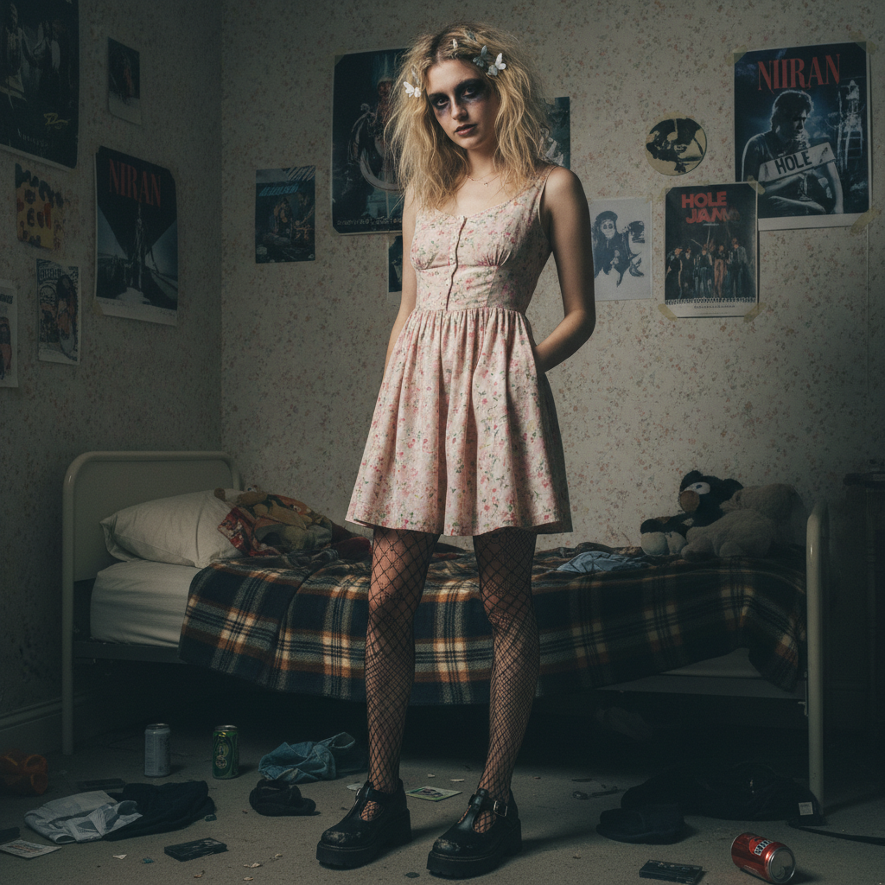

# Kinderwhore 童装娃娃



> **"碎花娃娃裙、涂花的口红、破洞丝袜——用'天真'作为武器。"**

## 概述

| 维度 | 描述 |
|------|------|
| 时期 | 1991–1997/2010s复兴 |
| 别名 | Kinderwhore, Kinder Whore, Riot Grrrl Fashion |
| 核心色彩 | 淡粉、白色、红色、黑色 |
| 关键元素 | 碎花娃娃裙、涂花口红、破洞丝袜、Mary Jane鞋 |
| 代表人物 | Courtney Love, Kat Bjelland (Babes in Toyland), Hole |
| 关联风格 | Grunge, Riot Grrrl, Coquette, Dark Feminine |

---

## 历史脉络

| 年份 | 事件 |
|------|------|
| 1991 | Kat Bjelland 创造 Kinderwhore 造型 |
| 1992 | Courtney Love 将其推向主流 |
| 1994 | Hole "Live Through This"——视觉巅峰 |
| 1997 | 随 Grunge 衰落 |
| 2010s | Tumblr 上的复兴 |
| 2020s | 与 Coquette/Dark Feminine 交叉 |

### 核心哲学

Kinderwhore 的精神是**"用'天真'的外表颠覆'天真'的含义"**：
- 娃娃裙 = 武器（不是顺从）
- 涂花 = 故意的（"我不是为你美"）
- 破损 = 力量（"完美是无聊的"）
- 女性气质 = 可以是愤怒的
- "看起来像娃娃，但会咬人"

---

## 视觉语法

### 色彩系统

```
主色：
  淡粉 (#FFB6C1) — 娃娃裙
  白色 (#FFFFFF) — 蕾丝、衬裙
  红色 (#FF0000) — 口红（涂花的）
  黑色 (#000000) — 眼线、丝袜

辅色：
  淡蓝 (#ADD8E6) — 碎花
  紫色 (#9370DB) — 瘀伤感
  米色 (#F5F5DC) — 复古

质感：
  蕾丝 — 裙子、内衣外穿
  丝袜 — 破洞的
  丝绒 — 发带
  棉 — 碎花裙
```

### 标志性元素

| 类别 | 元素 |
|------|------|
| 服装 | 碎花娃娃裙、内衣外穿、Peter Pan领 |
| 妆容 | 涂花红唇、烟熏眼、苍白底妆 |
| 鞋 | Mary Jane、厚底鞋、Dr. Martens |
| 配饰 | 发带、十字架、儿童饰品 |
| 态度 | 颠覆、愤怒、讽刺、女性主义 |

---

## 与千禧怀旧的关系

### Grunge 的女性面孔
- Kinderwhore = Grunge 的女性版本
- Kurt Cobain 穿法兰绒 / Courtney Love 穿娃娃裙
- 两者共享"破损""不完美""反主流"
- "90s 的女性愤怒有自己的制服"

### Coquette 的暗黑前身
- Kinderwhore (1990s) → Coquette (2020s)
- 两者共享"蝴蝶结""粉色""娃娃"
- 但 Kinderwhore = 颠覆性的 / Coquette = 拥抱性的
- "同样的元素，完全不同的态度"

---

## 中国语境

- 与中国"暗黑少女"风格的交叉
- 小红书上的"破碎感妆容"
- 与中国"辣妹"文化中的颠覆元素
- Courtney Love 在中国独立音乐圈的影响

---

## 设计应用

| 场景 | 应用方式 |
|------|----------|
| 时尚 | 娃娃裙+破损+红唇+颠覆+90s |
| 音乐 | Grunge/Riot Grrrl 视觉+海报 |
| 摄影 | 苍白+涂花+破损+对比+讽刺 |
| 品牌 | 颠覆性女性主义+复古+暗黑甜美 |

---

## 相关风格

← [Grunge Revival 垃圾摇滚复兴](grunge-revival.md) | [Riot Grrrl 暴女运动](riot-grrrl.md) →

↑ [返回千禧怀旧目录](README.md) | [返回总目录](../README.md)
