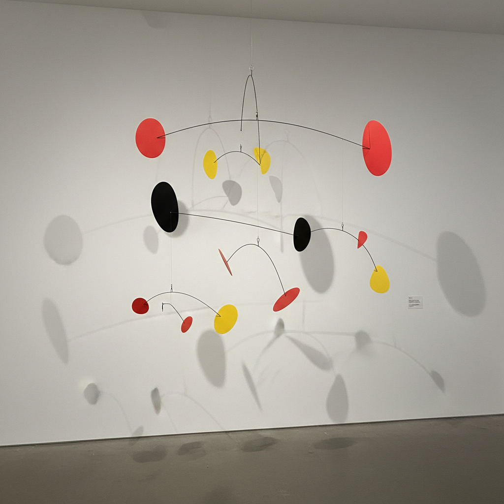

# Kinetic Art 动态艺术



> **"艺术不该挂在墙上不动——它应该旋转、摆动、随风起舞。"**

## 概述

| 维度 | 描述 |
|------|------|
| 时期 | 1920s–至今 |
| 别名 | Kinetic Art, Kinetic Sculpture, Motion Art, 动态雕塑 |
| 核心色彩 | 金属银、工业灰、原色（红黄蓝）、黑白 |
| 关键元素 | 运动、机械结构、光影变化、观众互动、时间维度 |
| 代表人物 | Alexander Calder, Jean Tinguely, Jesús Rafael Soto, Theo Jansen |
| 关联风格 | Op Art, Constructivism, Bauhaus, Interactive Art, New Media |

---

## 历史脉络

| 年份 | 事件 |
|------|------|
| 1920 | Naum Gabo "Kinetic Construction"——运动雕塑宣言 |
| 1931 | Alexander Calder 发明"Mobile"——悬挂动态雕塑 |
| 1955 | "Le Mouvement"展览——动态艺术正式命名 |
| 1960s | Jean Tinguely 自毁机器——机械的荒诞 |
| 1990s | Theo Jansen "Strandbeest"——风力行走生物 |
| 2010s | 数字动态艺术+互动装置 |
| 2020s | AI驱动的动态艺术+机器人雕塑 |

### 核心哲学

动态艺术的精神是**"静止是死亡——运动才是生命"**：
- 运动 = 生命（"一件不动的雕塑是一具尸体"）
- 时间 = 维度（"艺术不只占据空间——也占据时间"）
- 变化 = 本质（"你永远看不到同一件作品两次"）
- 互动 = 完成（"没有观众/风/光——作品是不完整的"）
- Calder: "我想做的是——让蒙德里安的画动起来"

---

## 视觉语法

### 色彩系统

```
主色：
  金属银 (#C0C0C0) — 机械、工业
  纯红 (#FF0000) — Calder经典
  纯黑 (#000000) — 结构、剪影
  纯白 (#FFFFFF) — 光、空间

辅色：
  纯黄 (#FFFF00) — 原色系统
  纯蓝 (#0000FF) — 原色系统
  透明 — 光线穿透

规则：
  - 原色为主（Calder传统）
  - 金属材质的自然色
  - 光影创造的色彩变化
  - 运动中的色彩混合

质感：
  金属 — 反光、工业
  平衡 — 悬挂、重力
  阴影 — 投射、变化
  风 — 不可预测的运动
```

### 标志性元素

| 类别 | 元素 |
|------|------|
| 运动 | 旋转、摆动、漂浮、行走、自毁 |
| 材料 | 金属、线材、电机、风、水、光 |
| 结构 | 悬挂、平衡、机械、齿轮 |
| 互动 | 风驱动、触摸、声音、光线 |
| 空间 | 三维、投影、阴影、环境 |
| 态度 | 运动、变化、时间、互动、生命 |

---

## 与千禧怀旧的关系

### 数字时代的"动态"
- 物理动态艺术 → 数字动态设计 → 交互设计
- Motion Design = 动态艺术的数字后代
- "Calder 的 Mobile 是最早的'动效设计'"
- 动态品牌标识 = 动态艺术的商业应用

### Theo Jansen 的病毒式传播
- Strandbeest 视频 = 互联网时代的动态艺术经典
- "一个用塑料管做的'生物'在海滩上行走——这就是艺术"
- 3D打印让人人可以制作自己的动态雕塑

---

## 中国语境

- 中国当代艺术中的动态装置
- 中国科技艺术展中的互动作品
- 与中国传统"走马灯"的对话
- 中国新媒体艺术教育中的动态艺术

---

## 设计应用

| 场景 | 应用方式 |
|------|----------|
| 装置 | 公共空间+博物馆+商业空间+互动 |
| 数字 | Motion Design+动态品牌+交互+生成 |
| 产品 | 动态玩具+装饰+教育+STEM |
| 建筑 | 动态立面+可变结构+环境响应 |

---

## 相关风格

← [Op Art 欧普艺术](op-art.md) | [Constructivism 构成主义](constructivism.md) →

↑ [返回千禧怀旧目录](README.md) | [返回总目录](../README.md)
