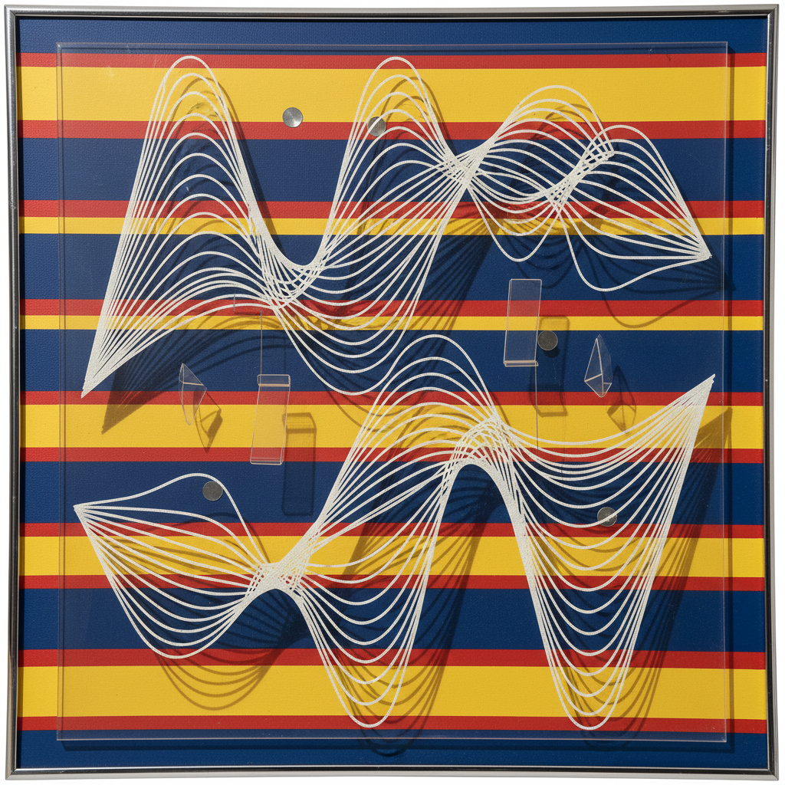

# Kinetic Painting 动态绘画

> **时期：** 1950年代–1970年代  
> **关键词：** 运动、光线、机械装置、观者互动、时间维度

## 概述

Kinetic Painting（动态绘画）是动态艺术在二维平面上的延伸——通过实际的物理运动（马达驱动、风力、磁力）或光线变化，让画面真正动起来。赫苏斯·拉斐尔·索托的穿透物和卡洛斯·克鲁兹-迭斯的色彩环境，将绘画从静态的窗口变为活的有机体，引入了时间作为第四维度。

## 风格特征

- **实际运动**：画面元素真正移动
- **光线变化**：随光源和角度改变外观
- **莫尔效应**：重叠图案产生动态干涉
- **观者互动**：移动中观看产生不同效果
- **时间维度**：作品随时间持续变化

## 代表人物与作品

- 赫苏斯·拉斐尔·索托 穿透物系列
- 卡洛斯·克鲁兹-迭斯 色彩物理
- 亚历山大·考尔德 动态雕塑
- 让·丁格利 机械装置

## 概念图

