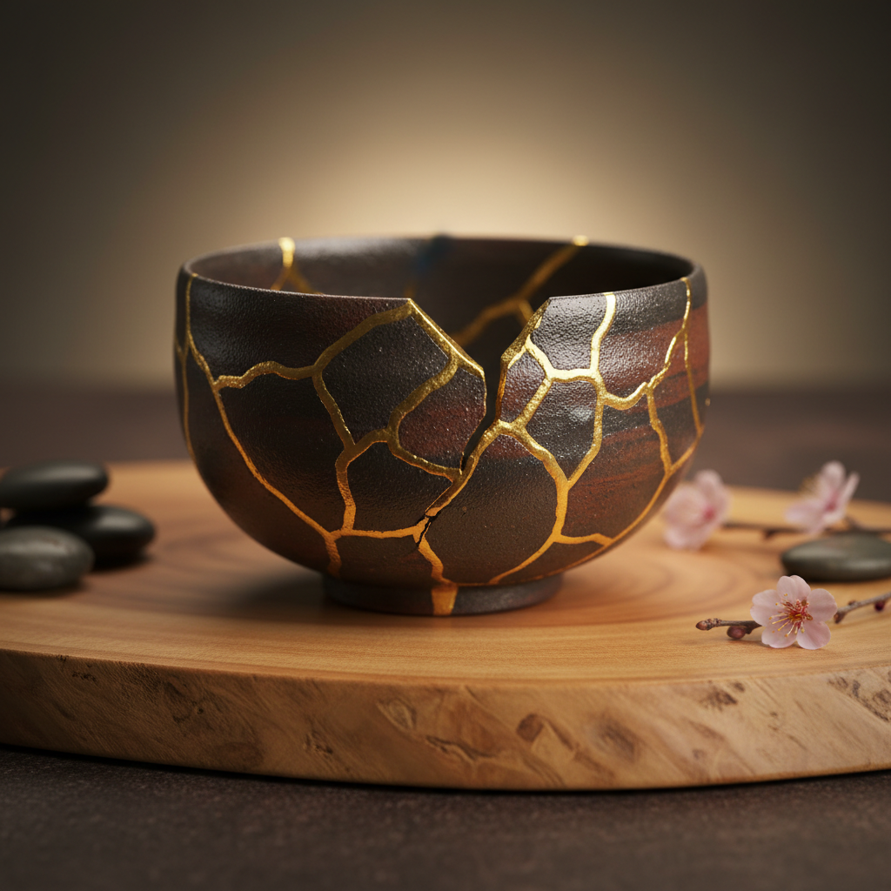

# Kintsugi Art 金缮艺术

> "Kintsugi is the art of golden repair — broken pottery is mended with lacquer mixed with powdered gold, silver, or platinum, transforming fractures into luminous seams that celebrate rather than hide the history of damage. The philosophy is radical: breakage is not something to conceal but something to illuminate. Every crack becomes a river of gold, every repair a testament to resilience, and the mended object becomes more beautiful than the original." — Unknown

## 概述

金缮艺术（Kintsugi Art）是一种日本传统的陶瓷修复技法——使用漆（urushi）混合金粉、银粉或铂金粉来修复破碎的陶瓷器物，将裂缝和断裂处变成金色的装饰线条。金缮（金継ぎ）体现了日本侘寂（wabi-sabi）美学中对不完美、无常和修复的尊重，将破损转化为美的一部分。

金缮艺术的实践包括：1）crack——修复裂缝；2）piece method——重新粘合碎片；3）joint call——用金漆填充缺失部分；4）makienaoshi——用金粉装饰修复处；5）呼继ぎ——用不同器物的碎片组合修复；6）当代金缮——将传统技法与现代设计结合的创作。

## 核心特征

| 特征 | 描述 |
|------|------|
| 修复 | 修复而非丢弃 |
| 金色 | 金色的修复线条 |
| 哲学 | 深刻的哲学意义 |
| 漆艺 | 传统漆艺的应用 |
| 侘寂 | 侘寂美学的体现 |
| 珍惜 | 珍惜物品的态度 |

## 视觉特征

- **金线**：金色的修复线条
- **裂纹**：可见的裂纹图案
- **对比**：金色与陶瓷的对比
- **不规则**：自然不规则的线条
- **光泽**：金粉的温暖光泽
- **故事**：每条线都是故事

## 代表作品

| 作品 | 艺术家/文化 | 年代 | 意义 |
|------|-------------|------|------|
| *Muromachi period repairs* | 日本 | 室町时代 | 最早的金缮 |
| *Tea ceremony bowls* | 日本 | 桃山-江户 | 茶道碗的金缮 |
| *Raku ware kintsugi* | 日本 | 传统 | 乐烧金缮 |
| *Contemporary kintsugi* | 当代 | 当代 | 当代金缮 |
| *Kintsugi philosophy art* | 当代 | 当代 | 金缮哲学艺术 |

## 历史时间线

| 时期 | 事件 |
|------|------|
| 室町时代 | 金缮的起源（15世纪） |
| 桃山时代 | 茶道文化中金缮的发展 |
| 江户时代 | 金缮技法的成熟 |
| 20世纪 | 金缮的文化遗产保护 |
| 当代 | 金缮的全球传播和哲学影响 |

## 中国语境

金缮艺术在中国有深厚的文化基础和广泛的当代实践。中国是漆艺的发源地——金缮使用的大漆（urushi）技术最初从中国传入日本。中国传统的"锔瓷"是另一种陶瓷修复传统——使用金属钉将碎片固定，与金缮有不同的美学但相同的惜物哲学。中国当代的金缮实践正在蓬勃发展——大量的工作室和课程教授金缮技法。中国的茶文化中，金缮修复的茶器被视为有特殊价值的物品——体现了对器物生命历程的尊重。中国的一些艺术家将金缮的哲学扩展到其他领域——在绘画、雕塑和装置艺术中运用"修复之美"的概念。中国的可持续生活运动中，金缮作为一种反对消费主义的实践获得了广泛关注——与中国传统的惜物文化产生共鸣。

## AI生成概念图

## 与其他风格的关系

- **Boro** → 缝补艺术
- **Wabi-Sabi** → 侘寂美学
- **Urushi** → 漆艺
- **Ceramics** → 陶瓷艺术
- **Tea Ceremony** → 茶道
- **Philosophy Art** → 哲学艺术

---

*浮光艺志 | Chronicle of Artistry*
