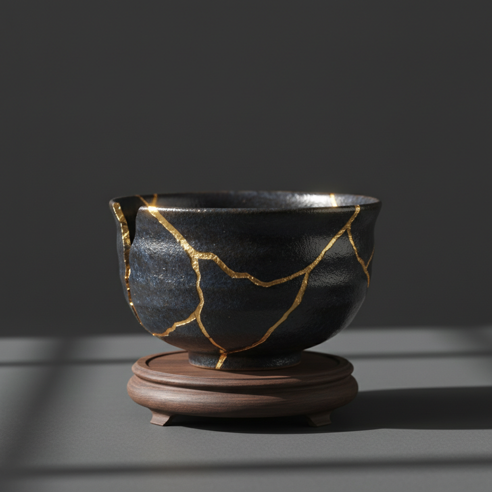

# Kintsugi 金缮

> "Kintsugi teaches us that broken things can become more beautiful than before." — Unknown

## 概述

金缮（Kintsugi/金継ぎ，日语"金色修补"）是用漆和金粉修复破碎陶瓷的日本传统工艺——不是隐藏裂痕，而是用金色的线条突出它们，将破损转化为美的一部分。这种哲学源自侘寂（wabi-sabi）美学——接受不完美、无常和不完整。金缮不仅是修复技术，更是一种生活哲学：伤痕不是缺陷，而是历史的一部分。

金缮的智慧在于：不要隐藏你的伤痕——它们是你故事的一部分，让你变得更加独特和珍贵。

## 核心特征

| 特征 | 描述 |
|------|------|
| 修复 | 修复破碎的陶瓷 |
| 金色 | 用金粉突出裂痕 |
| 漆 | 使用天然漆作为粘合剂 |
| 哲学 | 接受不完美的哲学 |
| 美化 | 将破损转化为美 |
| 历史 | 保留物品的历史 |

## 视觉特征

- **金线**：金色的修复线条
- **裂痕**：清晰可见的裂痕图案
- **对比**：金色与陶瓷的对比
- **随机**：裂痕的自然随机美
- **光泽**：金粉的温暖光泽
- **完整**：修复后的完整形态

## 代表作品

| 作品 | 艺术家 | 年代 | 意义 |
|------|--------|------|------|
| *Traditional kintsugi bowls* | 匿名 | 15世纪+ | 传统金缮茶碗 |
| *Shogun's tea bowl* | 匿名 | 15世纪 | 金缮起源的传说 |
| *Museum collections* | Various | 16-19世纪 | 博物馆收藏的金缮器物 |
| *Contemporary kintsugi* | Various | 2000s+ | 当代金缮艺术 |
| *Kintsugi philosophy art* | Various | 2010s+ | 金缮哲学的艺术延伸 |

## 历史时间线

| 时期 | 事件 |
|------|------|
| 15世纪 | 金缮的起源——室町时代 |
| 16世纪 | 茶道文化中的金缮 |
| 17-19世纪 | 金缮作为专业工艺 |
| 20世纪 | 金缮的相对沉寂 |
| 2000s+ | 金缮的全球复兴 |
| 当代 | 金缮哲学的文化影响力 |

## 中国语境

金缮在中国近年来非常流行——作为一种修复工艺和生活美学。中国有自己的传统陶瓷修复技法（如锔瓷），但金缮的"以金饰伤"理念在当代中国引起了强烈共鸣。中国的手工艺爱好者和茶道文化圈大量实践金缮。金缮的哲学——接受不完美——与中国传统的"残缺美"和"物哀"有相通之处。

## AI生成概念图

## 与其他风格的关系

- **Wabi-sabi** → 侘寂美学是金缮的哲学基础
- **Ceramics** → 陶瓷是金缮的载体
- **Lacquerware** → 漆艺是金缮的技术基础
- **Gilding** → 鎏金与金缮有材料相似
- **Repair Art** → 修复艺术的代表
- **Philosophy Art** → 金缮是哲学的视觉化

---

*浮光艺志 | Chronicle of Artistry*
