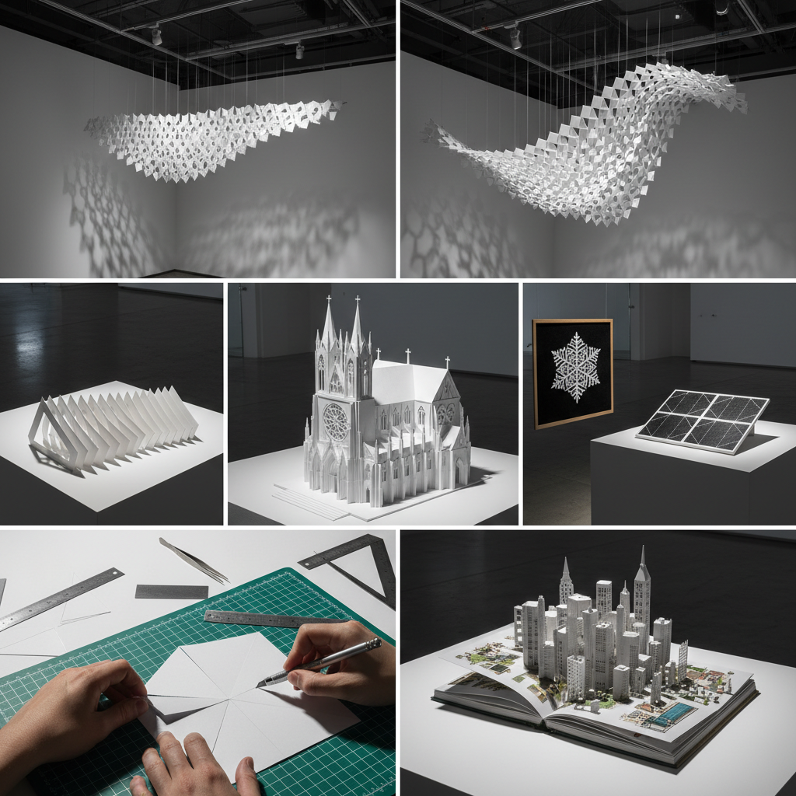

# Kirigami Art 剪纸折纸艺术

> "Kirigami is origami liberated by the cut — paper folded and then strategically sliced to create pop-up architectures, lattice structures, and transformable geometries impossible through folding alone, each incision unlocking new dimensions of movement and form from a flat sheet." — Unknown

## 概述

剪纸折纸艺术（Kirigami）是一种结合折叠（ori）和剪切（kiri）的纸艺技法。"Kirigami"来自日语"切る"（kiru，切）和"紙"（kami，纸）。与纯折纸（origami，不允许剪切）不同，Kirigami允许在纸上进行战略性的剪切，从而创造出仅靠折叠无法实现的结构——弹出式（pop-up）建筑、可伸展的网格结构、三维几何体等。

Kirigami的范围从简单的儿童手工（如纸雪花）到极其复杂的工程结构。当代Kirigami在科学和工程领域有重要应用——MIT等研究机构利用Kirigami原理设计可伸展的电子器件、太阳能电池板、医疗支架和软体机器人。Kirigami的核心思想是：通过精确的切割模式，使原本刚性的材料获得柔性和可变形性。

## 核心特征

| 特征 | 描述 |
|------|------|
| 剪切 | 战略性的剪切 |
| 折叠 | 结合折叠技法 |
| 弹出 | 弹出式结构 |
| 可变形 | 可变形的几何 |
| 工程 | 工程应用价值 |
| 单张 | 通常使用单张纸 |

## 视觉特征

- **立体**：从平面弹出的立体
- **几何**：精确的几何结构
- **网格**：可伸展的网格
- **光影**：剪切创造的光影
- **建筑**：建筑般的空间感
- **动态**：可变形的动态感

## 代表作品

| 作品 | 艺术家 | 年代 | 意义 |
|------|--------|------|------|
| *Pop-up architecture* | Various | 当代 | 弹出式建筑 |
| *Kirigami lattices* | Various | 当代 | 剪纸网格结构 |
| *Scientific kirigami* | MIT等 | 当代 | 科学应用 |
| *Kirigami art installations* | Various | 当代 | 剪纸装置艺术 |
| *Traditional kirigami* | 日本工匠 | 传统 | 传统剪纸折纸 |

## 历史时间线

| 时期 | 事件 |
|------|------|
| 传统 | 日本传统的剪纸折纸 |
| 20世纪 | Kirigami作为手工艺的发展 |
| 1990年代 | 弹出式书籍的流行 |
| 2010年代 | Kirigami在科学工程中的应用 |
| 当代 | Kirigami的跨学科发展 |

## 中国语境

Kirigami在中国有深厚的文化基础——中国的剪纸（paper cutting）传统与Kirigami有密切的关系。中国剪纸是世界非物质文化遗产，有数千年的历史。当代中国的设计师和工程师将Kirigami原理应用于产品设计、建筑设计和材料科学。中国的儿童手工教育中广泛使用Kirigami技法。中国的一些艺术家将传统剪纸与现代Kirigami结合创作当代艺术。中国的科研机构在Kirigami力学和应用方面有活跃的研究。

## AI生成概念图

## 与其他风格的关系

- **Origami** → 折纸
- **Paper Cutting** → 剪纸
- **Pop-up Art** → 弹出式艺术
- **Architectural Model** → 建筑模型
- **Geometric Art** → 几何艺术
- **Origami Tessellation** → 折纸镶嵌

---

*浮光艺志 | Chronicle of Artistry*
