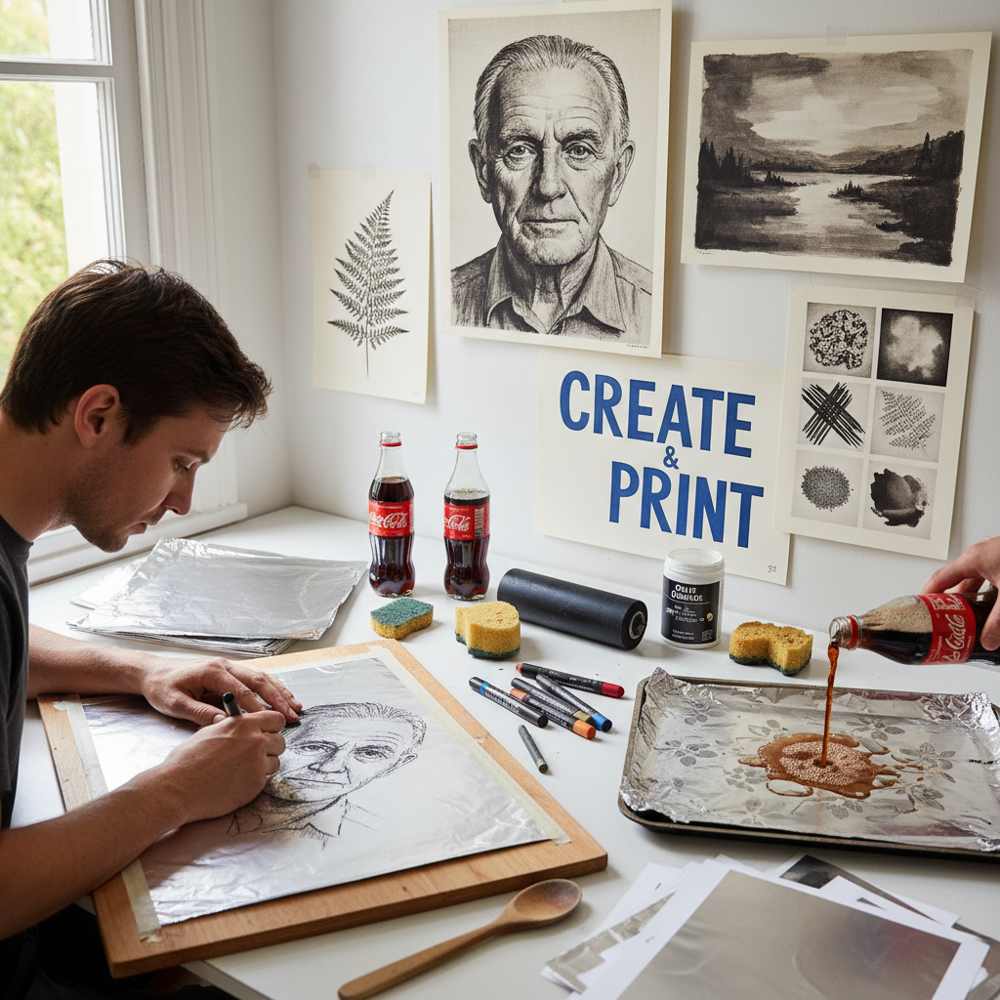

# Kitchen Lithography 厨房石版印刷

> "Kitchen lithography democratizes the oldest planographic process — aluminum foil and cola replace limestone and acid, proving that the magic of lithography, the oil-and-water principle that has printed masterworks for two centuries, can happen on a kitchen table with household materials." — Unknown

## 概述

厨房石版印刷（Kitchen Lithography）是一种使用家庭常见材料模拟传统石版印刷（lithography）原理的简化版画技法。传统石版印刷需要昂贵的石灰石板或铝版、专业的酸液和设备；而厨房石版使用铝箔（或一次性铝烤盘）作为版材，可乐（含磷酸）作为蚀刻液，食用油基蜡笔或油性标记笔作为绘画工具。

厨房石版印刷的原理与传统石版完全相同——基于油水不相容的化学原理：油性材料绘制的图像区域吸引油性油墨，排斥水；非图像区域吸水排油。可乐中的磷酸起到传统石版中硝酸/阿拉伯胶的作用——使非图像区域亲水。这种技法由艺术家Emilie Aizier（Emilion）在2010年代推广，使石版印刷从专业版画工作室走入普通人的厨房。

## 核心特征

| 特征 | 描述 |
|------|------|
| 家庭材料 | 使用家庭常见材料 |
| 油水原理 | 油水不相容原理 |
| 铝箔 | 铝箔作为版材 |
| 可乐 | 可乐作为蚀刻液 |
| 平版 | 平版印刷原理 |
| 民主化 | 版画的民主化 |

## 视觉特征

- **柔和**：柔和的色调
- **绘画性**：绘画性的笔触
- **平面**：平版印刷的平面感
- **质朴**：质朴的手工感
- **灰度**：丰富的灰度层次
- **即兴**：即兴的绘画痕迹

## 代表作品

| 作品 | 艺术家 | 年代 | 意义 |
|------|--------|------|------|
| *Kitchen litho prints* | Emilie Aizier | 2010s | 技法的推广 |
| *DIY lithography* | Various | 当代 | DIY石版印刷 |
| *Aluminum foil prints* | Various | 当代 | 铝箔版画 |
| *Educational kitchen litho* | Various | 当代 | 教育用厨房石版 |
| *Contemporary kitchen litho* | Various | 当代 | 当代厨房石版作品 |

## 历史时间线

| 时期 | 事件 |
|------|------|
| 1796年 | Alois Senefelder发明石版印刷 |
| 19-20世纪 | 传统石版印刷的发展 |
| 2010年代 | Emilie Aizier推广厨房石版 |
| 2015年后 | 社交媒体推动的全球流行 |
| 当代 | 厨房石版印刷的持续发展 |

## 中国语境

厨房石版印刷在中国的版画教育和手工创作社区中有逐步的推广。中国的美术教育者将厨房石版作为向学生介绍石版印刷原理的入门方式——不需要专业设备和有毒材料。中国的手工创作者通过社交媒体（小红书、B站）分享厨房石版印刷的教程和作品。中国的一些独立版画工作室将厨房石版作为体验课程提供给公众。

## AI生成概念图

## 与其他风格的关系

- **Lithography** → 石版印刷
- **Planographic Printing** → 平版印刷
- **DIY Printmaking** → DIY版画
- **Foam Printing** → 泡沫印刷
- **Gelatin Printing** → 明胶版印刷
- **Screen Printing** → 丝网印刷

---

*浮光艺志 | Chronicle of Artistry*
