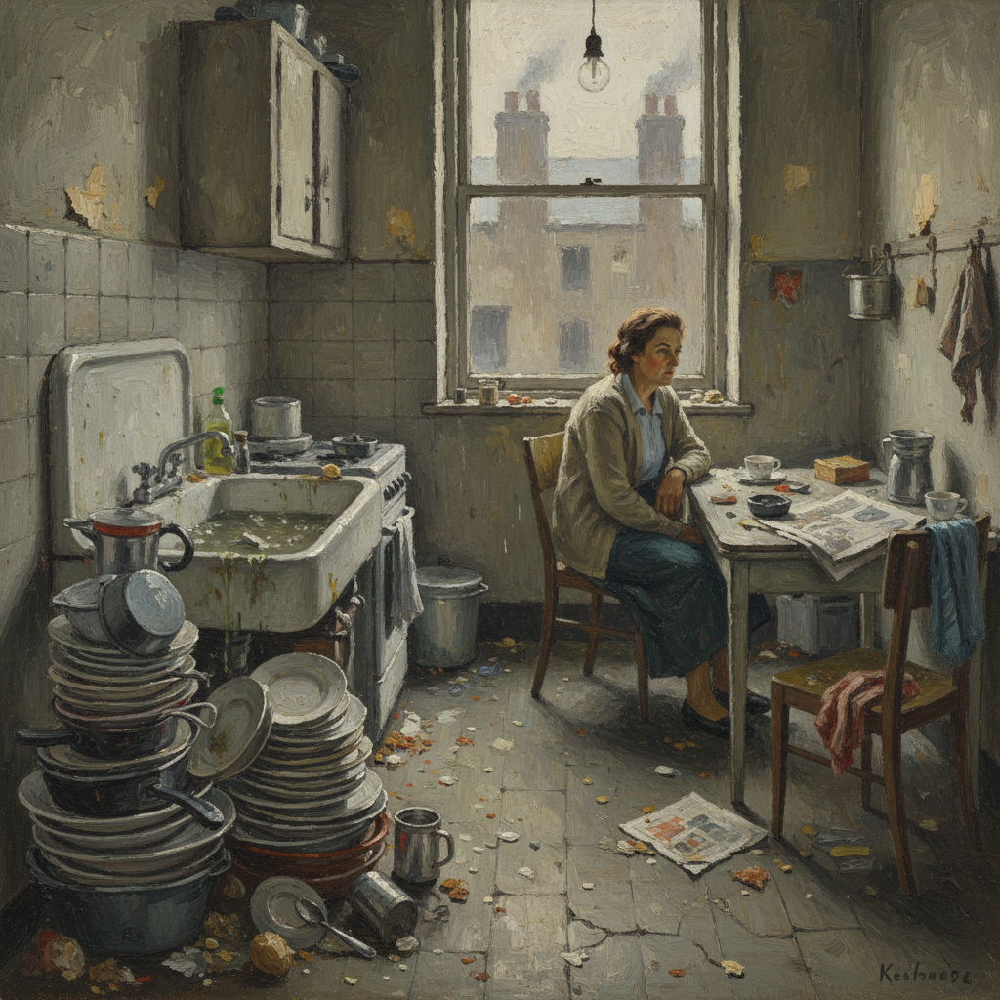

# Kitchen Sink Realism 厨房水槽现实主义

> **时期：** 1950年代–1960年代  
> **关键词：** 英国工人阶级、愤怒青年、日常琐碎、反精英、社会批判

## 概述

Kitchen Sink Realism（厨房水槽现实主义）是1950年代英国的艺术和文化运动，与文学中的"愤怒的青年"和戏剧中的"厨房水槽剧"并行。画家们描绘工人阶级家庭的真实生活——脏乱的厨房、堆满碗碟的水槽、后院的垃圾桶——以粗糙的笔触和灰暗的色调，拒绝战后英国艺术界的抽象化和精英化倾向。

## 风格特征

- **工人阶级场景**：厨房、后院、工厂、街道
- **灰暗色调**：工业城市的阴沉色彩
- **粗糙质感**：厚重的颜料和粗犷的笔触
- **反美化**：拒绝理想化和装饰性
- **社会关怀**：对底层生活的同情和记录

## 代表人物与作品

- 约翰·布拉特比 厨房静物
- 杰克·史密斯 谢菲尔德风景
- 德里克·格里夫斯 工业场景
- 爱德华·米德尔迪奇 花园与静物

## 概念图

