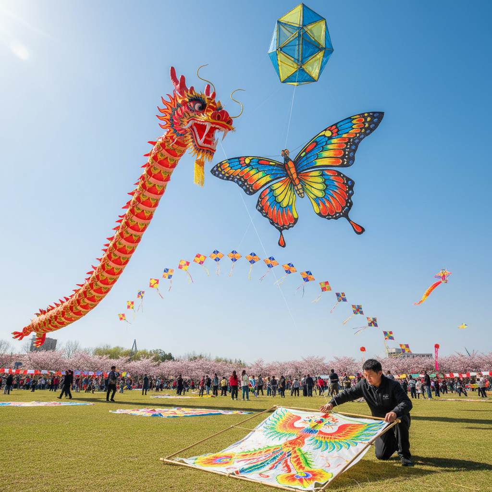

# Kite Art 风筝艺术

> "A kite is a painting that flies — a flat surface decorated with color and form, then given to the wind to become a living thing in the sky. Unlike any other art form, a kite must satisfy both aesthetics and aerodynamics: it must be beautiful enough to deserve the sky, and engineered well enough to reach it. When a kite flies, art escapes the gallery and joins the clouds." — Unknown

## 概述

风筝艺术（Kite Art）是以风筝为媒介的艺术创作——包括风筝的设计、制作、装饰和放飞表演。风筝艺术将绘画、雕塑、工程和表演融为一体，是世界上最古老的飞行艺术形式之一。

风筝艺术的实践包括：1）传统风筝——各文化传统的风筝设计和制作；2）艺术风筝——以艺术表达为目的的创意风筝；3）风筝绘画——在风筝面上的精美绑画；4）立体风筝——三维造型的风筝；5）巨型风筝——超大尺寸的风筝；6）风筝表演——编队放飞和特技风筝表演；7）风筝装置——将风筝元素融入当代艺术装置。

## 核心特征

| 特征 | 描述 |
|------|------|
| 飞行 | 能够飞上天空 |
| 风力 | 利用风力升空 |
| 轻盈 | 极致的轻盈 |
| 色彩 | 鲜艳的色彩装饰 |
| 结构 | 精巧的骨架结构 |
| 表演 | 放飞的表演性 |

## 视觉特征

- **色彩**：鲜艳的色彩
- **图案**：传统或创意图案
- **对称**：对称的造型
- **轻盈**：轻盈的材料质感
- **天空**：以蓝天为背景
- **运动**：风中的动态

## 代表作品

| 作品 | 艺术家 | 年代 | 意义 |
|------|--------|------|------|
| *潍坊风筝* | 传统 | 古代至今 | 中国风筝之都 |
| *Japanese kites* | 传统 | 古代至今 | 日本风筝传统 |
| *Indian kites* | 传统 | 古代至今 | 印度风筝文化 |
| *Art kites* | Various | 当代 | 当代艺术风筝 |
| *Stunt kites* | Various | 当代 | 特技风筝 |

## 历史时间线

| 时期 | 事件 |
|------|------|
| 春秋战国 | 中国发明风筝 |
| 唐宋 | 风筝的普及和艺术化 |
| 中世纪 | 风筝传入亚洲各国 |
| 18世纪 | 风筝传入欧洲 |
| 当代 | 风筝艺术的国际化发展 |

## 中国语境

风筝艺术是中国对世界文明的重大贡献之一。中国是风筝的发明国——传说鲁班和墨子在春秋战国时期就制作了最早的风筝。中国的风筝文化有超过2500年的历史。山东潍坊是世界公认的"风筝之都"——每年举办国际风筝节，潍坊风筝以其精美的绘画和精巧的结构闻名世界。中国各地有不同的风筝流派——北京风筝以沙燕为代表、天津风筝以软翅为特色、南通风筝以板鹞（哨口风筝）著称、潍坊风筝以龙头蜈蚣为标志。中国风筝的制作工艺包括"扎、糊、绑、放"四大技艺——每一步都需要高超的技巧。中国的风筝制作技艺是国家级非物质文化遗产。

## AI生成概念图

## 与其他风格的关系

- **Paper Art** → 纸艺术
- **Painting** → 绑画
- **Performance Art** → 表演艺术
- **Wind Art** → 风艺术
- **Folk Art** → 民间艺术
- **Aerodynamic Art** → 空气动力学艺术

---

*浮光艺志 | Chronicle of Artistry*
