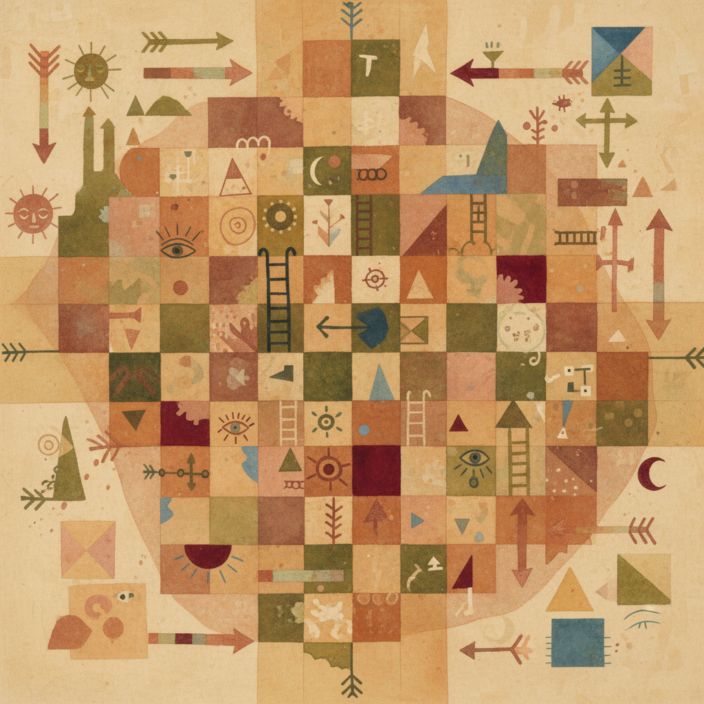

# Paul Klee 保罗·克利

> "A line is a dot that went for a walk." — Paul Klee

## 概述

保罗·克利（Paul Klee，1879–1940）是瑞士-德国画家，包豪斯教师，以融合抽象与具象、儿童般的天真与深刻的理论思考闻名。他的作品如同视觉诗歌——符号、色彩和线条在画面上自由游戏，创造出一个介于梦境和音乐之间的世界。

克利是少数能同时满足儿童和哲学家的艺术家——他的画看起来简单得像涂鸦，却蕴含着关于形式、色彩和创造力的深刻思考。

## 核心特征

| 特征 | 描述 |
|------|------|
| 线条游戏 | "线条散步"——自由的、探索性的线条 |
| 符号语言 | 箭头、眼睛、月亮、鱼——个人符号系统 |
| 色彩音乐 | 色彩如音符般的节奏和和声 |
| 儿童视角 | 刻意的天真——回到观看的原点 |
| 理论深度 | 包豪斯教学笔记——形式的哲学 |
| 幽默感 | 诙谐的标题和画面中的机智 |

## 视觉特征

- **线条**：细的、自由的、如儿童画般的轮廓
- **色彩**：柔和的色块——水彩般的透明层
- **符号**：箭头、眼睛、字母、几何形
- **构图**：网格化的色块或自由的线条场
- **质感**：多种媒介混合——油画、水彩、粉彩
- **尺度**：通常较小——亲密的观看距离

## 代表作品

| 作品 | 年代 | 意义 |
|------|------|------|
| *Twittering Machine* | 1922 | 机械与自然的幽默 |
| *Senecio* | 1922 | 面具般的面孔 |
| *Ad Parnassum* | 1932 | 点彩与马赛克的融合 |
| *Angelus Novus* | 1920 | 本雅明的"历史天使" |
| *Death and Fire* | 1940 | 晚期的简化与力量 |

## 真实作品（公共领域）

| 作品 | 来源 |
|------|------|
| *Twittering Machine* | [MoMA](https://www.moma.org/collection/works/37347) |
| *Angelus Novus* | [Israel Museum](https://www.imj.org.il/) |
| *Ad Parnassum* | [Kunstmuseum Bern](https://www.kunstmuseumbern.ch/) |

> ⚠️ 本条目优先使用真实作品。

## AI生成概念图

## 与其他风格的关系

- **Bauhaus** → 包豪斯的核心教师
- **Expressionism** → 表现主义的诗意分支
- **Surrealism** → 超现实主义者崇拜克利
- **Children's Art** → 儿童艺术的成人化探索
