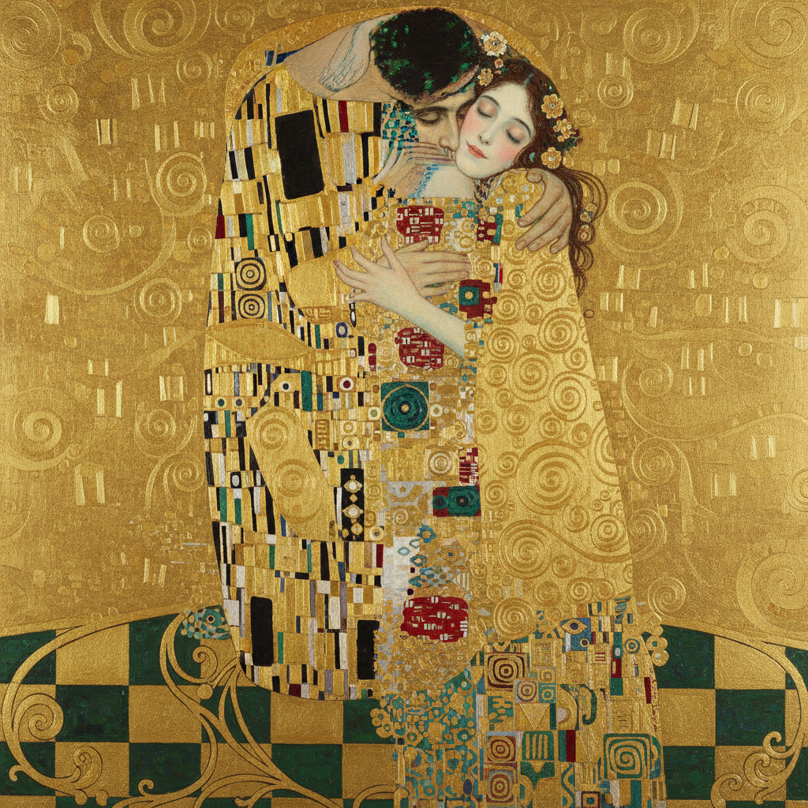

# Gustav Klimt 克里姆特

> "All art is erotic." — Gustav Klimt

## 概述

古斯塔夫·克里姆特（Gustav Klimt，1862–1918）是奥地利画家，维也纳分离派（Vienna Secession）的创始人和领袖，也是20世纪初最具辨识度的艺术家之一。他以金箔装饰、拜占庭马赛克风格和情色女性形象的独特融合创造了一种前所未有的"黄金风格"（Golden Phase）。

克里姆特的《吻》是世界上最著名的爱情图像之一，他将装饰艺术与象征主义、情色与神圣、平面与深度融为一体的独特方式至今仍深刻影响着当代艺术和设计。

## 核心特征

| 特征 | 描述 |
|------|------|
| 黄金装饰 | 大量使用真金箔和金色颜料 |
| 拜占庭影响 | 受拉文纳马赛克的直接启发 |
| 平面与深度 | 装饰性平面背景 + 写实的面部和手 |
| 情色与神圣 | 女性身体的情色表现与神圣装饰的结合 |
| 几何图案 | 螺旋、三角、圆形等几何装饰图案 |
| 象征主义 | 生、死、爱、性的象征性表达 |

## 视觉特征

- **金色**：大面积的金箔和金色装饰
- **图案**：螺旋、眼睛、三角形、花卉的密集装饰
- **人物**：写实的面部和手，装饰化的身体和衣物
- **色彩**：金、黑、深红、翡翠绿的华丽组合
- **构图**：垂直构图，人物被装饰图案包裹
- **质感**：金箔的真实光泽与颜料的对比

## 代表作品

| 作品 | 年代 | 意义 |
|------|------|------|
| *The Kiss* | 1907-08 | 世界上最著名的爱情图像之一 |
| *Portrait of Adele Bloch-Bauer I* | 1907 | "奥地利的蒙娜丽莎"——曾以1.35亿美元成交 |
| *The Tree of Life* | 1905-11 | 斯托克莱宫壁画——装饰艺术巅峰 |
| *Judith and the Head of Holofernes* | 1901 | 情色与暴力的金色融合 |
| *Danaë* | 1907 | 情色与神话的极致 |
| *Death and Life* | 1910-15 | 生死主题的象征性表达 |

## 真实作品（公共领域）

克里姆特的作品已进入公共领域：

| 作品 | 来源 |
|------|------|
| *The Kiss* | [Belvedere Museum](https://www.belvedere.at/en/kiss-gustav-klimt) / [Wikimedia](https://commons.wikimedia.org/wiki/File:The_Kiss_-_Gustav_Klimt_-_Google_Cultural_Institute.jpg) |
| *Portrait of Adele Bloch-Bauer I* | [Neue Galerie](https://www.neuegalerie.org/) |
| *The Tree of Life* | [Wikimedia](https://commons.wikimedia.org/wiki/File:Gustav_Klimt_-_The_Tree_of_Life.jpg) |

> ⚠️ 本条目优先使用真实作品。如需本地图片，请从上述来源手动下载后放入 `assets/artworks/klimt/` 并压缩。

## AI生成概念图

## 与其他风格的关系

- **Art Nouveau** → 新艺术运动的奥地利分支
- **Vienna Secession** → 维也纳分离派的创始人和领袖
- **Symbolism** → 象征主义的装饰性极致
- **Byzantine Art** → 拉文纳马赛克的直接影响
- **Egon Schiele** → 克里姆特的学生，走向表现主义
- **Art Deco** → 黄金装饰风格影响了装饰艺术

---

*浮光艺志 | Chronicle of Artistry*
