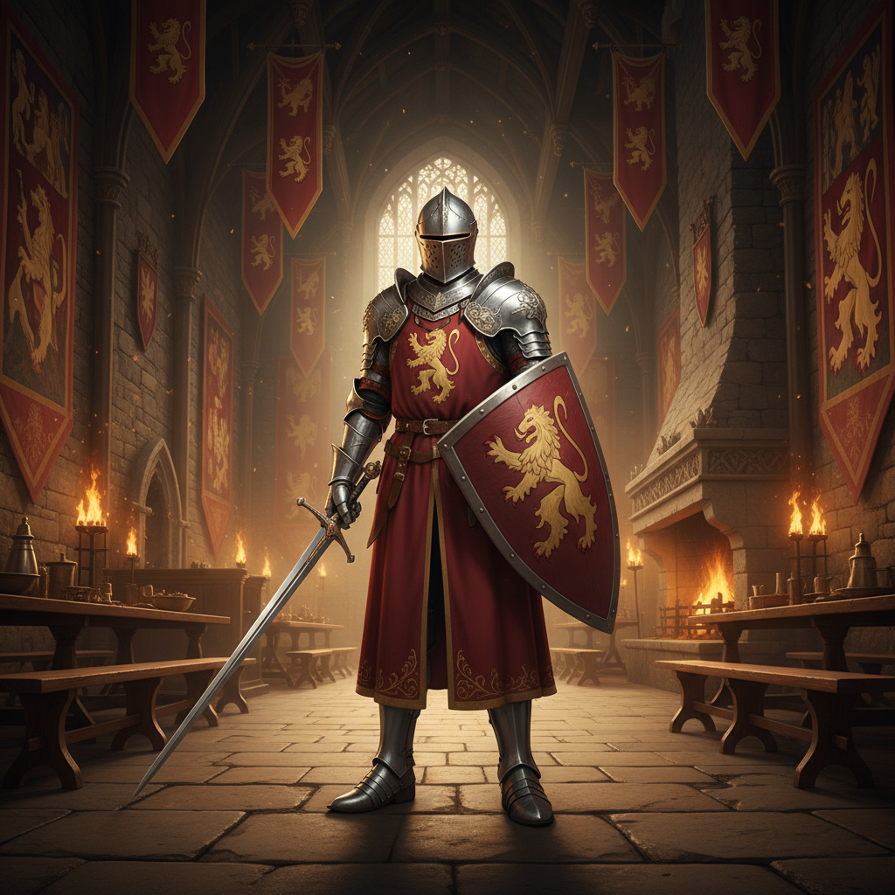

# Knightcore 骑士核



> **"银色盔甲、石砌城堡、骑士精神——中世纪的荣耀与浪漫。"**

## 概述

| 维度 | 描述 |
|------|------|
| 时期 | 2020–至今 |
| 别名 | Knightcore, Medieval Aesthetic, Chivalry Core |
| 核心色彩 | 银色、深红、金色、深蓝、石灰色 |
| 关键元素 | 盔甲、城堡、纹章、剑、石砌建筑 |
| 代表人物 | 《权力的游戏》、《指环王》、十字军 |
| 关联风格 | Dark Fantasy, Royalcore, Dark Academia, Regencycore |

---

## 历史脉络

### 从中世纪到 TikTok

| 时代 | 表现 |
|------|------|
| 500–1500 | 真实的中世纪骑士文化 |
| 1800s | 浪漫主义对中世纪的理想化 |
| 2001 | 《指环王》电影三部曲 |
| 2011 | 《权力的游戏》开播 |
| 2020 | TikTok 中世纪美学社区 |
| 2023 | Knightcore 作为正式美学名称 |

### 核心哲学

Knightcore 的精神是**"荣誉、勇气、忠诚——在混乱的世界里渴望秩序"**：
- 骑士精神 = 对"做正确的事"的渴望
- 城堡 = 安全感、归属感
- 盔甲 = 保护、力量
- 在道德模糊的时代渴望"黑白分明"
- "我愿意为信念而战"

---

## 视觉语法

### 色彩系统

```
主色：
  银色 (#C0C0C0) — 盔甲、剑
  深红 (#8B0000) — 纹章、旗帜
  金色 (#DAA520) — 王冠、装饰
  深蓝 (#000080) — 纹章、天空
  石灰 (#808080) — 城堡、石墙

辅色：
  黑色 (#000000) — 铁、阴影
  森林绿 (#228B22) — 旗帜、森林
  棕色 (#8B4513) — 皮革、木

质感：
  金属 — 盔甲、剑、盾
  石头 — 城堡、地牢
  皮革 — 护具、马鞍
  织物 — 旗帜、斗篷
  木头 — 盾牌、城门
```

### 标志性元素

| 类别 | 元素 |
|------|------|
| 装备 | 全身盔甲、剑、盾牌、长矛 |
| 建筑 | 城堡、塔楼、护城河、大厅 |
| 符号 | 纹章、十字、狮子、鹰 |
| 服装 | 锁子甲、斗篷、皮靴 |
| 场景 | 比武场、城堡大厅、森林 |
| 氛围 | 史诗、庄严、荣耀 |

---

## 与千禧怀旧的关系

### 《权力的游戏》一代
- 千禧一代成长于《指环王》和《权力的游戏》
- 中世纪美学 = 童年/青年的幻想世界
- 在"一切都不确定"的时代渴望"确定的价值观"
- 骑士精神 = 对"英雄主义"的怀念

---

## 中国语境

- 与"西方奇幻"/"中世纪"的交叉
- 中国版：武侠/仙侠 = 东方的 Knightcore
- 游戏文化（《黑暗之魂》《艾尔登法环》）的影响
- LARP（实景角色扮演）在中国的兴起

---

## 设计应用

| 场景 | 应用方式 |
|------|----------|
| 游戏 | 中世纪设定+盔甲+城堡+纹章 |
| 品牌 | 纹章+金属质感+衬线字体+庄严 |
| 空间 | 石墙+铁艺+烛光+挂毯 |
| 时尚 | 金属配饰+皮革+链条+斗篷 |

---

## 相关风格

← [Dark Fantasy 暗黑奇幻](dark-fantasy.md) | [Royalcore 皇室核](royalcore.md) →

↑ [返回千禧怀旧目录](README.md) | [返回总目录](../README.md)
