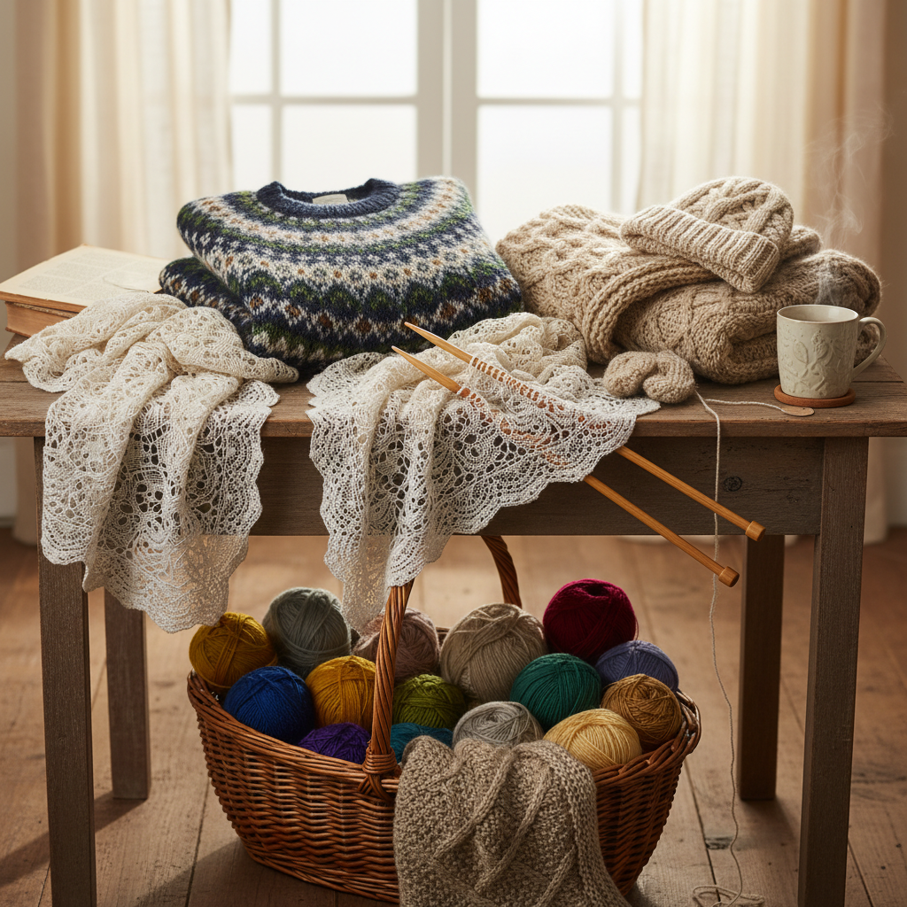

# Knitting 棒针编织

> "Knitting is the mathematics of loops — two sticks, one thread, and the patience to build fabric one stitch at a time." — Unknown

## 概述

棒针编织（Knitting）是使用两根或多根棒针（knitting needles）将纱线编织成环圈织物的手工艺。与钩针编织在任何时刻只有一个活环不同，棒针编织在针上同时保持一整排活环——通过将新环穿过旧环来逐行构建织物。棒针编织的两个基本针法——下针（knit）和上针（purl）——的组合可以创造出无穷无尽的纹理和图案。从冰岛的洛皮毛衣到费尔岛的彩色图案，棒针编织承载着丰富的文化传统。

棒针编织的哲学在于：简单规则的无限组合——仅用两种基本针法，就能创造出从简单的围巾到复杂的蕾丝披肩的一切。

## 核心特征

| 特征 | 描述 |
|------|------|
| 棒针 | 使用两根或多根棒针 |
| 环圈 | 环环相扣的结构 |
| 弹性 | 织物具有弹性 |
| 行列 | 逐行逐列的构建 |
| 图案 | 丰富的图案可能 |
| 传统 | 深厚的文化传统 |

## 视觉特征

- **纹理**：V形针迹的纹理
- **弹性**：有弹性的织物
- **色彩**：多色提花图案
- **温暖**：温暖的视觉感受
- **规律**：规律的针迹排列
- **柔软**：柔软的手感

## 代表作品

| 作品 | 艺术家 | 年代 | 意义 |
|------|--------|------|------|
| *Fair Isle patterns* | 匿名 | 传统 | 费尔岛彩色编织 |
| *Aran sweaters* | 匿名 | 传统 | 阿兰岛花样毛衣 |
| *Icelandic lopapeysa* | 匿名 | 20世纪 | 冰岛洛皮毛衣 |
| *Kaffe Fassett designs* | Kaffe Fassett | 1980s+ | 色彩大师的编织 |
| *Contemporary knit art* | Various | 当代 | 当代编织艺术 |

## 历史时间线

| 时期 | 事件 |
|------|------|
| 11世纪 | 最早的棒针编织证据（埃及） |
| 14-15世纪 | 欧洲编织行会的形成 |
| 16世纪 | 编织机的发明 |
| 19世纪 | 维多利亚时代的编织热 |
| 1960s-70s | 手工编织的复兴 |
| 当代 | Ravelry时代的全球编织社区 |

## 中国语境

棒针编织在中国有广泛的群众基础——几乎每个中国家庭都有会织毛衣的长辈。中国的手工编织传统主要集中在实用性织物（毛衣、围巾、帽子）上。改革开放前，手工编织是中国家庭的重要技能。当代中国的编织爱好者社区非常活跃——编织人生等论坛和各种社交媒体群组连接着数百万编织爱好者。中国编织者特别擅长复杂的花样设计和精细的蕾丝编织。

## AI生成概念图

## 与其他风格的关系

- **Crochet** → 钩针编织
- **Weaving** → 编织
- **Fiber Art** → 纤维艺术
- **Fair Isle** → 费尔岛编织
- **Textile Art** → 纺织艺术
- **Fashion** → 针织时装

---

*浮光艺志 | Chronicle of Artistry*
