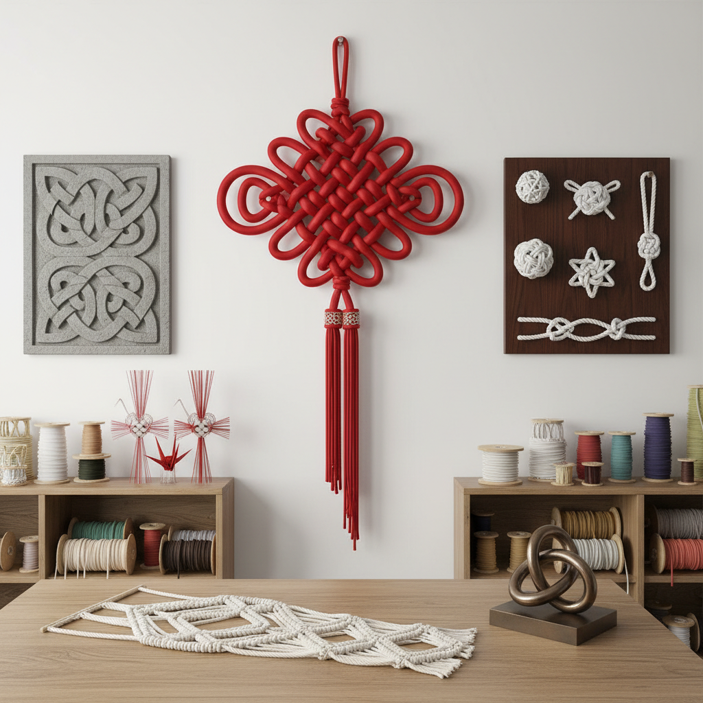

# Knot Art 绳结艺术

> "A knot is topology made tangible — a single continuous line that crosses over and under itself to create structure, strength, and beauty from nothing but its own path through space. Every knot is a puzzle, a proof, and a poem: it holds without glue, decorates without paint, and connects without welding. The art of knotting transforms the humblest of materials — a length of cord — into objects of mathematical elegance and visual splendor." — Unknown

## 概述

绳结艺术（Knot Art）是以绳结为核心的艺术创作——通过系结、编织和缠绕绳索、线绳或丝带，创造出装饰性结、功能性结和艺术性结构。绳结艺术是数学（拓扑学）、工艺和美学的交汇，在世界各文化中都有深厚的传统。

绳结艺术的实践包括：1）中国结——中国传统的装饰性绳结；2）水手结——航海传统中的功能性和装饰性绳结；3）凯尔特结——凯尔特文化中的无尽结图案；4）日本结——日本的装饰性绳结（水引、组�的）；5）宏观编结（Macramé）——用绳结技法创造的装饰品；6）数学结——基于拓扑学的结构艺术；7）当代绳结雕塑——以绳结为媒介的当代艺术。

## 核心特征

| 特征 | 描述 |
|------|------|
| 连续 | 连续不断的线条 |
| 对称 | 高度的对称性 |
| 结构 | 自我支撑的结构 |
| 数学 | 数学的拓扑关系 |
| 象征 | 丰富的象征意义 |
| 手工 | 纯手工制作 |

## 视觉特征

- **交叉**：线条的交叉穿越
- **对称**：完美的对称图案
- **重复**：重复的结构单元
- **立体**：三维的立体感
- **色彩**：彩色绳的色彩搭配
- **流畅**：流畅的曲线

## 代表作品

| 作品 | 艺术家 | 年代 | 意义 |
|------|--------|------|------|
| *中国结* | 传统 | 古代至今 | 中国传统绳结 |
| *Celtic knots* | 传统 | 中世纪至今 | 凯尔特无尽结 |
| *Sailor's knots* | 传统 | 古代至今 | 水手装饰结 |
| *Mizuhiki* | 日本传统 | 古代至今 | 日本水引 |
| *Knot sculptures* | Various | 当代 | 当代绳结雕塑 |

## 历史时间线

| 时期 | 事件 |
|------|------|
| 史前 | 人类最早的绳结使用 |
| 古代 | 各文化的装饰性绳结 |
| 中世纪 | 凯尔特结和航海结的发展 |
| 近代 | 绳结的系统化分类 |
| 当代 | 绳结作为当代艺术媒介 |

## 中国语境

绳结艺术在中国有极其深厚的文化传统。中国结是中国最具代表性的传统手工艺之一——从远古的"结绳记事"到今天的装饰艺术，绳结贯穿了中国文化的全部历史。中国结的种类极其丰富——盘长结、如意结、吉祥结、团锦结、万字结、双钱结、纽扣结等，每种结都有特定的象征意义。中国结在中国文化中象征着团圆、吉祥、如意和长寿——是春节和婚庆中不可或缺的装饰元素。中国结的编制技艺是国家级非物质文化遗产。中国当代的一些设计师将中国结元素融入现代设计——从建筑（如北京奥运会的"中国结"立交桥）到时装、珠宝和室内设计。中国结的数学结构也引起了拓扑学家的兴趣。

## AI生成概念图

## 与其他风格的关系

- **Macramé** → 宏观编结
- **Textile Art** → 纺织艺术
- **Celtic Art** → 凯尔特艺术
- **Mathematical Art** → 数学艺术
- **Rope Art** → 绳艺术
- **Chinese Traditional Craft** → 中国传统工艺

---

*浮光艺志 | Chronicle of Artistry*
