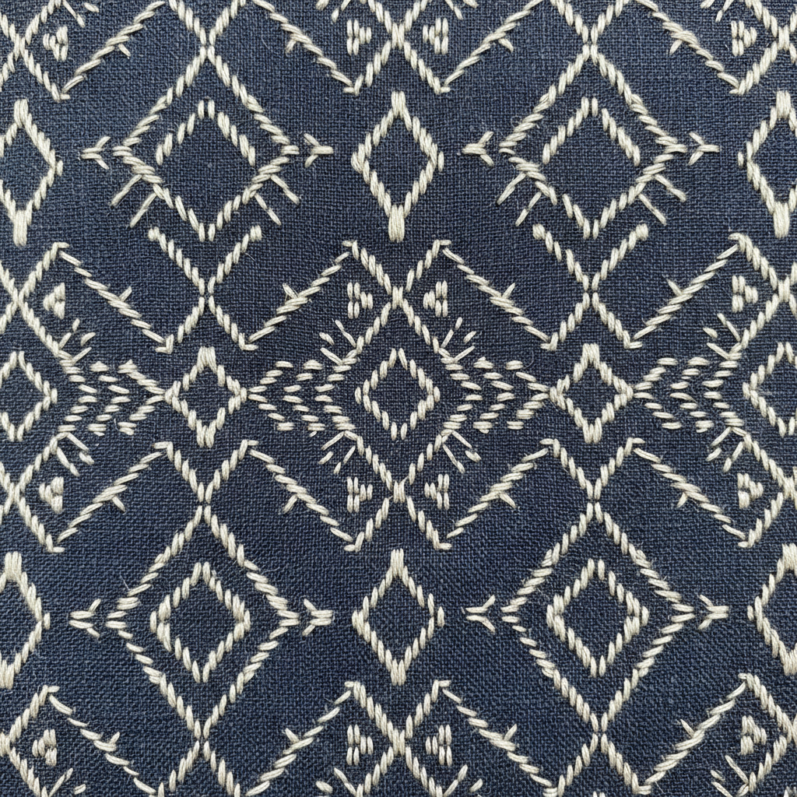

# Kogin Art 津轻小巾刺绣艺术

> "Kogin is geometry born of necessity — farmers' wives in northern Japan stitched horizontal running stitches through the warp of coarse hemp cloth, counting odd numbers of threads to build diamond and arrow patterns that insulated against bitter winters. What began as reinforcement became art, each modoko motif carrying a name drawn from nature: cat's paw, bamboo knot, butterfly wing." — Unknown

## 概述

津轻小巾刺绣艺术（Kogin Art）是日本青森县津轻地区的传统刺绣技法——通过在粗麻布的经线上进行水平方向的计数刺绣，以奇数线为单位创造几何图案。小巾刺绣（こぎん刺し）最初是为了加固和保暖粗糙的麻布衣物，后来发展为独特的装饰艺术，以其精密的几何图案（模様/modoko）著称。

津轻小巾刺绣艺术的实践包括：1）计数刺绣——以奇数经线为单位的水平刺绣；2）模样（Modoko）——传统的几何图案单元；3）总刺（Sou-zashi）——全面覆盖的刺绣；4）色彩——传统的白线蓝布配色；5）图案组合——多个模样的组合设计；6）现代应用——将传统图案应用于现代产品；7）当代小巾——将传统技法与现代设计结合的创作。

## 核心特征

| 特征 | 描述 |
|------|------|
| 几何 | 精密的几何图案 |
| 计数 | 奇数线计数规则 |
| 水平 | 水平方向的针法 |
| 保暖 | 起源于保暖需求 |
| 津轻 | 青森县津轻地区 |
| 对称 | 严格的对称设计 |

## 视觉特征

- **几何**：精密的菱形和箭头图案
- **对称**：严格的轴对称
- **密集**：密集覆盖的针脚
- **对比**：白线蓝布的经典对比
- **规律**：数学般的规律性
- **质朴**：质朴自然的美感

## 代表作品

| 作品 | 艺术家/文化 | 年代 | 意义 |
|------|-------------|------|------|
| *Traditional kogin garments* | 津轻 | 江户时代 | 传统小巾衣物 |
| *Modoko pattern collections* | 津轻 | 传统 | 模样图案集 |
| *Kogin-zashi samplers* | 津轻 | 传统 | 小巾刺绣样品 |
| *Contemporary kogin* | 日本 | 当代 | 当代小巾设计 |
| *Kogin accessories* | 日本 | 当代 | 小巾刺绣配饰 |

## 历史时间线

| 时期 | 事件 |
|------|------|
| 江户时代 | 津轻小巾刺绣的起源 |
| 明治时代 | 棉布普及后的衰落 |
| 昭和时代 | 民艺运动中的再发现 |
| 1960年代 | 作为传统工艺的保护 |
| 当代 | 小巾刺绣的现代化复兴 |

## 中国语境

津轻小巾刺绣与中国的一些传统刺绣有相似的起源和美学。中国的挑花绣（如苗族挑花）同样是计数刺绣——在布料经纬线上按规律创造几何图案。中国北方的补花和加固刺绣——与小巾刺绣的实用起源相似。中国的少数民族刺绣中，许多几何图案的刺绣——与小巾刺绣的美学有共鸣。中国当代的手工爱好者群体中，小巾刺绣（kogin）作为一种日本传统手工——正在获得关注。中国的纤维艺术教育中，小巾刺绣作为东亚计数刺绣的代表——在比较研究中被提及。

## AI生成概念图

## 与其他风格的关系

- **Sashiko** → 刺子绣
- **Geometric Art** → 几何艺术
- **Folk Art** → 民间艺术
- **Counted Thread** → 计数刺绣
- **Textile Art** → 纺织艺术
- **Japanese Craft** → 日本工艺

---

*浮光艺志 | Chronicle of Artistry*
