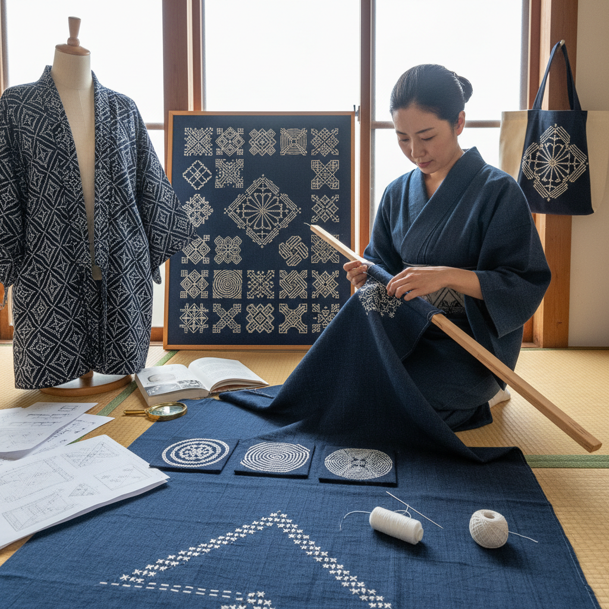

# Kogin Sashiko 津轻刺子绣

> "Kogin is counting made beautiful — odd numbers of threads picked up on a needle across the warp of coarse linen, each row a mathematical sequence that builds into diamond patterns so precise they seem machine-made, yet every stitch was placed by hand in the dim light of a northern Japanese farmhouse to keep the cold at bay." — Unknown

## 概述

津轻刺子绣（Kogin-zashi/こぎん刺し）是日本青森县津轻地区特有的一种计数线刺绣（counted thread embroidery）。与普通刺子绣（sashiko）的自由平针不同，Kogin严格按照织物的经纬线计数——针只在奇数根经线上穿过（1、3、5、7...），形成精确的几何菱形图案。

Kogin起源于江户时代（17-19世纪）的津轻地区——当时的农民被禁止穿棉布，只能穿粗麻布。为了保暖，妇女们用棉线在粗麻布上密密地刺绣，填满织物的间隙以抵御严寒。这种实用的需求催生了精美的几何图案——传统的Kogin图案（模様/moyō）有数百种，每种都有名称和寓意。Kogin的图案全部基于奇数计数规则，形成独特的菱形对称美学。

## 核心特征

| 特征 | 描述 |
|------|------|
| 计数 | 严格的计数线技法 |
| 奇数 | 奇数经线规则 |
| 菱形 | 菱形几何图案 |
| 保暖 | 填充保暖功能 |
| 精确 | 极其精确的针法 |
| 地方 | 津轻地区特有 |

## 视觉特征

- **菱形**：精确的菱形图案
- **对称**：严格的对称美
- **密集**：密集的刺绣覆盖
- **几何**：数学般的几何感
- **素雅**：传统白线蓝布
- **精密**：精密的计数美感

## 代表作品

| 作品 | 艺术家 | 年代 | 意义 |
|------|--------|------|------|
| *Traditional kogin garments* | 津轻农妇 | 江户时代 | 传统津轻刺子衣 |
| *Kogin pattern collections* | Various | 明治-昭和 | 图案收集保存 |
| *Contemporary kogin art* | Various | 当代 | 当代津轻刺子艺术 |
| *Kogin accessories* | Various | 当代 | 津轻刺子配饰 |
| *Modern kogin design* | Various | 当代 | 现代设计应用 |

## 历史时间线

| 时期 | 事件 |
|------|------|
| 江户时代 | 津轻地区Kogin的起源 |
| 明治时代 | Kogin的衰落 |
| 昭和时代 | 民艺运动对Kogin的保护 |
| 1960年代 | Kogin的学术研究和复兴 |
| 当代 | Kogin的全球传播和创新 |

## 中国语境

津轻刺子绣在中国的手工刺绣社区中有一定的知名度——中国的刺绣爱好者通过日本手工书籍和社交媒体了解Kogin。中国的手工材料市场上有Kogin专用的粗织布和图案集。中国传统的计数线刺绣（如十字绣的某些变体）与Kogin有技法上的相似性。中国的一些手工工作室开设Kogin课程。Kogin的几何美学与中国传统的几何纹样（如回纹、万字纹）有审美上的共鸣。

## AI生成概念图

## 与其他风格的关系

- **Sashiko** → 刺子绣
- **Counted Thread** → 计数线刺绣
- **Cross Stitch** → 十字绣
- **Hardanger** → 哈当厄尔刺绣
- **Geometric Art** → 几何艺术
- **Folk Art** → 民间艺术

---

*浮光艺志 | Chronicle of Artistry*
