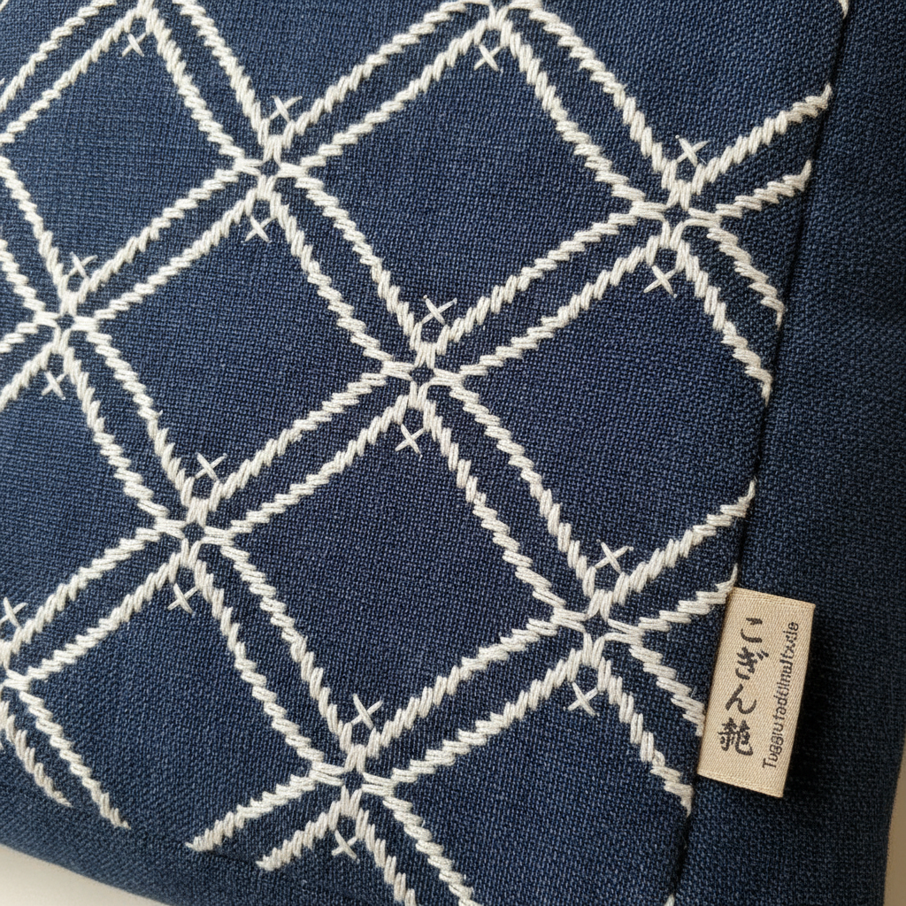

# Kogin-zashi こぎん刺し | 津軽こぎん

> **"雪国的几何——津轻农妇在粗麻布上用白线刺出比雪花更精密的菱形图案。"**

## 概述

こぎん刺し（Kogin-zashi / 津軽こぎん）是日本青森县津轻地区的传统刺绣艺术，农妇在粗麻布（麻の布）上用白色棉线以计数针法（counting thread）刺出精密的几何图案。这种技法诞生于江户时代的贫困——津轻藩禁止农民穿棉衣，农妇只能在粗糙的麻布上刺绣来增加保暖性和耐久性。白线在蓝染麻布上形成的菱形图案（モドコ modoko）有200多种基本单元，可以无限组合。

## 核心特征

- **计数针法**：数经纬线的精确刺绣
- **奇数规则**：只刺奇数根经线
- **菱形基本单元**：モドコ（modoko）
- **蓝白配色**：蓝染麻布+白棉线
- **保暖功能**：增加织物厚度
- **200+基本图案**：可无限组合

## 常见モドコ（基本单元）

| 名称 | 特征 |
|------|------|
| 花こ | 花形 |
| 豆こ | 豆形 |
| 猫の足 | 猫爪形 |
| 梅の花 | 梅花形 |
| 竹の節 | 竹节形 |
| 石畳 | 棋盘形 |

## 视觉特征

- 蓝底白线的经典配色
- 精密的菱形几何图案
- 计数针法的规律节奏
- 粗麻布的质朴质感
- 雪花般的对称美
- 密集刺绣的厚重感

## 与其他风格的关系

| 风格 | 关系 |
|------|------|
| Sashiko刺子绣 | 共享日本刺绣传统 |
| Boro襤褸 | 共享北方贫困美学 |
| 北欧刺绣 | 共享计数针法 |
| 当代刺绣 | こぎん的现代复兴 |
| 像素艺术 | 共享网格构成 |

## 概念图

---

*浮光艺志 | Chronicle of Artistry*
