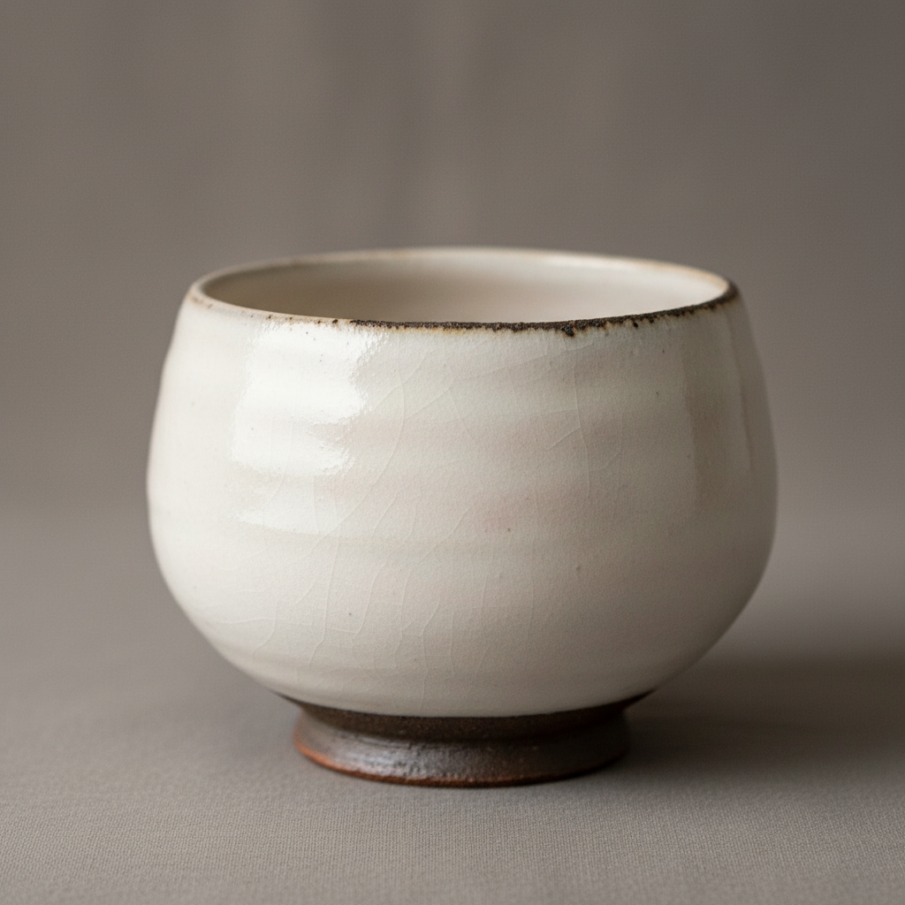

# Kohiki Art 粉引艺术

> "Kohiki is snow fallen on dark earth — a thick coat of white slip dipped or poured over iron-rich clay, then covered with transparent glaze and fired until the white develops a soft, powdery warmth that glows from within, the dark body occasionally peeking through cracks and edges like soil beneath winter's first frost, creating vessels of quiet, luminous beauty." — Unknown

## 概述

粉引艺术（Kohiki Art）是一种将深色坯体浸入或浇淋白色化妆土（白泥浆），再施透明釉烧制的陶瓷技法。粉引以其柔和温暖的白色表面著称——厚厚的白色化妆土层在烧制后呈现出粉质的、从内部发光的温暖白色，边缘和裂缝处透出深色坯体，形成含蓄而丰富的视觉效果。粉引在韩国李朝和日本茶道中都占有重要地位。

粉引艺术的核心要素包括：1）白色化妆土——厚层白泥浆覆盖；2）浸泡法——将坯体浸入化妆土中；3）深色坯体——铁质丰富的深色粘土；4）透明釉——化妆土上覆盖透明釉；5）粉质感——柔和温暖的粉状白色；6）边缘露胎——边缘处透出的深色；7）温润光泽——内敛含蓄的光泽。

## 核心特征

| 特征 | 描述 |
|------|------|
| 粉质白色 | 柔和温暖的粉状白色表面 |
| 厚化妆土 | 厚层白色化妆土覆盖 |
| 边缘露胎 | 边缘透出的深色坯体 |
| 内发光感 | 从内部发出的温暖光泽 |
| 含蓄美 | 内敛而丰富的视觉效果 |
| 触感温润 | 柔和舒适的触感 |

## 视觉特征

- **温暖白色**：柔和的粉质白色
- **深色边缘**：边缘露出的铁色坯体
- **微妙变化**：白色中的细微色调变化
- **粉质肌理**：粉状的表面质感
- **内敛光泽**：含蓄的温润光泽
- **自然裂纹**：化妆土的自然开裂

## 代表作品

| 作品 | 艺术家/文化 | 年代 | 意义 |
|------|-------------|------|------|
| *李朝粉引茶碗* | 韩国李朝 | 15-16世纪 | 韩国粉引的原型 |
| *粉引茶碗（三好）* | 日本传世 | 16世纪 | 日本茶道名碗 |
| *滨田庄司粉引作品* | 滨田庄司 | 20世纪 | 民艺运动中的粉引 |
| *李秉昌粉引* | 李秉昌 | 20世纪 | 韩国现代粉引 |
| *当代粉引* | 各地陶艺家 | 当代 | 粉引的现代演绎 |

## 历史时间线

| 时期 | 事件 |
|------|------|
| 李朝初期 | 韩国粉引技法的成熟 |
| 15-16世纪 | 粉引茶碗传入日本 |
| 桃山时代 | 日本茶人珍视粉引茶碗 |
| 20世纪 | 民艺运动推广粉引美学 |
| 当代 | 粉引在国际陶艺中的广泛应用 |

## 中国语境

粉引技法与中国北方陶瓷的化妆土传统有直接渊源。中国磁州窑系统的白化妆土技术——在粗糙的深色坯体上施白色化妆土再施透明釉——是粉引技法的技术源头。中国定窑的白瓷追求纯净均匀的白色，而粉引则保留了化妆土的不均匀和坯体的透出，形成了不同的美学取向。在中国当代陶艺中，粉引作为一种温暖含蓄的装饰手法受到越来越多的关注。粉引所体现的"不完美中的完美"与中国文人审美中对"天然去雕饰"的追求相呼应。

## AI生成概念图

## 与其他风格的关系

- **Hakeme** → 刷毛目
- **Mishima** → 三岛手
- **Buncheong** → 粉青沙器
- **White Slip** → 白化妆土
- **Tea Ceremony** → 茶道
- **Mingei** → 民艺运动

---

*浮光艺志 | Chronicle of Artistry*
