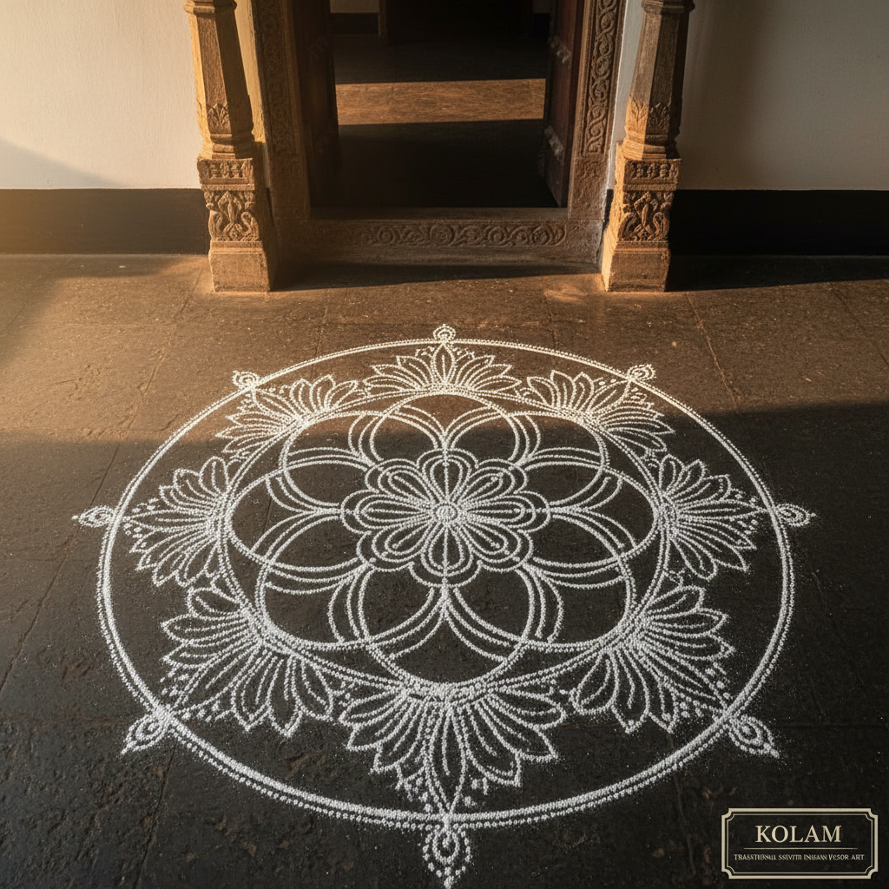

# Kolam 科拉姆图案

> "A kolam is a prayer drawn on the earth — an offering of beauty to the morning." — Unknown

## 概述

科拉姆（Kolam）是南印度的传统地面装饰艺术——每天清晨，女性用米粉或石灰粉在门前的地面上绘制精美的几何图案。这些图案通常基于点阵网格，用连续的曲线连接各点形成对称的花纹。科拉姆不仅是装饰，更是一种日常的精神实践——它是对大地的祝福、对来客的欢迎、对宇宙秩序的视觉冥想。

科拉姆的哲学在于它的短暂性——每天画、每天被脚步和风抹去，明天再重新画。这种日复一日的创造和消逝是对无常的接受和对当下的珍视。

## 核心特征

| 特征 | 描述 |
|------|------|
| 地面 | 在地面上绘制 |
| 粉末 | 使用米粉或石灰粉 |
| 几何 | 基于几何和点阵 |
| 对称 | 高度对称的图案 |
| 短暂 | 每天重新绘制 |
| 仪式 | 具有精神和仪式意义 |

## 视觉特征

- **点阵**：基于规则点阵的结构
- **曲线**：连续流畅的曲线
- **对称**：多轴对称的图案
- **白色**：白色粉末在深色地面上
- **复杂**：从简单到极其复杂
- **有机**：花卉和自然元素

## 代表作品

| 作品 | 艺术家 | 年代 | 意义 |
|------|--------|------|------|
| *Traditional kolams* | 匿名女性 | 传统 | 日常科拉姆 |
| *Pongal kolams* | 匿名 | 传统 | 丰收节大型科拉姆 |
| *Sikku kolam* | 匿名 | 传统 | 连续线科拉姆 |
| *Competition kolams* | Various | 当代 | 科拉姆比赛作品 |
| *Contemporary kolam art* | Various | 2000s+ | 当代科拉姆艺术 |

## 历史时间线

| 时期 | 事件 |
|------|------|
| 古代 | 南印度的早期地面装饰 |
| 传统 | 代代相传的女性艺术 |
| 殖民时期 | 科拉姆作为文化抵抗 |
| 20世纪 | 科拉姆的学术研究 |
| 当代 | 科拉姆的全球认知 |
| 数学研究 | 科拉姆与图论的关系 |

## 中国语境

科拉姆在中国主要作为印度文化的一部分被了解。中国传统中也有类似的地面装饰传统——如春节时在门前撒石灰画图案。科拉姆的几何美学与中国传统的窗花剪纸有结构上的相似。当代中国的数学艺术和算法艺术研究者对科拉姆的数学结构有浓厚兴趣。

## AI生成概念图

## 与其他风格的关系

- **Rangoli** → 北印度的彩色地面装饰
- **Mandala** → 曼陀罗与科拉姆有对称相似
- **Islamic Geometry** → 伊斯兰几何与科拉姆有数学相通
- **Sand Art** → 沙画与科拉姆有短暂性相似
- **Mathematical Art** → 科拉姆的数学结构
- **Ephemeral Art** → 短暂艺术的代表

---

*浮光艺志 | Chronicle of Artistry*
