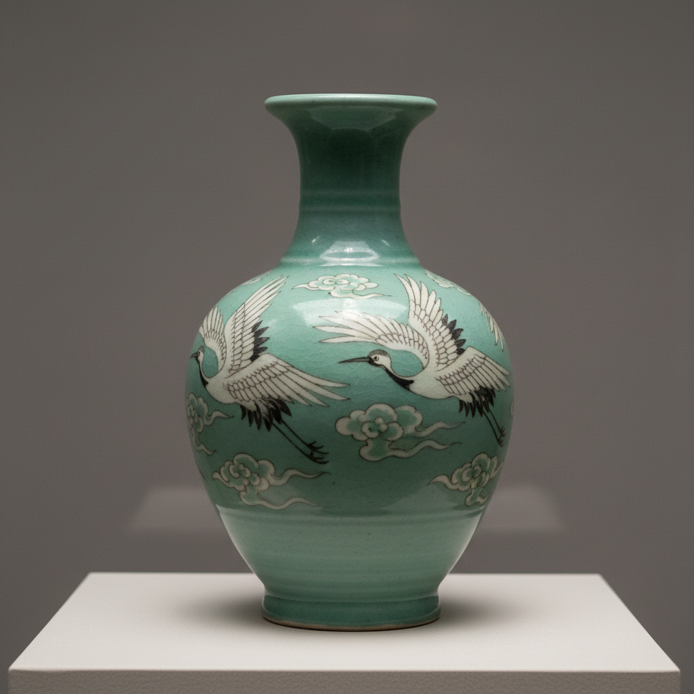

# Korean Celadon Art 高丽青瓷艺术

> "Korean celadon is jade made from earth — a luminous blue-green glaze of extraordinary depth and purity developed during the Goryeo dynasty that Chinese connoisseurs themselves praised as 'first under heaven,' distinguished by the invention of sanggam inlay where white and black slip are pressed into carved channels to create patterns visible beneath the translucent glaze, a technique unique to Korea that elevates celadon from monochrome to narrative." — Unknown

## 概述

高丽青瓷艺术（Korean Celadon Art）是朝鲜半岛高丽王朝（918-1392年）时期发展的一种极其精美的青瓷艺术。高丽青瓷以其独特的翡翠色釉和创新的镶嵌（象嵌/상감）技法著称——其釉色被中国宋代文人太平老人赞为"天下第一"。高丽青瓷在吸收中国越窑和汝窑技术的基础上，发展出了独特的韩国风格——特别是象嵌青瓷（镶嵌青瓷）是高丽独创的技法。

高丽青瓷艺术的核心要素包括：1）翡翠色釉——独特的翡翠绿色釉；2）象嵌技法——白黑泥镶嵌装饰；3）高丽王朝——高丽时期的巅峰；4）中国影响——受越窑汝窑影响；5）独创发展——发展出独特风格；6）贵族文化——高丽贵族的审美；7）造型优雅——优雅的器形设计。

## 核心特征

| 特征 | 描述 |
|------|------|
| 翡翠色釉 | 独特翡翠绿色釉 |
| 象嵌技法 | 白黑泥镶嵌装饰 |
| 高丽王朝 | 高丽时期巅峰 |
| 中国影响 | 受越窑汝窑影响 |
| 独创发展 | 发展出独特风格 |
| 贵族文化 | 高丽贵族审美 |

## 视觉特征

- **翡翠色**：深沉的翡翠绿色
- **镶嵌纹样**：白黑泥的镶嵌图案
- **鹤云纹**：经典的鹤与云纹样
- **造型优雅**：优雅流畅的器形
- **釉面温润**：温润如玉的釉面
- **细腻质感**：精细的胎体质感

## 代表作品

| 作品 | 艺术家/文化 | 年代 | 意义 |
|------|-------------|------|------|
| *象嵌青瓷云鹤纹梅瓶* | 高丽 | 12世纪 | 韩国国宝 |
| *翡色青瓷* | 高丽 | 11-12世纪 | 纯色青瓷巅峰 |
| *象嵌青瓷菊花纹碗* | 高丽 | 12世纪 | 镶嵌技法精品 |
| *青瓷狮子香炉* | 高丽 | 12世纪 | 造型青瓷 |
| *象嵌青瓷柳纹净瓶* | 高丽 | 12-13世纪 | 佛教器物 |

## 历史时间线

| 时期 | 事件 |
|------|------|
| 10世纪 | 高丽青瓷的起源 |
| 11世纪 | 纯色青瓷的成熟 |
| 12世纪 | 象嵌青瓷的发明和巅峰 |
| 13世纪 | 蒙古入侵后的衰落 |
| 当代 | 高丽青瓷的复兴和研究 |

## 中国语境

高丽青瓷与中国青瓷有深厚的渊源关系。高丽青瓷的技术源自中国越窑——10世纪时高丽工匠学习了越窑的青瓷烧造技术，并在此基础上发展出了自己的风格。中国宋代文献《袖中锦》中太平老人将"高丽秘色"列为"天下第一"——这是对高丽青瓷品质的最高赞誉。高丽青瓷的翡翠色釉与中国汝窑的天青色有相似之处——但高丽青瓷的色调更偏绿色，带有独特的翡翠质感。高丽独创的象嵌（镶嵌）技法是对中国青瓷传统的重要创新——这种在坯体上刻出图案再填入白色或黑色泥料的技法，使青瓷从单色装饰走向了图案装饰。高丽青瓷证明了东亚陶瓷文化圈内的技术传播和创新——中国的技术种子在朝鲜半岛开出了独特的花朵。

## AI生成概念图

## 与其他风格的关系

- **Chinese Celadon** → 中国青瓷
- **Yue Ware** → 越窑
- **Ru Ware** → 汝窑
- **Buncheong** → 粉青沙器
- **Sanggam Inlay** → 象嵌技法
- **Goryeo Dynasty** → 高丽王朝

---

*浮光艺志 | Chronicle of Artistry*
