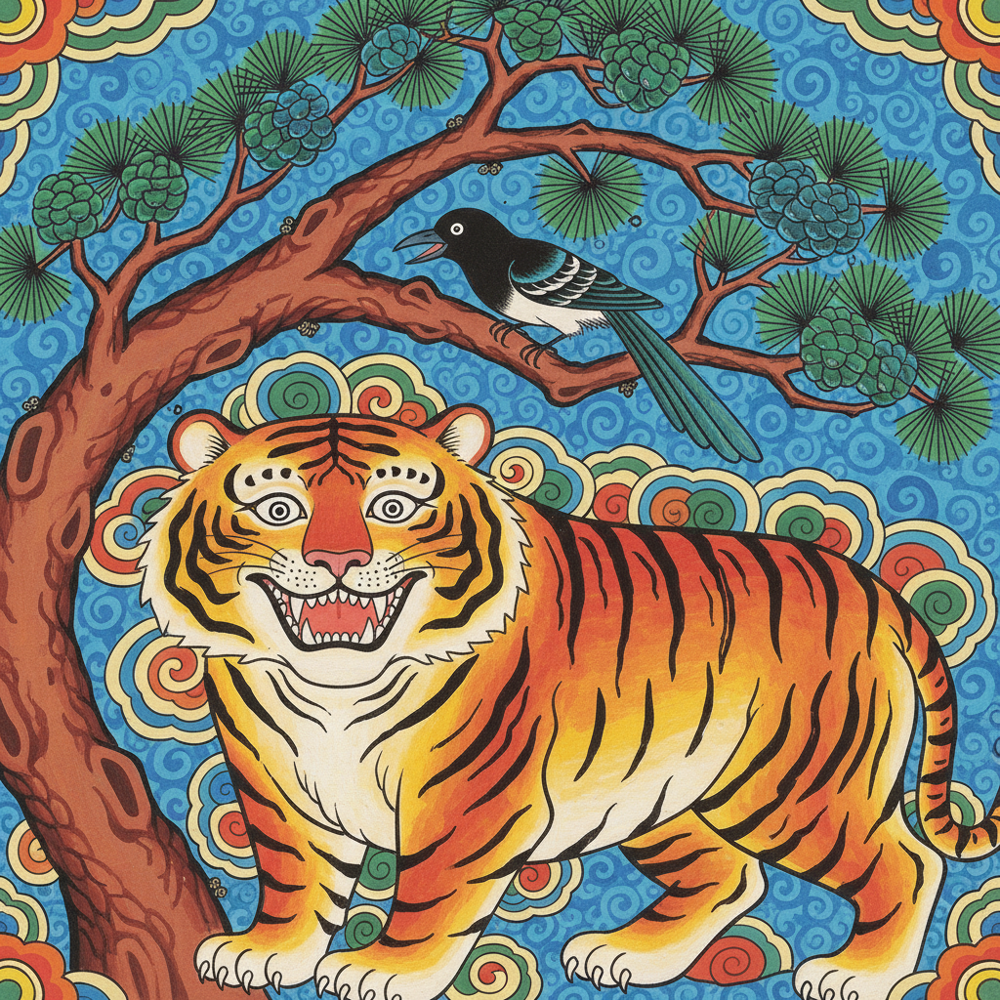

# Korean Minhwa 韩国民画 | 민화

> **"无名画工的宇宙——虎笑、鹊鸣、十长生永驻。"**

## 概述

韩国民画（민화 / Minhwa）是朝鲜王朝（1392–1897）时期由民间无名画工创作的装饰性绘画传统。与宫廷画院的精英绘画不同，民画以其大胆的色彩、天真的造型、幽默的想象力和吉祥寓意，服务于普通百姓的日常生活——装饰房间、祈求福寿、驱邪避灾。它是韩国视觉文化中最具生命力和民族特色的传统之一。

## 主要题材

| 题材 | 含义 |
|------|------|
| 虎与鹊 (호작도) | 驱邪镇宅，虎常被画得憨态可掬 |
| 十长生 (십장생) | 鹤、鹿、龟、松、竹、水、云、石、日、灵芝——长寿象征 |
| 牡丹 (모란도) | 富贵荣华 |
| 文字图 (문자도) | 孝、悌、忠、信等汉字与图像融合 |
| 书架图 (책거리) | 书籍、文房四宝的静物——学问与教养 |
| 花鸟图 (화조도) | 夫妻和睦、多子多福 |
| 山水图 | 理想化的桃源仙境 |
| 鱼虾图 | 科举及第（鱼跃龙门） |

## 核心特征

- **无名性**：画工不署名，是集体传统而非个人表达
- **吉祥寓意**：每个图像都承载祝福和祈愿
- **大胆色彩**：五方色（青赤黄白黑）的鲜艳运用
- **天真造型**：不追求写实，追求生动和趣味
- **幽默感**：虎被画成笑脸猫般的形象
- **装饰功能**：屏风、门画、嫁妆画等实用场景

## 视觉特征

- 鲜艳饱和的矿物色彩
- 平面化构图，无透视深度
- 粗犷有力的轮廓线
- 动物的拟人化、漫画化表现
- 文字与图像的创意融合
- 对称式构图（屏风成对）

## 与其他风格的关系

| 风格 | 关系 |
|------|------|
| 中国年画 | 共享吉祥寓意和民间传统 |
| 日本浮世绘 | 同为东亚民间视觉文化 |
| 墨西哥民间艺术 | 共享鲜艳色彩和天真造型 |
| Art Brut | 共享"局外人"的自由表达 |
| 当代韩国设计 | 民画元素被大量运用于现代设计 |
| Pop Art | 共享大胆色彩和通俗性 |

## 当代复兴

- 韩国当代艺术家重新诠释民画传统
- K-pop 和韩国品牌设计中的民画元素
- 民画风格的文创产品和插画
- 被视为韩国文化身份的重要载体

## 概念图

---

*浮光艺志 | Chronicle of Artistry*
