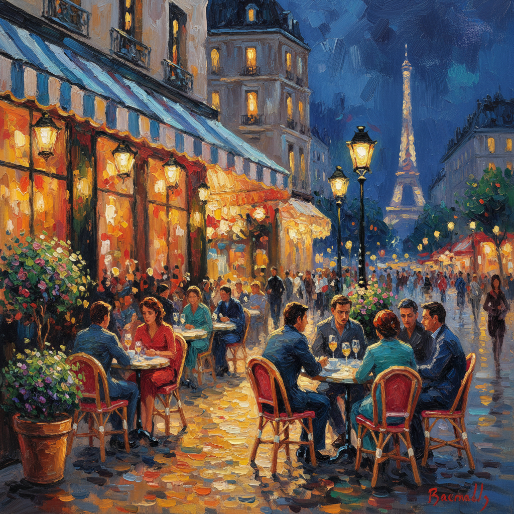

# Korovin Art 科罗文艺术

> "Color is joy. Color is the sun." — Konstantin Korovin

## 概述

科罗文艺术（Korovin Art）是19-20世纪之交俄罗斯画家康斯坦丁·阿列克谢耶维奇·科罗文（Konstantin Alexeyevich Korovin, 1861-1939）创立的俄罗斯印象主义绑画风格。科罗文被誉为"俄罗斯印象主义之父"——他是第一个将法国印象派的光色理念系统性地引入俄罗斯绑画的画家。他的作品充满了色彩的欢乐和光线的诗意——巴黎的咖啡馆、克里米亚的阳光、北方的雪景都在他笔下焕发出绚丽的色彩。

科罗文不仅是杰出的画家，还是俄罗斯最伟大的舞台设计师之一——他为莫斯科大剧院和马蒙托夫私人歌剧院设计了大量舞台布景和服装，将印象派的色彩理念引入了戏剧艺术。他的画作《巴黎咖啡馆》系列以自由奔放的笔触和明亮的色彩捕捉了巴黎夜生活的魅力。

科罗文艺术的核心要素包括：1）色彩至上——色彩作为绑画的核心语言；2）印象主义——法国印象派的俄罗斯化；3）光线诗意——对光线效果的敏感捕捉；4）自由笔触——奔放而充满活力的笔触；5）舞台艺术——绑画与戏剧的融合；6）生活情趣——对生活之美的热爱；7）装饰性——色彩的装饰性表达。

## 核心特征

| 特征 | 描述 |
|------|------|
| 色彩至上 | 色彩作为核心语言 |
| 印象主义 | 法国印象派俄罗斯化 |
| 光线诗意 | 光线效果敏感捕捉 |
| 自由笔触 | 奔放充满活力笔触 |
| 舞台艺术 | 绑画与戏剧融合 |
| 装饰性 | 色彩装饰性表达 |

## 视觉特征

- **明亮色彩**：高度饱和的明亮色彩
- **自由笔触**：快速而自由的笔触
- **光影闪烁**：闪烁的光影效果
- **夜景灯光**：巴黎夜景中的灯光
- **花卉静物**：色彩绚丽的花卉
- **北方雪景**：银白色的北方风景

## 代表作品

| 作品 | 年代 | 意义 |
|------|------|------|
| *巴黎咖啡馆* (Paris Cafe) | 1890年代 | 印象主义代表 |
| *冬天* (Winter) | 1894 | 北方风景 |
| *玫瑰与紫罗兰* (Roses and Violets) | 1912 | 色彩的欢乐 |
| *在阳台上* (On the Terrace) | 1910年代 | 外光画 |
| *北方田园诗* (Northern Idyll) | 1886 | 早期杰作 |
| *鱼、酒与水果* (Fish, Wine and Fruit) | 1916 | 静物画 |

## 历史时间线

| 时期 | 事件 |
|------|------|
| 1861年 | 出生于莫斯科 |
| 1875-1886年 | 就读莫斯科绘画学校 |
| 1880年代 | 加入马蒙托夫艺术圈 |
| 1890年代 | 多次赴巴黎，确立印象主义风格 |
| 1900-1917年 | 舞台设计和绑画创作巅峰 |
| 1923年 | 移居巴黎 |
| 1939年 | 在巴黎去世 |

## 中国语境

科罗文在中国美术教育中代表了俄罗斯绑画从严格写实向色彩表现过渡的关键环节。他的印象主义方法——强调色彩的独立表现力和光线的诗意——为中国油画家提供了一种超越苏派严格写实的可能路径。中国改革开放后，许多画家开始重新审视印象主义的价值——科罗文作为俄罗斯印象主义的代表，成为连接中国画家熟悉的俄罗斯传统与法国印象派之间的桥梁。他"色彩就是欢乐"的理念也启发了中国当代油画对色彩表现力的追求。科罗文的舞台设计工作还展示了绑画艺术与其他艺术形式融合的可能性。

## 概念图

## 与其他风格的关系

- **Impressionism** → 印象主义
- **Serov** → 谢洛夫（同学和挚友）
- **Levitan** → 列维坦（同学）
- **Monet** → 莫奈（法国印象派）
- **Art Nouveau** → 新艺术运动
- **Mir Iskusstva** → 艺术世界派

---

*浮光艺志 | Chronicle of Artistry*
