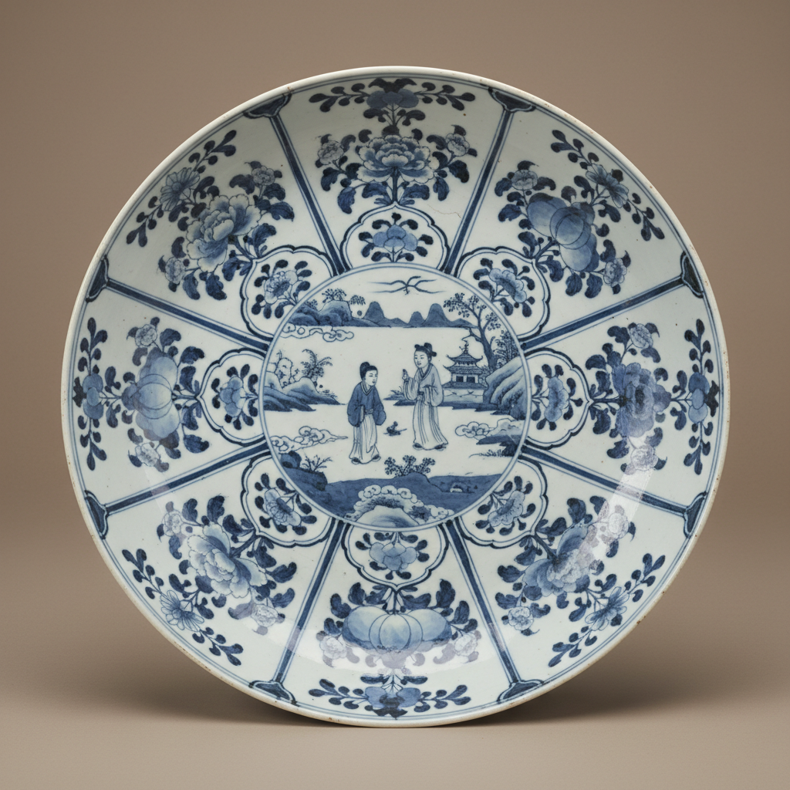

# Kraak Porcelain Art 克拉克瓷艺术

> "Kraak porcelain is China's first global export — blue-and-white dishes with paneled borders radiating like petals around a central scene, made in Jingdezhen for Portuguese carracks that carried them to Lisbon, Amsterdam, and beyond, the first Chinese ceramics to reach Europe in commercial quantities, their distinctive paneled design becoming synonymous with Oriental luxury in the Western imagination." — Unknown

## 概述

克拉克瓷艺术（Kraak Porcelain Art）是16-17世纪中国景德镇为欧洲市场生产的一种外销青花瓷。克拉克瓷（Kraak）得名于葡萄牙大帆船"Carrack"——这些瓷器通过葡萄牙和荷兰的贸易船队运往欧洲。克拉克瓷以其独特的开光（paneled）装饰风格著称——盘面被分割成多个放射状的开光区域，每个开光内绘有花卉、果实、昆虫或风景图案。

克拉克瓷艺术的核心要素包括：1）开光装饰——放射状的开光分区；2）青花绘制——钴蓝色的青花装饰；3）外销定制——为欧洲市场定制；4）薄胎轻巧——胎体较薄较轻；5）图案程式化——标准化的装饰图案；6）贸易瓷——大规模贸易商品；7）文化交流——中西文化交流的载体。

## 核心特征

| 特征 | 描述 |
|------|------|
| 开光装饰 | 放射状开光分区 |
| 青花绘制 | 钴蓝色青花装饰 |
| 外销定制 | 为欧洲市场定制 |
| 薄胎轻巧 | 胎体较薄较轻 |
| 图案程式化 | 标准化装饰图案 |
| 贸易瓷 | 大规模贸易商品 |

## 视觉特征

- **开光分区**：放射状的开光边框
- **青花蓝白**：经典的蓝白配色
- **花卉图案**：花卉、果实、昆虫
- **中心图案**：中心的主题图案
- **边饰丰富**：丰富的边饰装饰
- **盘碟为主**：以大盘大碟为主

## 代表作品

| 作品 | 艺术家/文化 | 年代 | 意义 |
|------|-------------|------|------|
| *万历克拉克盘* | 景德镇 | 1573-1620年 | 经典克拉克瓷 |
| *圣卡塔琳娜号瓷器* | 景德镇 | 1602年 | 荷兰缴获的货物 |
| *哈彻沉船瓷器* | 景德镇 | 17世纪 | 海底打捞瓷器 |
| *克拉克瓷碗* | 景德镇 | 16-17世纪 | 碗形克拉克瓷 |
| *克拉克瓷瓶* | 景德镇 | 16-17世纪 | 瓶形克拉克瓷 |

## 历史时间线

| 时期 | 事件 |
|------|------|
| 1557年 | 葡萄牙在澳门建立贸易站 |
| 1570年代 | 克拉克瓷大规模生产 |
| 1602年 | 荷兰缴获圣卡塔琳娜号 |
| 17世纪中 | 明清交替导致生产中断 |
| 17世纪末 | 日本伊万里瓷替代 |

## 中国语境

克拉克瓷是中国陶瓷外销史上的重要篇章。明代万历年间（1573-1620年），景德镇为满足欧洲市场的巨大需求，大规模生产这种开光式青花瓷器。克拉克瓷的生产反映了当时全球贸易的繁荣——中国瓷器通过海上丝绸之路运往世界各地。克拉克瓷虽然在中国国内不被视为高档瓷器——它们是为出口而批量生产的商品瓷——但在欧洲却被视为珍贵的东方奢侈品。克拉克瓷的开光装饰风格对欧洲陶瓷产生了深远影响——荷兰代尔夫特陶器和日本伊万里瓷都模仿了克拉克瓷的风格。近年来，随着海底沉船的打捞，大量克拉克瓷重见天日——这些瓷器为研究明代外销瓷和海上贸易提供了珍贵的实物资料。

## AI生成概念图

## 与其他风格的关系

- **Blue and White** → 青花瓷
- **Export Porcelain** → 外销瓷
- **Armorial Porcelain** → 纹章瓷
- **Delftware** → 代尔夫特陶
- **Imari** → 伊万里
- **Maritime Trade** → 海上贸易

---

*浮光艺志 | Chronicle of Artistry*
