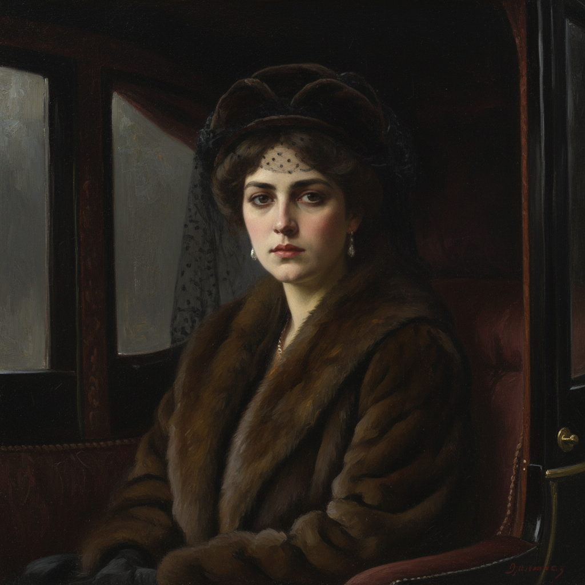

# Kramskoi Art 克拉姆斯柯依艺术

> "An artist is a critic of social phenomena." — Ivan Kramskoi

## 概述

克拉姆斯柯依艺术（Kramskoi Art）是19世纪俄罗斯画家伊万·尼古拉耶维奇·克拉姆斯柯依（Ivan Nikolayevich Kramskoi, 1837-1887）创立的心理现实主义肖像画风格。克拉姆斯柯依是巡回展览画派的创始人和精神领袖——他不仅是杰出的画家，更是俄罗斯艺术民主运动的组织者和理论家。他领导了1863年"十四人起义"——一群美术学院学生拒绝按学院指定的题目创作，集体退出学院，开创了俄罗斯艺术独立的先河。

克拉姆斯柯依最著名的作品《无名女郎》（1883）描绘了一位坐在马车中的神秘女性——她高傲而忧郁的目光穿越时空，成为俄罗斯艺术中最具辨识度的形象之一。这幅画的主人公身份至今成谜——有人认为她是安娜·卡列尼娜的化身。他的另一杰作《荒野中的基督》（1872）以极简的构图表现了基督在旷野中面对诱惑时的内心挣扎。

克拉姆斯柯依艺术的核心要素包括：1）心理深度——对人物内心世界的深刻揭示；2）肖像艺术——精湛的肖像画技法；3）社会责任——艺术家的社会使命感；4）精神探索——对人类精神困境的思考；5）组织领导——艺术运动的领导力；6）民主精神——反对学院专制的勇气；7）哲学思辨——画作中的哲学深度。

## 核心特征

| 特征 | 描述 |
|------|------|
| 心理深度 | 人物内心世界深刻揭示 |
| 肖像艺术 | 精湛肖像画技法 |
| 社会责任 | 艺术家社会使命感 |
| 精神探索 | 人类精神困境思考 |
| 民主精神 | 反对学院专制勇气 |
| 哲学思辨 | 画作中哲学深度 |

## 视觉特征

- **深邃目光**：人物深邃而有穿透力的目光
- **暗色背景**：深色背景突出人物
- **精确面部**：极其精确的面部刻画
- **简洁构图**：去除多余元素的简洁
- **内省氛围**：沉思和内省的氛围
- **古典技法**：扎实的古典绘画技法

## 代表作品

| 作品 | 年代 | 意义 |
|------|------|------|
| *无名女郎* (Unknown Woman) | 1883 | 最著名的作品 |
| *荒野中的基督* (Christ in the Wilderness) | 1872 | 精神探索的巅峰 |
| *托尔斯泰肖像* (Portrait of Tolstoy) | 1873 | 文豪肖像 |
| *月夜* (Moonlit Night) | 1880 | 抒情作品 |
| *涅克拉索夫肖像* (Portrait of Nekrasov) | 1877-1878 | 诗人肖像 |
| *护林人* (The Forester) | 1874 | 人民形象 |

## 历史时间线

| 时期 | 事件 |
|------|------|
| 1837年 | 出生于沃罗涅日省 |
| 1857-1863年 | 就读圣彼得堡美术学院 |
| 1863年 | 领导"十四人起义" |
| 1870年 | 创立巡回展览画派 |
| 1872年 | 创作《荒野中的基督》 |
| 1883年 | 创作《无名女郎》 |
| 1887年 | 在圣彼得堡去世 |

## 中国语境

克拉姆斯柯依在中国美术史教育中有着重要的地位——他作为巡回展览画派的创始人，代表了"艺术为人民服务"理念的先驱。他领导的"十四人起义"在中国被视为艺术家争取创作自由的典范。《无名女郎》在中国广为人知——这幅画的神秘魅力和精湛技法使其成为俄罗斯肖像画的代名词。克拉姆斯柯依关于"艺术家是社会现象的批评者"的理念，与中国20世纪"文艺为工农兵服务"的方针有深层的呼应。他证明了艺术家不仅是技艺的掌握者，更应该是社会良知的承担者——这一理念深刻影响了中国现代美术的发展方向。

## 概念图

## 与其他风格的关系

- **Peredvizhniki** → 巡回展览画派（创始人）
- **Repin** → 列宾（学生）
- **Shishkin** → 希施金（同道）
- **Critical Realism** → 批判现实主义
- **Academic Art** → 学院派（反叛对象）
- **Serov** → 谢洛夫（后继者）

---

*浮光艺志 | Chronicle of Artistry*
