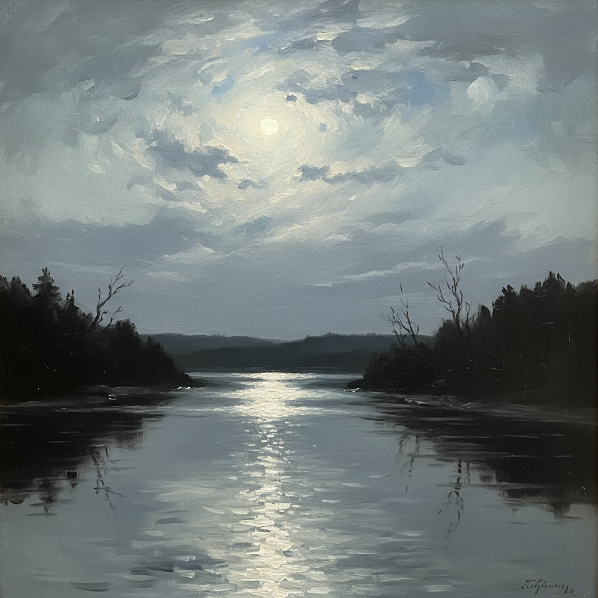

# Kuindzhi Art 库因芝艺术

> "An artist is a king of nature who can make the sun shine and the moon glow on his canvas." — Arkhip Kuindzhi

## 概述

库因芝艺术（Kuindzhi Art）是19世纪俄罗斯风景画大师阿尔希普·伊万诺维奇·库因芝（Arkhip Ivanovich Kuindzhi, 1842-1910）创立的光影风景画风格。库因芝被誉为"光的魔术师"——他以极其大胆的光影对比和近乎超自然的色彩效果著称，能在画布上创造出令人震撼的光感。他的画作在展出时曾引起轰动——观众怀疑他在画布后面藏了灯光。

库因芝最著名的作品《第聂伯河上的月夜》（1880）以其不可思议的月光效果震惊了整个俄罗斯画坛——银色的月光洒在河面上，达到了几乎幻觉般的真实感。他的风格介于写实主义和象征主义之间——用极简的构图和极致的光影创造出超越现实的视觉体验。

库因芝艺术的核心要素包括：1）光影极致——极端的光影对比效果；2）色彩大胆——超越常规的色彩运用；3）构图极简——极其简洁的构图；4）月光效果——标志性的月光表现；5）装饰性——接近装饰艺术的平面感；6）神秘感——超自然的神秘氛围；7）创新精神——不断突破传统的勇气。

## 核心特征

| 特征 | 描述 |
|------|------|
| 光影极致 | 极端光影对比效果 |
| 色彩大胆 | 超越常规色彩运用 |
| 构图极简 | 极其简洁的构图 |
| 月光效果 | 标志性月光表现 |
| 装饰性 | 接近装饰艺术平面感 |
| 神秘感 | 超自然神秘氛围 |

## 视觉特征

- **强烈光感**：画面中强烈的光源效果
- **月光银辉**：银色月光的不可思议表现
- **色彩饱和**：高度饱和的色彩
- **简洁剪影**：树木和地形的剪影效果
- **天空主导**：天空占据画面主体
- **平面装饰**：接近平面化的装饰效果

## 代表作品

| 作品 | 年代 | 意义 |
|------|------|------|
| *第聂伯河上的月夜* (Moonlit Night on the Dnieper) | 1880 | 最著名的作品 |
| *乌克兰之夜* (Ukrainian Night) | 1876 | 早期月光杰作 |
| *白桦林* (Birch Grove) | 1879 | 阳光的极致 |
| *彩虹* (Rainbow) | 1900-1905 | 晚期作品 |
| *日落后* (After the Rain) | 1879 | 光影对比 |
| *厄尔布鲁士山* (Elbrus) | 1890年代 | 山景系列 |

## 历史时间线

| 时期 | 事件 |
|------|------|
| 1842年 | 出生于马里乌波尔 |
| 1868年 | 进入圣彼得堡美术学院 |
| 1874年 | 加入巡回展览画派 |
| 1880年 | 《第聂伯河上的月夜》引起轰动 |
| 1882年 | 退出公众视野近20年 |
| 1894年 | 成为美术学院教授 |
| 1910年 | 在圣彼得堡去世 |

## 中国语境

库因芝在中国的知名度不如希施金和列维坦，但他的艺术理念对中国当代风景画有独特的启示。库因芝对光影的极致追求与中国传统绘画中"留白"和"虚实"的概念有某种呼应——都是通过极端的对比来创造视觉张力。他的简洁构图和装饰性倾向也与中国画的平面化传统有相通之处。库因芝证明了风景画可以超越纯粹的写实——通过主观的光影处理达到接近抽象和象征的境界。他是列维坦的老师——对俄罗斯下一代风景画家产生了深远影响。库因芝的"光的魔术"在当代数字艺术和光影摄影中找到了新的回响——他对极端光影效果的追求预示了现代视觉艺术对光的探索。

## 真实作品

## 与其他风格的关系

- **Shishkin** → 希施金（精确写实风景）
- **Levitan** → 列维坦（学生，抒情风景）
- **Peredvizhniki** → 巡回展览画派
- **Symbolism** → 象征主义
- **Luminism** → 光辉主义
- **Tonalism** → 色调主义

---

*浮光艺志 | Chronicle of Artistry*
