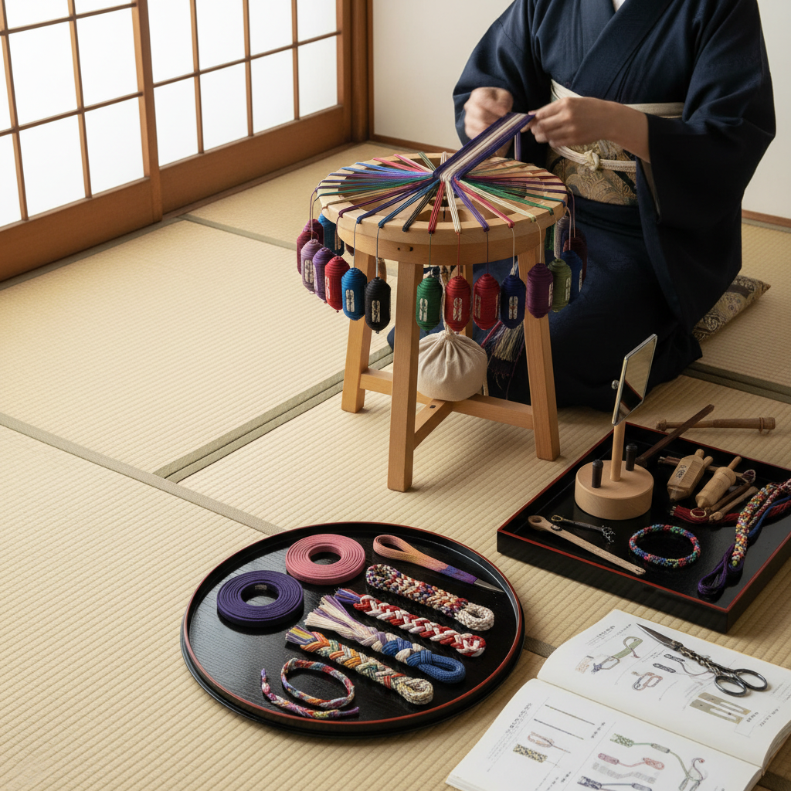

# Kumihimo Art 组纽艺术

> "Kumihimo — 'gathered threads' — is the Japanese art of braiding cords from multiple strands of silk, creating round, flat, or square braids of extraordinary complexity and beauty. On a traditional marudai stand, weighted bobbins dance in precise choreography, crossing and recrossing in patterns that produce cords stronger than any single thread, with surfaces that shimmer as light catches the interlocking silk at different angles." — Unknown

## 概述

组纽艺术（Kumihimo Art）是日本传统的多股编绳艺术——使用特制的编绳台（丸台、角台、高台等）将多根丝线按照特定的交叉规律编织成圆形、扁平或方形的装饰绳带。组纽在日本文化中有重要地位，从武士盔甲的绑带到和服的帯缔（腰带装饰绳），从茶道具的结绳到佛教法器的装饰。

组纽艺术的实践包括：1）丸台编——圆形编绳台上的编织；2）角台编——方形编绳台上的编织；3）高台编——高台上的复杂编织；4）绫竹台编——特殊台上的扁平编织；5）指组——不用工具的手指编绳；6）当代组纽——将传统技法与现代设计结合的创作。

## 核心特征

| 特征 | 描述 |
|------|------|
| 多股 | 多根丝线的交叉 |
| 精密 | 极其精密的编织 |
| 丝绸 | 传统使用丝线 |
| 工具 | 专用编绳台 |
| 功能 | 兼具装饰和功能 |
| 日本 | 日本传统工艺 |

## 视觉特征

- **编织**：精密的多股编织结构
- **光泽**：丝绸的柔和光泽
- **色彩**：多色丝线的搭配
- **图案**：编织产生的几何图案
- **圆润**：圆形编绳的饱满感
- **流动**：绳带的流动曲线

## 代表作品

| 作品 | 艺术家/文化 | 年代 | 意义 |
|------|-------------|------|------|
| *Samurai armor lacing* | 日本武士 | 平安至江户 | 盔甲编绳 |
| *Obijime cords* | 日本传统 | 江户至今 | 和服帯缔 |
| *Domyo kumihimo* | 道明 | 奈良时代至今 | 最古老的组纽世家 |
| *Buddhist ritual cords* | 佛教 | 古代至今 | 佛教法器绳 |
| *Contemporary kumihimo* | 当代 | 当代 | 当代组纽创作 |

## 历史时间线

| 时期 | 事件 |
|------|------|
| 奈良时代 | 组纽从大陆传入日本 |
| 平安时代 | 贵族服饰的组纽 |
| �的�的镰仓-战国 | 武士盔甲编绳的发展 |
| 江户时代 | 和服帯缔的黄金时代 |
| 当代 | 组纽的现代传承和国际传播 |

## 中国语境

组纽艺术与中国有深厚的历史渊源——日本的组纽技术最初从中国大陆传入。中国的"中国结"和编绳传统是组纽的文化源头——中国古代的绳编技术通过丝绸之路和遣唐使传入日本。中国传统的"络子"（装饰编绳）与日本组纽有直接的技术关联——都是多股丝线的交叉编织。中国的编绳艺术在当代也有丰富的发展——从传统中国结到现代编绳首饰。中国的一些手工艺人开始学习日本组纽的丸台技法——将其与中国传统编绳结合。中国的丝绸产业为组纽提供了优质的原材料——中国丝线在国际组纽界有很高的声誉。中国的非物质文化遗产中，多种编绳技艺被列入保护名录——如绳编、中国结等。

## AI生成概念图

## 与其他风格的关系

- **Macrame** → 编结艺术
- **Braiding** → 编辫艺术
- **Japanese Art** → 日本艺术
- **Textile Art** → 纺织艺术
- **Silk Art** → 丝绸艺术
- **Functional Art** → 功能艺术

---

*浮光艺志 | Chronicle of Artistry*
