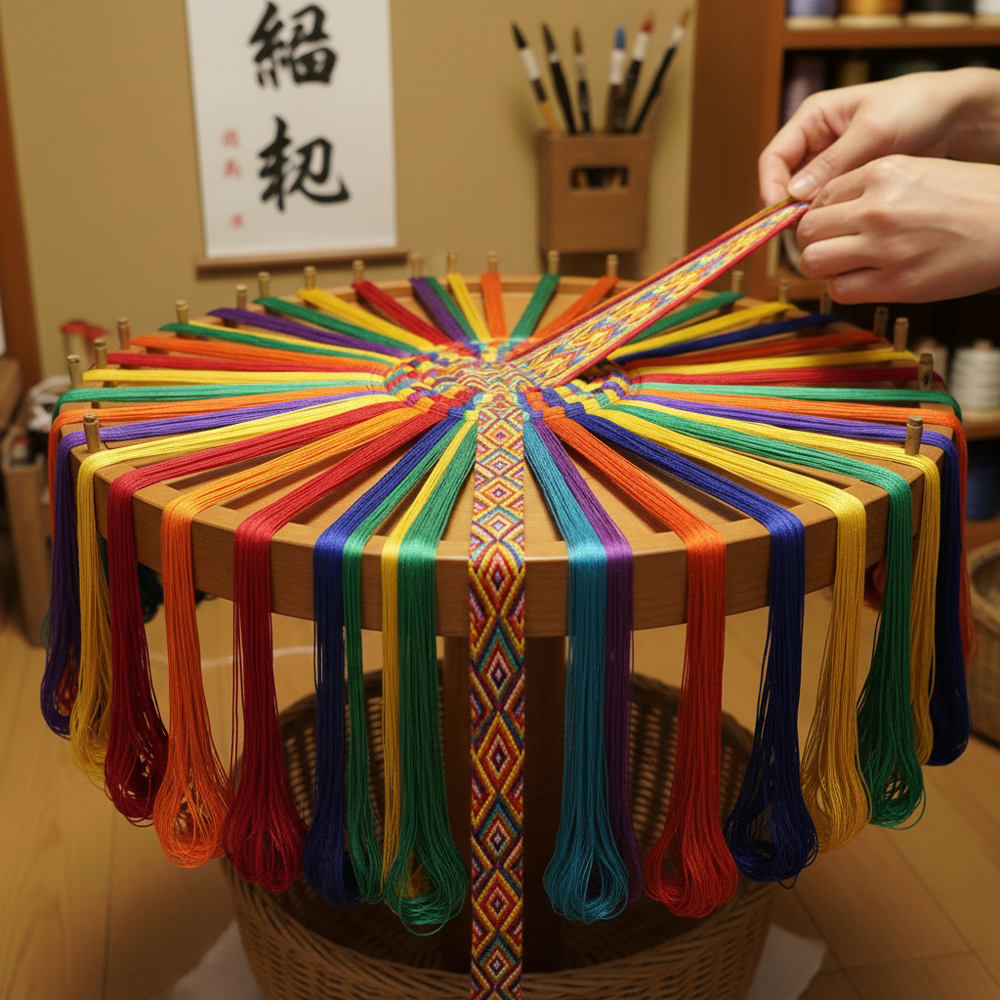

# Kumihimo 組紐 | くみひも

> **"丝线的数学——日本工匠在圆台上用数十根丝线编织出比绳索更精密的立体编带。"**

## 概述

組紐（Kumihimo / くみひも）是日本传统的丝线编绳艺术，使用专用的圆台（丸台 marudai）或方台（角台 kakudai），将数十根甚至上百根彩色丝线按照精确的数学规律交叉编织，形成圆形、扁平或方形的编带。組紐最初用于武士盔甲的绑带和刀剑的装饰绳，后来成为和服腰带（帯締め obijime）的核心配件。每一种编法都有独特的名称和数学结构——从简单的8股编到复杂的144股编，组合出无穷的色彩图案。

## 核心特征

- **丝线编织**：数十根丝线的精密交叉
- **专用工具**：丸台（圆台）和角台（方台）
- **数学规律**：严格的编织序列
- **立体结构**：圆形、扁平、方形截面
- **色彩设计**：通过线色排列产生图案
- **实用与美**：从武具到和服配件

## 主要编法

| 编法 | 特征 |
|------|------|
| 丸打 | 圆形截面 |
| 平打 | 扁平截面 |
| 角打 | 方形截面 |
| 笹浪 | 波浪图案 |
| 唐打 | 中国传入的编法 |
| 奈良打 | 奈良时代传统 |

## 视觉特征

- 丝线的光泽和色彩
- 精密的编织纹理
- 规律的几何图案
- 立体的绳状结构
- 多色丝线的渐变
- 柔软而有力的质感

## 与其他风格的关系

| 风格 | 关系 |
|------|------|
| Macramé编结 | 共享编绳传统 |
| Celtic Knotwork | 共享交织美学 |
| 中国结 | 共享东亚编绳传统 |
| 当代纤维艺术 | 組紐的现代转化 |
| 数学艺术 | 組紐的数学结构 |

## 概念图

---

*浮光艺志 | Chronicle of Artistry*
