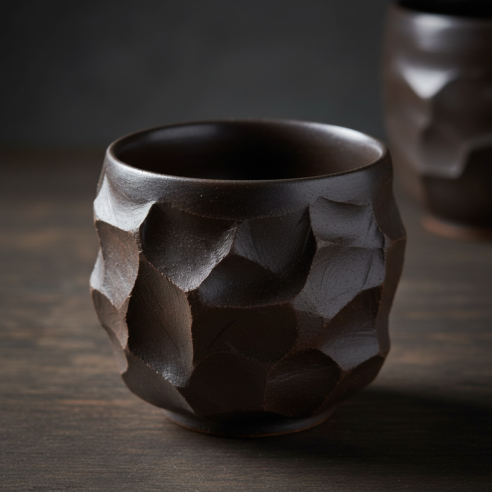

# Kurinuki Art 刳り貫き艺术

> "Kurinuki is sculpture in reverse — instead of building up from nothing, the potter begins with a solid block of clay and carves inward, hollowing out the vessel from within like a sculptor finding the form hidden inside stone, each facet and plane left by the carving tool becoming the surface decoration, the marks of removal becoming the marks of creation." — Unknown

## 概述

刳り貫き艺术（Kurinuki Art）是一种从实心粘土块中雕刻挖空而成器物的日本陶瓷技法。与传统的拉坯或盘筑不同，刳り貫き从一整块粘土开始，用刀具从外部雕刻造型、从内部挖空形成容器。这种"减法"成型方式保留了雕刻的刀痕和棱面，使每件作品都具有雕塑般的力量感和原始美。

刳り貫き艺术的核心要素包括：1）实心起始——从一整块实心粘土开始；2）雕刻成型——用刀具从外部雕刻形态；3）内部挖空——从内部挖出空间形成容器；4）刀痕保留——保留雕刻工具的痕迹作为装饰；5）棱面效果——多面体般的雕刻表面；6）厚重感——比拉坯作品更厚重的器壁；7）雕塑性——介于器物与雕塑之间的存在。

## 核心特征

| 特征 | 描述 |
|------|------|
| 减法成型 | 从实心块中雕刻而非堆积 |
| 刀痕装饰 | 雕刻痕迹作为表面纹理 |
| 棱面造型 | 多面体般的几何表面 |
| 厚重器壁 | 比拉坯更厚实的壁体 |
| 雕塑感 | 器物与雕塑的融合 |
| 原始力量 | 粗犷有力的视觉效果 |

## 视觉特征

- **刀痕肌理**：清晰的雕刻工具痕迹
- **棱面几何**：多角度的切面效果
- **厚重体量**：沉稳有力的体量感
- **不规则形态**：自由雕刻的有机形态
- **粗犷表面**：未经打磨的原始质感
- **内外对比**：粗犷外表与光滑内壁的对比

## 代表作品

| 作品 | 艺术家/文化 | 年代 | 意义 |
|------|-------------|------|------|
| *刳り貫き茶碗* | 日本传统 | 桃山时代 | 传统刳り貫き茶碗 |
| *Shozo Michikawa作品* | 道川省三 | 当代 | 当代刳り貫き大师 |
| *Kohei Nakamura作品* | 中村康平 | 当代 | 现代刳り貫き探索 |
| *当代刳り貫き杯* | 各地陶艺家 | 当代 | 清酒杯等小器物 |
| *刳り貫き花器* | 当代陶艺家 | 当代 | 雕塑性花器 |

## 历史时间线

| 时期 | 事件 |
|------|------|
| 古代 | 原始的挖空成型技法 |
| 桃山时代 | 日本茶陶中的刳り貫き |
| 20世纪 | 现代陶艺家重新发现此技法 |
| 21世纪 | 刳り貫き在国际陶艺界流行 |
| 当代 | 社交媒体推动刳り貫き的全球传播 |

## 中国语境

刳り貫き技法在中国有古老的渊源——中国新石器时代的某些陶器就是从实心泥块中挖空而成。中国的紫砂壶制作中也有类似的"挖"的技法。在中国当代陶艺中，刳り貫き作为一种强调过程痕迹和雕塑性的技法受到年轻陶艺家的欢迎。它与中国传统的"因材施艺"理念相通——尊重材料本身的特性，让制作过程成为作品的一部分。近年来，中国社交媒体上刳り貫き教程和作品分享非常活跃，推动了这一技法在中国的普及。

## AI生成概念图

## 与其他风格的关系

- **Sculpture** → 雕塑
- **Tea Ceremony** → 茶道
- **Wabi-Sabi** → 侘寂美学
- **Subtractive Art** → 减法艺术
- **Wood Carving** → 木雕
- **Stone Carving** → 石雕

---

*浮光艺志 | Chronicle of Artistry*
