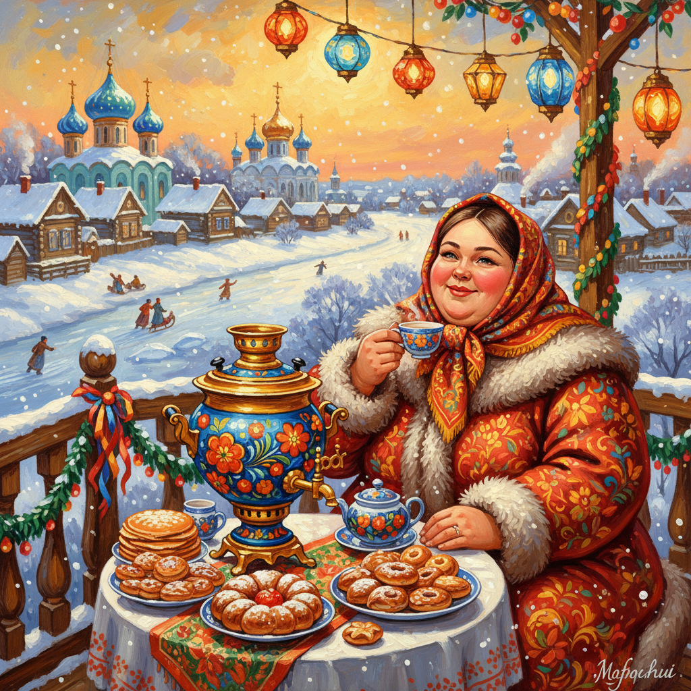

# Kustodiev Art 库斯托季耶夫艺术

> "I paint the Russian holiday." — Boris Kustodiev

## 概述

库斯托季耶夫艺术（Kustodiev Art）是20世纪初俄罗斯画家鲍里斯·米哈伊洛维奇·库斯托季耶夫（Boris Mikhailovich Kustodiev, 1878-1927）创立的民俗装饰绑画风格。库斯托季耶夫被誉为"俄罗斯节日的画家"——他以鲜艳的色彩、欢快的氛围和装饰性的构图，描绘了俄罗斯民间节日、集市、茶饮和冬季娱乐的场景。他的画作是对旧俄罗斯商人阶层生活的诗意化再现——充满了色彩的欢乐和生活的热情。

库斯托季耶夫最著名的作品《商人妻子饮茶》（1918）描绘了一位丰满的商人妻子在阳台上悠闲饮茶的场景——桌上摆满了水果、糕点和茶具，远处是俄罗斯小城的全景。这幅画以其鲜艳的色彩和丰盈的生活气息成为俄罗斯民俗绑画的经典。令人感动的是，库斯托季耶夫晚年因脊椎疾病瘫痪在轮椅上——但他依然创作出了这些充满欢乐和生命力的作品。

库斯托季耶夫艺术的核心要素包括：1）民俗节日——俄罗斯民间节日和集市；2）装饰色彩——鲜艳而装饰性的色彩；3）丰盈之美——丰满、富足的美学；4）冬季场景——雪橇、冰雪、冬日阳光；5）商人文化——旧俄商人阶层的生活；6）欢乐氛围——充满欢乐和热情的氛围；7）民间艺术——融合民间艺术元素。

## 核心特征

| 特征 | 描述 |
|------|------|
| 民俗节日 | 俄罗斯民间节日集市 |
| 装饰色彩 | 鲜艳装饰性色彩 |
| 丰盈之美 | 丰满富足的美学 |
| 冬季场景 | 雪橇冰雪冬日阳光 |
| 商人文化 | 旧俄商人阶层生活 |
| 欢乐氛围 | 充满欢乐热情氛围 |

## 视觉特征

- **鲜艳色彩**：红、蓝、金的鲜艳搭配
- **冬日雪景**：白雪覆盖的俄罗斯小城
- **丰满人物**：丰满健康的俄罗斯女性
- **集市场景**：热闹的集市和节日
- **装饰边框**：民间艺术风格的装饰
- **全景构图**：俯瞰式的城镇全景

## 代表作品

| 作品 | 年代 | 意义 |
|------|------|------|
| *商人妻子饮茶* (Merchant's Wife at Tea) | 1918 | 最著名的作品 |
| *谢肉节* (Maslenitsa) | 1916 | 民俗节日 |
| *冬日集市* (Winter Fair) | 1919 | 冬季欢乐 |
| *美人* (Beauty) | 1915 | 俄罗斯之美 |
| *布尔什维克* (Bolshevik) | 1920 | 革命象征 |
| *浴后的维纳斯* (Russian Venus) | 1926 | 民族美学 |

## 历史时间线

| 时期 | 事件 |
|------|------|
| 1878年 | 出生于阿斯特拉罕 |
| 1896-1903年 | 就读圣彼得堡美术学院 |
| 1903-1910年 | 早期创作和旅行 |
| 1911年 | 开始出现脊椎疾病 |
| 1916年 | 完全瘫痪，仍坚持创作 |
| 1918年 | 创作《商人妻子饮茶》 |
| 1927年 | 在列宁格勒去世 |

## 中国语境

库斯托季耶夫在中国有着独特的吸引力。他对民间节日和民俗生活的热情描绘，与中国年画和民间美术的传统有深刻的共鸣——都以鲜艳的色彩和欢乐的氛围表现人民的节日生活。库斯托季耶夫的装饰性风格也与中国民间美术的装饰传统有相通之处。他在瘫痪状态下依然创作出充满生命力的作品——这种精神力量在中国被视为艺术家坚韧意志的典范。《商人妻子饮茶》中对"丰盈之美"的赞颂，与中国传统审美中"福禄寿"的丰满意象有文化上的呼应。库斯托季耶夫证明了民俗题材可以成为高雅艺术——这一理念对中国当代民俗绑画的发展有重要的启示。

## 概念图

## 与其他风格的关系

- **Repin** → 列宾（导师）
- **Russian Folk Art** → 俄罗斯民间艺术
- **Art Nouveau** → 新艺术运动
- **Vasnetsov** → 瓦斯涅佐夫（民族浪漫）
- **Mir Iskusstva** → 艺术世界派
- **Naive Art** → 素朴艺术

---

*浮光艺志 | Chronicle of Artistry*
