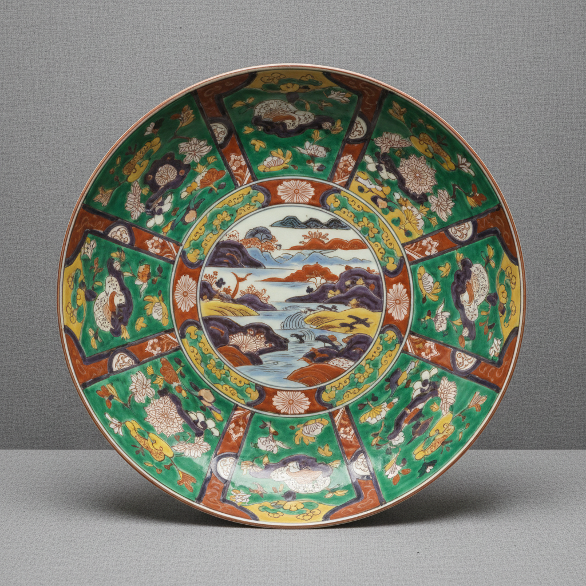

# Kutani Art 九谷烧艺术

> "Kutani is color unleashed — Japanese porcelain from Ishikawa prefecture painted in five bold colors of green, yellow, purple, navy blue, and red with a fearless intensity that fills every surface with pattern upon pattern, landscapes within landscapes, a maximalist aesthetic where restraint is abandoned in favor of chromatic celebration, each piece a festival of pigment." — Unknown

## 概述

九谷烧艺术（Kutani Art）是日本石川县（加贺地区）发展的一种以浓烈色彩著称的彩绘瓷器艺术。九谷烧以其大胆的"五彩"（绿、黄、紫、紺青、红）装饰著称——色彩浓烈、构图大胆、装饰密集，形成了独特的"九谷风格"。九谷烧分为"古九谷"（17世纪）和"再兴九谷"（19世纪复兴）两个时期——古九谷以其神秘的起源和大胆的风格著称。

九谷烧艺术的核心要素包括：1）五彩浓烈——绿黄紫紺红五色；2）满工装饰——密集的装饰风格；3）大胆构图——大胆奔放的构图；4）古九谷——17世纪的神秘起源；5）再兴九谷——19世纪的复兴；6）加贺文化——加贺藩的文化传统；7）色彩冲击——强烈的色彩冲击力。

## 核心特征

| 特征 | 描述 |
|------|------|
| 五彩浓烈 | 绿黄紫紺红五色 |
| 满工装饰 | 密集装饰风格 |
| 大胆构图 | 大胆奔放构图 |
| 古九谷 | 17世纪神秘起源 |
| 再兴九谷 | 19世纪复兴 |
| 色彩冲击 | 强烈色彩冲击力 |

## 视觉特征

- **浓烈色彩**：浓烈饱和的色彩
- **绿色主调**：大面积的绿色
- **黄色底色**：黄色的底色运用
- **满工构图**：密集填满的构图
- **山水人物**：山水和人物题材
- **几何分区**：几何形的分区装饰

## 代表作品

| 作品 | 艺术家/文化 | 年代 | 意义 |
|------|-------------|------|------|
| *古九谷色绘大皿* | 加贺 | 17世纪 | 古九谷代表 |
| *青手九谷* | 加贺 | 17世纪 | 绿色主调风格 |
| *赤绘九谷* | 加贺 | 19世纪 | 红绘风格 |
| *金襴手九谷* | 加贺 | 19世纪 | 金彩风格 |
| *当代九谷* | 石川县 | 当代 | 当代传承 |

## 历史时间线

| 时期 | 事件 |
|------|------|
| 1655年 | 古九谷窑的开窑 |
| 1730年代 | 古九谷窑的突然关闭 |
| 1807年 | 再兴九谷的开始 |
| 明治时代 | 九谷烧的出口繁荣 |
| 当代 | 九谷烧的传承和创新 |

## 中国语境

九谷烧与中国陶瓷有密切的技术和风格渊源。古九谷的起源至今仍有争议——有学者认为古九谷实际上是有田地区生产的，也有学者坚持其加贺本地起源说。九谷烧的五彩风格明显受到中国明代五彩和清代康熙五彩的影响——特别是其浓烈的色彩和满工的构图方式。但九谷烧发展出了独特的日本风格——特别是"青手"（以绿色为主调）风格在中国陶瓷中没有直接对应。九谷烧的"赤绘"（红绘）风格则与中国的矾红彩有相似之处。九谷烧在明治时期大量出口到欧美——与中国外销瓷在国际市场上形成竞争。九谷烧的大胆色彩运用对当代陶艺也有启发——证明了浓烈色彩在陶瓷上的表现力。

## AI生成概念图

## 与其他风格的关系

- **Wucai** → 五彩
- **Imari** → 伊万里
- **Famille Verte** → 素三彩
- **Arita Ware** → 有田烧
- **Overglaze Enamel** → 釉上彩
- **Kaga Culture** → 加贺文化

---

*浮光艺志 | Chronicle of Artistry*
