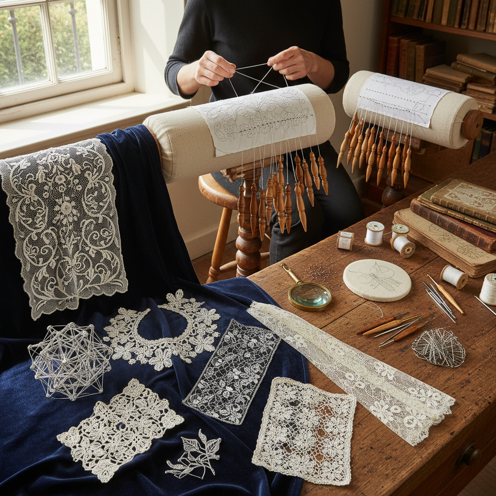

# Lacework Art 蕾丝艺术

> "Lace is architecture in thread — open structures of extraordinary complexity built from nothing but a single continuous thread or a network of threads twisted, knotted, or looped into patterns of breathtaking delicacy. A piece of fine lace contains more engineering per square inch than a Gothic cathedral: every thread must support its neighbors, every hole must hold its shape, every pattern must emerge from the systematic manipulation of dozens or hundreds of threads working in concert." — Unknown

## 概述

蕾丝艺术（Lacework Art）是使用细线通过编织、钩编、针编或机织等方法制作开放式网状装饰织物的纺织艺术——以其极其精细的线条、复杂的图案和优雅的透明效果著称。蕾丝是欧洲纺织艺术中最精美的品类之一，从16世纪起成为贵族和教会的重要装饰。

蕾丝艺术的实践包括：1）梭芯蕾丝——使用梭芯在枕垫上编织；2）针蕾丝——使用针和线缝制的蕾丝；3）钩编蕾丝——使用钩针制作的蕾丝；4）机织蕾丝——工业机器生产的蕾丝；5）爱尔兰蕾丝——爱尔兰钩编蕾丝传统；6）威尼斯蕾丝——意大利针蕾丝传统；7）当代蕾丝——将传统技法与现代设计结合的创作。

## 核心特征

| 特征 | 描述 |
|------|------|
| 精细 | 极其精细的线条 |
| 透明 | 开放的网状结构 |
| 复杂 | 极其复杂的图案 |
| 优雅 | 优雅精致的美感 |
| 耗时 | 极其耗时的制作 |
| 珍贵 | 历史上极其珍贵 |

## 视觉特征

- **透明**：开放的网状透明效果
- **精细**：极其精细的线条和图案
- **对比**：实体与空洞的对比
- **流动**：图案的流动曲线
- **对称**：精确的对称设计
- **轻盈**：极其轻盈的质感

## 代表作品

| 作品 | 艺术家/文化 | 年代 | 意义 |
|------|-------------|------|------|
| *Venetian punto in aria* | 意大利 | 16世纪 | 最早的针蕾丝 |
| *Bruges bobbin lace* | 比利时 | 16世纪至今 | 布鲁日梭芯蕾丝 |
| *Honiton lace* | 英国 | 16世纪至今 | 英国蕾丝传统 |
| *Irish crochet lace* | 爱尔兰 | 19世纪至今 | 爱尔兰钩编蕾丝 |
| *Chantilly lace* | 法国 | 17世纪至今 | 法国黑蕾丝 |

## 历史时间线

| 时期 | 事件 |
|------|------|
| 15世纪 | 蕾丝的起源（意大利和佛兰德斯） |
| 16-17世纪 | 蕾丝的黄金时代 |
| 18世纪 | 蕾丝作为奢侈品的巅峰 |
| 19世纪 | 机器蕾丝的出现 |
| 当代 | 手工蕾丝的艺术复兴 |

## 中国语境

蕾丝艺术在中国有独特的发展历程。中国传统的"抽纱"工艺与蕾丝有密切关系——山东烟台、广东汕头等地的抽纱是中国版的蕾丝艺术。中国的抽纱工艺在19世纪末由传教士引入——结合了欧洲蕾丝技法和中国传统刺绣美学。中国的汕头抽纱被列入国家级非物质文化遗产——以其精美的工艺和独特的风格著称于世。中国曾是世界上最大的手工蕾丝出口国之一——20世纪中期中国的蕾丝产品大量出口欧美。中国当代的一些纺织艺术家将蕾丝技法与中国传统图案结合——创造具有东方美学的蕾丝作品。中国的时装设计中，蕾丝是重要的面料和装饰元素——从婚纱到高级定制都大量使用蕾丝。

## AI生成概念图

## 与其他风格的关系

- **Bobbin Lace** → 梭芯蕾丝
- **Needle Lace** → 针蕾丝
- **Crochet** → 钩编艺术
- **Embroidery** → 刺绣艺术
- **Textile Art** → 纺织艺术
- **Fashion Design** → 时装设计

---

*浮光艺志 | Chronicle of Artistry*
