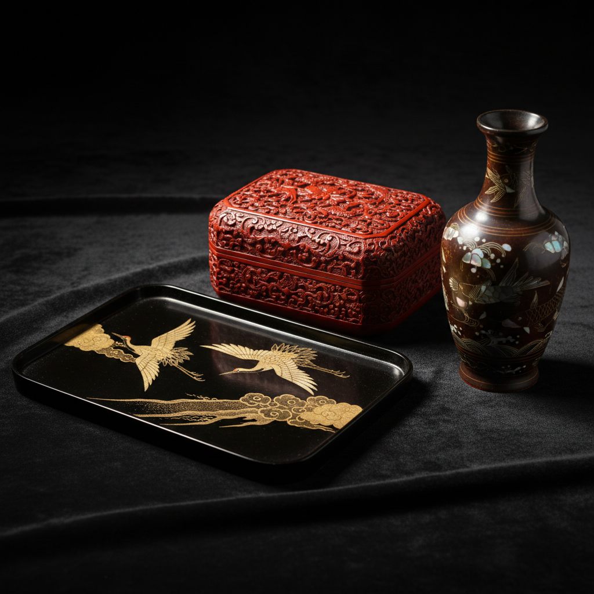

# Lacquer Art 漆艺

> "Lacquer is the blood of the tree, transformed by human hands into eternal beauty." — 松田权六

## 概述

漆艺（Lacquer Art）是使用天然漆液（主要来自漆树）作为涂料和粘合剂的装饰艺术和绘画形式。漆艺是东亚文明最独特的艺术贡献之一——中国是漆艺的发源地，拥有超过7000年的历史。漆的独特性在于它干燥后形成极其坚硬、光滑、耐久的表面，可以打磨出镜面般的光泽。

漆艺融合了绘画、雕刻、镶嵌等多种技法——螺钿、蒔绘、雕漆、脱胎漆器等技法展现了漆的无限可能。

## 核心特征

| 特征 | 描述 |
|------|------|
| 天然漆 | 使用漆树分泌的天然漆液 |
| 多层性 | 需要数十层甚至上百层涂漆 |
| 极耐久 | 干燥后极其坚硬耐久 |
| 光泽 | 可打磨出深邃的镜面光泽 |
| 工时长 | 每层需要干燥——创作周期极长 |
| 综合性 | 融合绘画、雕刻、镶嵌等技法 |

## 视觉特征

- **光泽**：深邃的、温润的光泽
- **色彩**：传统以黑、红、金为主
- **层次**：多层漆的深度感
- **镶嵌**：螺钿、金银、蛋壳的镶嵌
- **雕刻**：在厚漆层上的精细雕刻
- **平滑**：极其光滑的表面质感

## 代表作品

| 作品/传统 | 地区 | 年代 | 意义 |
|-----------|------|------|------|
| 河姆渡漆碗 | 中国 | ~5000 BCE | 最早的漆器之一 |
| 曾侯乙漆棺 | 中国 | 公元前433年 | 战国漆艺的巅峰 |
| 蒔绘 | 日本 | 8世纪-至今 | 金粉漆绘的极致 |
| 螺钿漆器 | 中国/韩国 | 唐代-至今 | 贝壳镶嵌的华丽 |
| 雕漆 | 中国 | 宋代-至今 | 剔红剔犀的精细 |
| 脱胎漆器 | 中国福州 | 清代-至今 | 轻薄如纸的漆器 |

## 历史时间线

| 时期 | 事件 |
|------|------|
| ~7000年前 | 中国最早的漆器 |
| 战国-汉代 | 中国漆艺的第一个黄金时代 |
| 唐代 | 漆艺传入日本、韩国 |
| 宋-明 | 雕漆、螺钿的高峰 |
| 江户时代 | 日本蒔绘的极致 |
| 20世纪 | 越南磨漆画——漆的现代绘画 |
| 当代 | 漆艺作为当代艺术媒介的复兴 |

## 中国语境

中国是漆艺的故乡——从河姆渡的漆碗到当代的漆画创作，漆艺贯穿了中国文明的全部历史。中国的漆艺传统包括：福州脱胎漆器、扬州漆器、平遥推光漆器、成都漆器等地方流派。当代中国漆画作为独立画种在全国美展中占有一席之地。中国美术学院等机构的漆艺专业培养了新一代漆艺术家。

## AI生成概念图

## 与其他风格的关系

- **Decorative Arts** → 漆艺是装饰艺术的重要组成
- **Mixed Media** → 漆与螺钿、金银的混合
- **Sculpture** → 脱胎漆器是漆的雕塑形式
- **Painting** → 漆画是漆的绘画形式
- **Craft** → 漆艺挑战了工艺与艺术的界限
- **Encaustic Art** → 蜡画与漆画共享层叠涂覆的逻辑

---

*浮光艺志 | Chronicle of Artistry*
