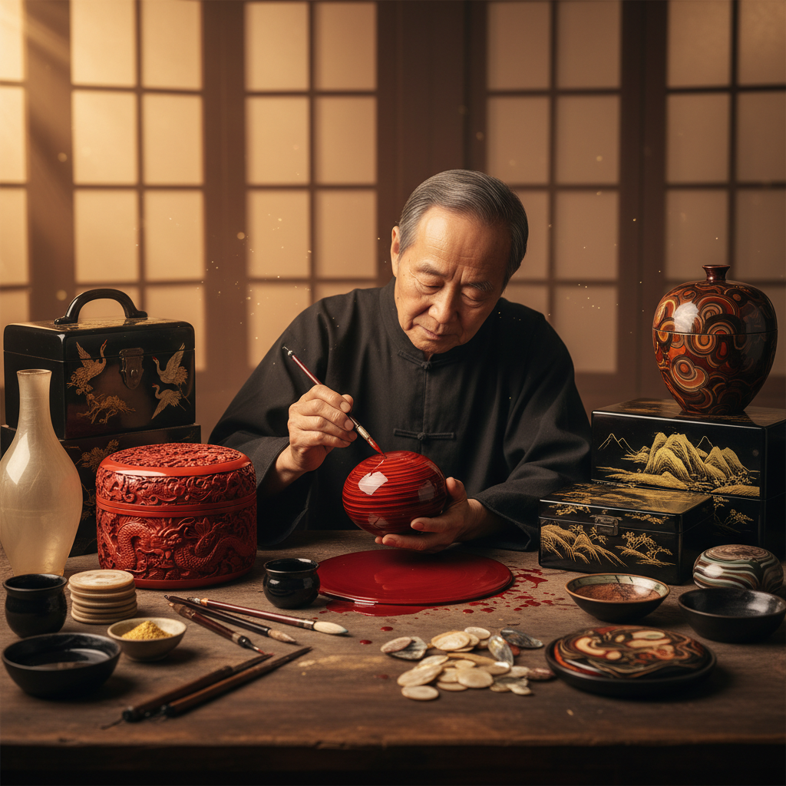

# Lacquerware Art 漆器艺术

> "Lacquer is liquid patience — each coat must dry for days before the next is applied, and a fine piece may require thirty, fifty, even a hundred layers. The lacquer master works in darkness and humidity, building up surfaces that will outlast bronze, creating depths of color that seem to glow from within. When the final polish reveals the accumulated layers, time itself becomes visible — compressed into a surface harder than wood, more lustrous than silk." — Unknown

## 概述

漆器艺术（Lacquerware Art）是以天然漆液（主要来自漆树）为涂料，通过多层涂漆、雕刻、镶嵌和装饰等技法在木、竹、布等胎体上创造各种器物和艺术品的工艺——是东亚地区最具代表性的传统工艺之一，有着七千年以上的历史。

漆器艺术的实践包括：1）素漆——纯色漆器；2）雕漆——在厚漆层上雕刻图案（剔红、剔黑等）；3）描金——用金粉在漆面上描绘图案；4）螺钿——将贝壳片镶嵌在漆面上；5）莳绘——日本特有的金银粉装饰技法；6）犀皮漆——多色漆层经打磨后呈现的纹理；7）脱胎漆器——以布或纸为胎的轻薄漆器。

## 核心特征

| 特征 | 描述 |
|------|------|
| 耐久 | 极其耐久防腐 |
| 光泽 | 深邃的漆面光泽 |
| 层次 | 多层积累的深度 |
| 耐心 | 需要极大耐心的工艺 |
| 华丽 | 华丽的装饰效果 |
| 天然 | 天然漆液为原料 |

## 视觉特征

- **深红**：经典的朱红漆色
- **漆黑**：深邃的黑漆底色
- **金色**：描金和莳绘的金色
- **螺钿**：贝壳的虹彩光泽
- **浮雕**：雕漆的立体效果
- **光泽**：镜面般的漆面光泽

## 代表作品

| 作品 | 艺术家/文化 | 年代 | 意义 |
|------|-------------|------|------|
| *河姆渡漆碗* | 中国新石器 | 公元前5000年 | 最早的漆器 |
| *楚国漆器* | 中国战国 | 公元前4世纪 | 战国漆器巅峰 |
| *永乐剔红* | 中国明代 | 15世纪 | 明代雕漆 |
| *Japanese maki-e* | 日本传统 | 平安时代至今 | 日本莳绘 |
| *Korean najeonchilgi* | 韩国传统 | 高丽时代至今 | 韩国螺钿漆器 |

## 历史时间线

| 时期 | 事件 |
|------|------|
| 公元前5000年 | 中国最早的漆器 |
| 战国-汉代 | 漆器的第一个高峰 |
| 唐宋 | 雕漆和螺钿的发展 |
| 明清 | 漆器工艺的全面繁荣 |
| 当代 | 漆器的现代传承与创新 |

## 中国语境

漆器艺术是中国最古老的工艺传统之一——中国是世界漆器的发源地，有"漆器之国"的美誉。中国的漆器历史可追溯到七千年前的河姆渡文化——比陶瓷还要古老。中国的雕漆（剔红）是世界上最精美的漆器形式之一——北京雕漆被列入国家级非物质文化遗产。中国的福州脱胎漆器以其轻薄如纸的特点著称——与北京景泰蓝、江西景德镇瓷器并称中国传统工艺"三宝"。中国的扬州漆器以螺钿镶嵌闻名——将贝壳的虹彩与漆面的深邃完美结合。中国当代的漆艺家将传统漆器技法与现代艺术理念相结合——漆画作为一种独立的绘画形式在中国得到了很大发展。中国的大漆（生漆）是一种天然环保的涂料——在当代可持续设计中重新受到重视。

## AI生成概念图

## 与其他风格的关系

- **Woodworking** → 木工艺术
- **Gold Leaf Art** → 金箔艺术
- **Shell Art** → 贝壳艺术
- **Carving** → 雕刻艺术
- **Japanese Art** → 日本艺术
- **Decorative Art** → 装饰艺术

---

*浮光艺志 | Chronicle of Artistry*
