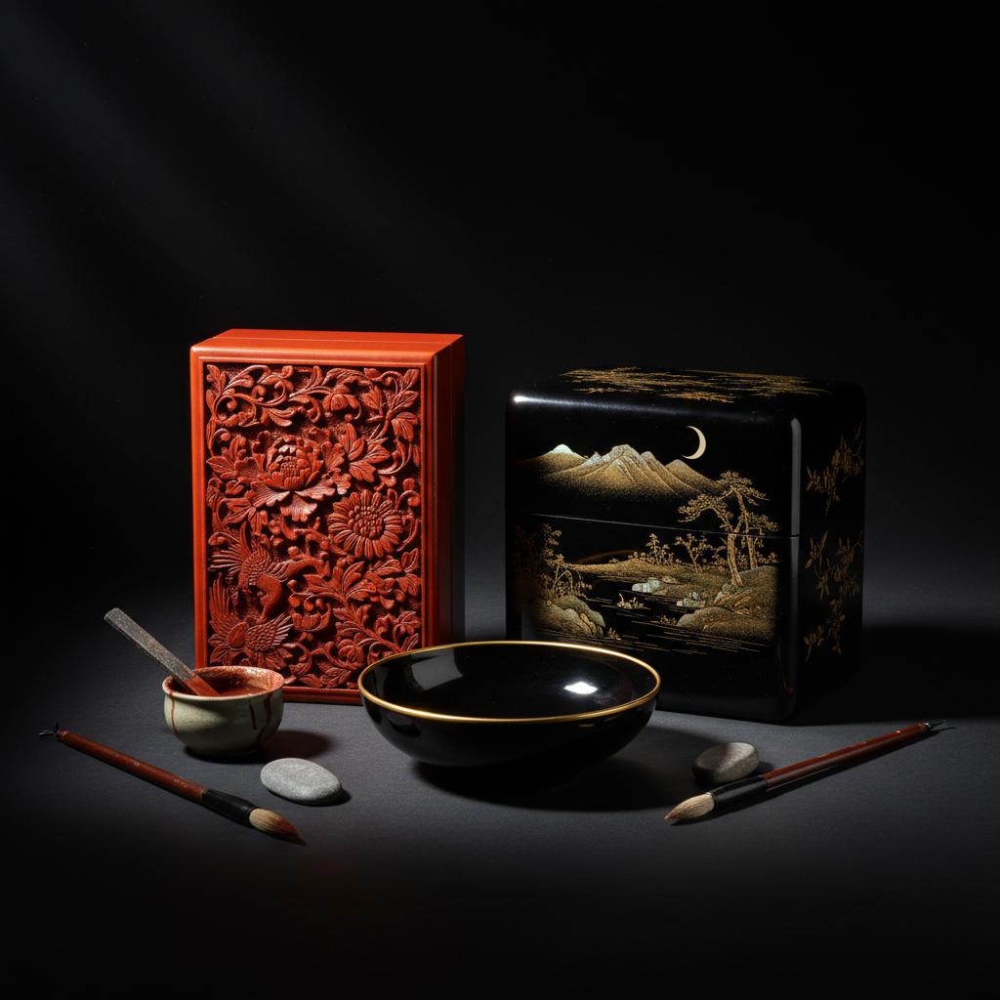

# Lacquerware 漆器

> "Lacquer is time made visible — each layer a day's work, dozens of layers a season's patience, the finished piece a monument to slow craft." — Unknown

## 概述

漆器（Lacquerware）是使用天然漆（主要是漆树汁液）涂覆在木、竹、布等胎体上，经过多次涂刷、干燥、打磨，形成坚硬光滑的保护性和装饰性表面的工艺。天然漆是一种神奇的材料——它在潮湿环境中固化（而非干燥），形成的漆膜耐水、耐热、耐腐蚀，可以保存数千年。漆器是东亚文明最重要的工艺传统之一。

漆器的哲学在于：时间的积累——每一层漆都需要等待固化，一件精美的漆器可能需要数十甚至上百层漆，每一层都是时间和耐心的沉淀。

## 核心特征

| 特征 | 描述 |
|------|------|
| 天然漆 | 使用漆树汁液 |
| 多层 | 数十层的涂覆 |
| 耐久 | 极其耐久的表面 |
| 光泽 | 深邃的光泽 |
| 缓慢 | 极其缓慢的过程 |
| 装饰 | 丰富的装饰技法 |

## 视觉特征

- **光泽**：深邃温润的光泽
- **黑红**：经典的黑红配色
- **光滑**：极其光滑的表面
- **深度**：多层漆的深度感
- **装饰**：精美的装饰图案
- **温润**：温润如玉的质感

## 代表作品

| 作品 | 艺术家 | 年代 | 意义 |
|------|--------|------|------|
| *Hemudu lacquerware* | 匿名 | 公元前5000年 | 最早的漆器 |
| *Warring States lacquer* | 匿名 | 战国 | 战国漆器的巅峰 |
| *Japanese maki-e* | Various | 传统 | 日本莳绘 |
| *Ming carved lacquer* | 匿名 | 明代 | 明代剔红 |
| *Contemporary lacquer art* | Various | 当代 | 当代漆艺术 |

## 历史时间线

| 时期 | 事件 |
|------|------|
| 公元前7000年 | 中国最早的漆器（跨湖桥） |
| 战国-汉代 | 中国漆器的第一个高峰 |
| 唐宋 | 漆器技法的多样化 |
| 明清 | 剔红、描金等技法的巅峰 |
| 传统 | 日本漆器（莳绘等）的发展 |
| 当代 | 当代漆艺术的创新 |

## 中国语境

中国是漆器的发源地——拥有7000年以上的漆器历史，是世界上最早使用天然漆的文明。中国漆器技法极其丰富：剔红（雕漆）、描金、螺钿镶嵌、犀皮（变涂）、脱胎漆器等。福州脱胎漆器、扬州漆器、平遥推光漆器、成都漆器等都是国家级非物质文化遗产。当代中国的漆艺术家正在将传统漆艺与当代艺术结合，创造出新的表达形式。中国美术学院等院校设有漆艺专业。

## AI生成概念图

## 与其他风格的关系

- **Maki-e** → 日本莳绘
- **Gilding** → 鎏金（描金漆器）
- **Inlay** → 镶嵌（螺钿漆器）
- **Woodworking** → 木工（胎体）
- **Ceramics** → 陶瓷（类似的表面处理）
- **Kintsugi** → 金缮（漆的修复应用）

---

*浮光艺志 | Chronicle of Artistry*
