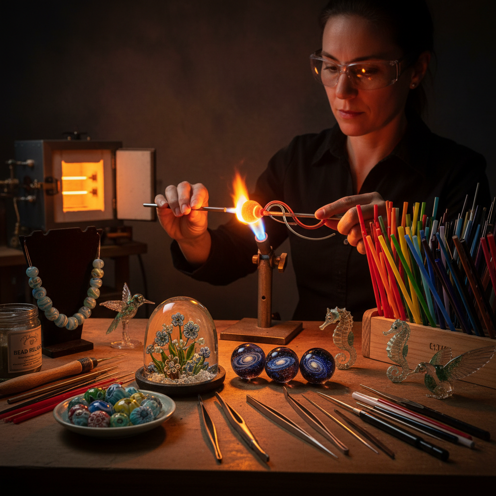

# Lampwork Art 灯工玻璃艺术

> "Lampwork is glass tamed by breath and flame — a single rod of color held in a focused torch until it glows like a tiny sun, then wound, pulled, twisted, and shaped into beads, figurines, and sculptures of impossible delicacy. The lampworker works in miniature, building worlds on the tip of a mandrel, layering color upon color until a bead becomes a universe — a garden, an ocean, a galaxy compressed into a sphere no larger than a marble." — Unknown

## 概述

灯工玻璃艺术（Lampwork Art）是使用火焰（传统上为油灯火焰，现代多用丙烷/氧气火焰）加热玻璃棒使其软化，然后在金属芯棒上缠绕、塑形和装饰的玻璃工艺——主要用于制作玻璃珠、小型玻璃雕塑和科学玻璃器具。灯工是最古老的玻璃加工技法之一。

灯工玻璃艺术的实践包括：1）珠饰制作——在芯棒上缠绕制作玻璃珠；2）微型雕塑——用灯工技法制作小型玻璃雕塑；3）花卉制作——制作精美的玻璃花卉；4）动物造型——制作玻璃动物；5）内含物珠——在珠内嵌入花朵等图案；6）科学玻璃——实验室玻璃器具的制作；7）当代灯工——将灯工作为当代艺术表达的创作。

## 核心特征

| 特征 | 描述 |
|------|------|
| 微型 | 小尺寸的精细工作 |
| 火焰 | 直接用火焰加工 |
| 即时 | 快速成型的技法 |
| 色彩 | 丰富的色彩可能 |
| 精细 | 极其精细的细节 |
| 个人 | 个人化的创作方式 |

## 视觉特征

- **透明**：玻璃的透明和半透明
- **色彩**：鲜艳的玻璃色彩
- **圆润**：火焰塑造的圆润形态
- **微缩**：微缩的精细世界
- **光泽**：火焰抛光的光泽
- **内含**：珠内的精美图案

## 代表作品

| 作品 | 艺术家/文化 | 年代 | 意义 |
|------|-------------|------|------|
| *Venetian glass beads* | 威尼斯 | 15世纪至今 | 威尼斯灯工珠 |
| *Loren Stump murrine* | Loren Stump | 当代 | 超写实灯工 |
| *Paul Stankard botanicals* | Paul Stankard | 当代 | 植物灯工雕塑 |
| *Satoshi Tomizu marbles* | 富水敏 | 当代 | 日本宇宙珠 |
| *Trade beads* | 各文化 | 16-19世纪 | 贸易珠 |

## 历史时间线

| 时期 | 事件 |
|------|------|
| 古代 | 最早的灯工珠制作 |
| 中世纪 | 威尼斯灯工的发展 |
| 16-19世纪 | 贸易珠的全球流通 |
| 20世纪 | 科学玻璃和艺术灯工 |
| 当代 | 灯工艺术的全球复兴 |

## 中国语境

灯工玻璃艺术在中国有独特的传统和快速的当代发展。中国古代的琉璃珠制作中就有灯工技法的应用——用火焰加热玻璃棒制作各种珠饰。中国的料器（北京料器）传统中，灯工是核心技法之一——用于制作精美的玻璃花卉、水果和动物造型。中国当代的灯工玻璃艺术发展迅速——受到国际灯工艺术运动的影响，中国出现了大量灯工艺术家和工作室。中国的一些城市（如北京、上海、深圳）有活跃的灯工社区——定期举办工作坊和展览。中国的灯工珠饰市场也在快速增长——手工灯工珠作为个性化首饰受到年轻消费者的喜爱。中国的一些灯工艺术家在国际比赛中获得认可——展示了中国灯工艺术的水平。

## AI生成概念图

## 与其他风格的关系

- **Glass Blowing** → 吹制玻璃
- **Millefiori** → 千花玻璃
- **Bead Art** → 珠饰艺术
- **Jewelry Art** → 珠宝艺术
- **Miniature Art** → 微型艺术
- **Scientific Glass** → 科学玻璃

---

*浮光艺志 | Chronicle of Artistry*
