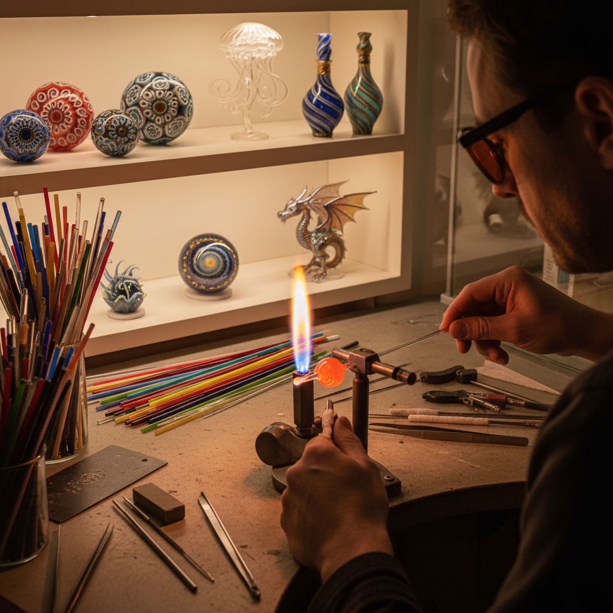

# Lampwork Glass 灯工玻璃

> "Lampwork is glass dancing on a flame — the artist holds a rod of colored glass in the focused heat of a torch, watching it glow and soften, then coaxes it with tools and gravity into beads, figures, and vessels of impossible delicacy, each piece born in fire and frozen in light." — Unknown

## 概述

灯工玻璃（Lampwork Glass）是一种使用火焰（传统上是油灯火焰，现代使用丙烷/氧气火炬）加热玻璃棒或玻璃管，使其软化后用工具塑形的玻璃艺术技法。灯工的名称来源于早期使用油灯火焰加热玻璃的做法——艺术家在灯前工作（working at the lamp）。

灯工玻璃的核心是"小规模、高精度"——与吹制玻璃的大型作品不同，灯工通常创作小型精细的作品：玻璃珠（beads）、小型雕塑、微型动物、花朵、首饰配件、科学仪器等。灯工艺术家使用各种工具——镊子、压板、石墨模具、钨针等——在火焰中精确控制玻璃的形态。灯工玻璃的色彩极其丰富，可以创造出复杂的内部图案和色彩层次。

## 核心特征

| 特征 | 描述 |
|------|------|
| 火焰 | 使用火炬加热 |
| 精细 | 小型精细作品 |
| 玻璃棒 | 使用玻璃棒/管 |
| 即时 | 即时塑形 |
| 色彩 | 极其丰富的色彩 |
| 工具 | 精密的手工工具 |

## 视觉特征

- **精致**：极其精致的细节
- **色彩**：丰富的内部色彩
- **透明**：透明和半透明层次
- **微型**：微型的精密感
- **光泽**：玻璃的光泽
- **流动**：熔融的流动感

## 代表作品

| 作品 | 艺术家 | 年代 | 意义 |
|------|--------|------|------|
| *Venetian glass beads* | 威尼斯工匠 | 传统 | 威尼斯玻璃珠 |
| *Blaschka glass flowers* | Leopold & Rudolf Blaschka | 19世纪 | 科学玻璃模型 |
| *Contemporary glass marbles* | Various | 当代 | 当代玻璃弹珠 |
| *Lampwork sculptures* | Various | 当代 | 灯工玻璃雕塑 |
| *Art glass beads* | Various | 当代 | 艺术玻璃珠 |

## 历史时间线

| 时期 | 事件 |
|------|------|
| 古代 | 早期玻璃珠制作 |
| 中世纪 | 威尼斯玻璃珠产业 |
| 17-18世纪 | 科学仪器的灯工制作 |
| 19世纪 | Blaschka科学玻璃模型 |
| 20世纪 | 灯工艺术的复兴 |
| 当代 | 灯工玻璃的艺术化发展 |

## 中国语境

灯工玻璃在中国有快速的发展——中国的玻璃艺术工作室和手工体验课程中，灯工是最受欢迎的玻璃艺术入门方式之一。中国的博山琉璃（山东淄博）有悠久的灯工传统——博山的琉璃内画壶就是灯工技术的应用。中国的当代灯工艺术家创作从首饰到雕塑的各种作品。中国的手工市集和创意园区中，灯工玻璃体验课程非常流行。

## AI生成概念图

## 与其他风格的关系

- **Glass Blowing** → 吹制玻璃
- **Glass Fusing** → 玻璃熔合
- **Bead Making** → 珠子制作
- **Jewelry Making** → 首饰制作
- **Scientific Glassblowing** → 科学玻璃吹制
- **Murano Glass** → 穆拉诺玻璃

---

*浮光艺志 | Chronicle of Artistry*
