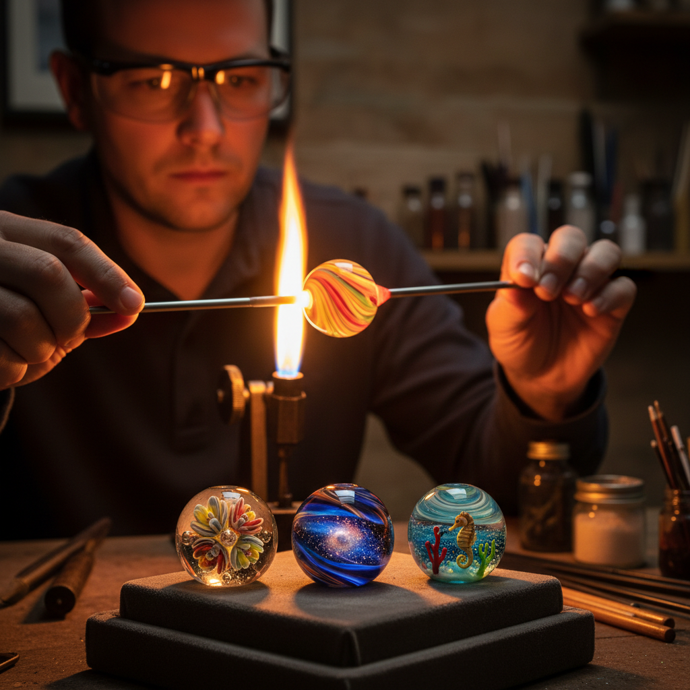

# Lampwork 灯工玻璃

> "Lampwork is painting with molten glass — each bead a tiny universe of color and light." — Unknown

## 概述

灯工玻璃（Lampwork）是在火焰（传统上是油灯火焰，现代使用燃气喷灯）前熔化玻璃棒，然后用工具塑造成珠子、小型雕塑和装饰品的玻璃工艺。与玻璃吹制的大型作品不同，灯工专注于小巧精致的创作——每一颗灯工珠都是一个微型的艺术世界，内部可以包含花朵、动物、风景甚至整个星系。从威尼斯的传统玻璃珠到当代的艺术灯工，这种"在火焰前绘画"的技艺创造了无数令人惊叹的微型杰作。

灯工的魅力在于：微观中的宏大——在一颗直径不到2厘米的珠子里，可以容纳一整个想象的世界。

## 核心特征

| 特征 | 描述 |
|------|------|
| 火焰 | 在喷灯火焰前工作 |
| 小型 | 专注小型精致作品 |
| 玻璃棒 | 以玻璃棒为原料 |
| 色彩 | 丰富的内部色彩 |
| 珠子 | 珠子是主要产品 |
| 即时 | 需要快速精确操作 |

## 视觉特征

- **色彩**：鲜艳的内部色彩
- **透明**：玻璃的透明质感
- **微型**：精致的微型世界
- **圆润**：熔融后的圆润形态
- **内含**：内部的装饰元素
- **光泽**：玻璃的光泽和折射

## 代表作品

| 作品 | 艺术家 | 年代 | 意义 |
|------|--------|------|------|
| *Venetian trade beads* | 匿名 | 15世纪+ | 威尼斯贸易珠 |
| *Murano lampwork* | 匿名 | 传统 | 穆拉诺灯工传统 |
| *Loren Stump murrine* | Loren Stump | 2000s+ | 超写实灯工 |
| *Paul Stankard botanicals* | Paul Stankard | 1970s+ | 植物灯工艺术 |
| *Contemporary art beads* | Various | 当代 | 当代艺术灯工珠 |

## 历史时间线

| 时期 | 事件 |
|------|------|
| 古代 | 早期的火焰玻璃加工 |
| 15世纪 | 威尼斯灯工珠的兴起 |
| 16-18世纪 | 贸易珠的全球传播 |
| 19世纪 | 科学玻璃仪器的灯工 |
| 1960s+ | 艺术灯工运动 |
| 当代 | 灯工作为独立艺术形式 |

## 中国语境

中国的灯工玻璃传统主要体现在博山琉璃中——山东博山的琉璃工匠使用灯工技法制作各种小型玻璃制品。当代中国的灯工玻璃艺术正在快速发展，许多艺术家在学习西方灯工技法的同时融入中国美学元素。中国的灯工珠市场也在增长，特别是在手工珠宝和收藏品领域。

## AI生成概念图

## 与其他风格的关系

- **Glass Blowing** → 玻璃吹制的微型版本
- **Millefiori** → 千花技法在灯工中的应用
- **Canework** → 玻璃棒在灯工中的使用
- **Jewelry** → 灯工珠宝
- **Miniature Art** → 微型艺术
- **Murano Glass** → 威尼斯玻璃传统

---

*浮光艺志 | Chronicle of Artistry*
