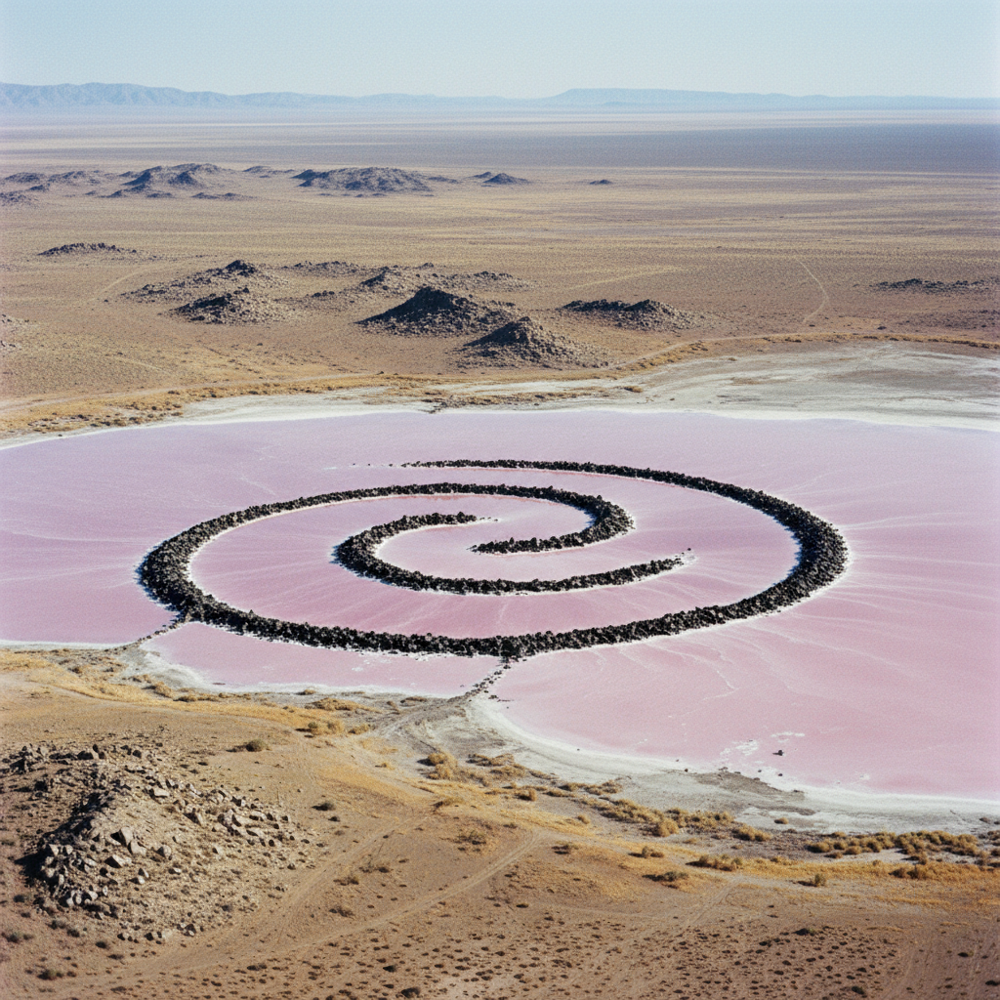

# Land Art Painting 大地艺术绘画

> **时期：** 1968年–至今  
> **关键词：** 自然景观、地形干预、航拍视角、短暂性、环境对话

## 概述

Land Art Painting（大地艺术绘画）是大地艺术在二维表现中的延伸——艺术家用绘画记录、规划或再现那些在自然景观中创作的巨型作品。从罗伯特·史密森的螺旋形防波堤到克里斯托的包裹项目，这些作品的航拍图像本身就成为了一种新的风景画传统，将地球表面变为画布。

## 风格特征

- **航拍视角**：俯瞰大地的宏观构图
- **几何与自然**：人工形式嵌入自然景观
- **短暂记录**：用绘画保存临时性作品
- **规模感**：超越人体尺度的巨大
- **材料即地形**：泥土、石头、植被作为媒材

## 代表人物与作品

- 罗伯特·史密森《螺旋形防波堤》
- 迈克尔·海泽《双重否定》
- 沃尔特·德·玛利亚《闪电原野》
- 安迪·戈兹沃西 自然装置

## 概念图

