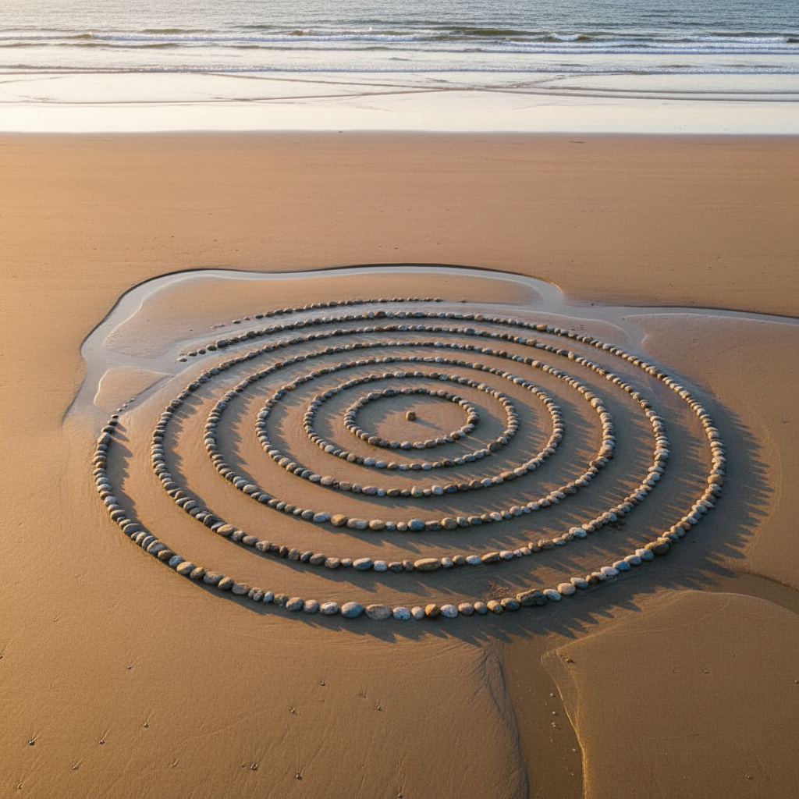

# Land Art Revival 大地艺术复兴

> **时期：** 2000年代–至今  
> **关键词：** 景观介入、临时性、自然材料、气候叙事、数字记录

## 概述

大地艺术复兴是对1960-70年代经典大地艺术（Land Art）的当代重新诠释。与前辈们的纪念碑式永久改造不同，当代大地艺术家更倾向于临时性的、轻触式的景观介入——用自然材料创造短暂的几何图案、用行走作为绘画、用无人机记录转瞬即逝的地景装置，强调人与自然的对话而非征服。

## 风格特征

- **临时性**：作品随自然力量消逝
- **轻触式**：不永久改变地貌
- **自然材料**：石头、树枝、冰、沙、叶子
- **几何与有机**：人工秩序与自然形态的对话
- **航拍视角**：无人机记录创造新的观看方式

## 代表人物与作品

- Andy Goldsworthy 自然材料临时雕塑
- Richard Long 行走艺术
- Nils-Udo 自然巢穴装置
- Jim Denevan 沙滩几何绘画
- Sylvain Meyer 雪地几何

## 概念图

