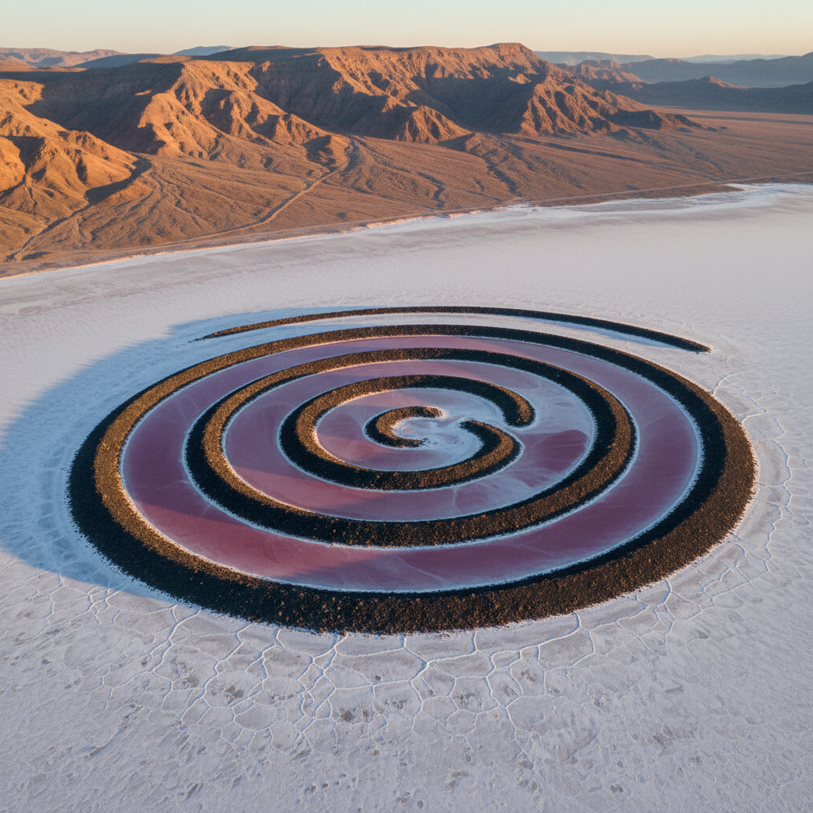

# Land Art 大地艺术

> "I think of my work as a celebration of the natural world." — Andy Goldsworthy

## 概述

大地艺术（Land Art / Earth Art / Earthworks）是1960年代末兴起的艺术运动，艺术家直接在自然景观中创作——使用泥土、岩石、植物、水等自然材料，或在大地上进行大规模的改造。大地艺术是对画廊体制和艺术商品化的反叛——作品无法被买卖、无法被移动，只能在原地体验。

大地艺术的激进性在于它将整个地球作为画布——作品的尺度可以大到只能从空中俯瞰。

## 核心特征

| 特征 | 描述 |
|------|------|
| 自然材料 | 使用大地本身的材料 |
| 大尺度 | 常常是巨大的——航拍尺度 |
| 场域性 | 与特定地点不可分离 |
| 临时性 | 许多作品会被自然侵蚀 |
| 反商业 | 无法被画廊收藏和买卖 |
| 过程性 | 创作过程本身是作品的一部分 |

## 视觉特征

- **尺度**：从人体尺度到航拍尺度
- **材料**：泥土、石头、木头、冰、叶子
- **几何**：在自然中的几何形式
- **对比**：人工秩序与自然混沌的对比
- **时间**：作品随时间变化和消逝
- **光影**：自然光线的变化

## 代表作品

| 作品 | 艺术家 | 年代 | 意义 |
|------|--------|------|------|
| *Spiral Jetty* | Robert Smithson | 1970 | 大地艺术的标志性作品 |
| *Double Negative* | Michael Heizer | 1969 | 在沙漠中挖出的巨型沟壑 |
| *Lightning Field* | Walter De Maria | 1977 | 400根不锈钢杆——等待闪电 |
| *Running Fence* | Christo & Jeanne-Claude | 1976 | 40公里的白色织物围栏 |
| *Ephemeral works* | Andy Goldsworthy | 1980s-至今 | 自然材料的短暂诗意 |
| *Sun Tunnels* | Nancy Holt | 1976 | 混凝土管道框住太阳 |

## 历史时间线

| 时期 | 事件 |
|------|------|
| 1968 | "Earthworks"展览——Dwan Gallery |
| 1969 | Heizer的Double Negative |
| 1970 | Smithson的Spiral Jetty |
| 1970s | Christo的大规模包裹项目 |
| 1977 | De Maria的Lightning Field |
| 1980s-至今 | Goldsworthy——诗意的自然装置 |
| 2000s-至今 | 生态意识下的新大地艺术 |

## 中国语境

大地艺术在中国有独特的发展。中国的大地艺术常与乡村振兴、生态保护和文化旅游结合。一些中国艺术家如展望（不锈钢假山石）在自然与人工的对话中创作。中国的"大地艺术节"（如越后妻有模式的中国版本）将大地艺术与乡村社区发展结合。中国传统的园林艺术可视为大地艺术的古老先驱。

## AI生成概念图

## 与其他风格的关系

- **Environmental Art** → 环境艺术与大地艺术有重叠
- **Minimalism** → 极简主义的几何纯粹性影响了大地艺术
- **Conceptual Art** → 观念艺术的反商业精神
- **Sculpture** → 大地艺术扩展了雕塑的尺度概念
- **Public Art** → 大地艺术是公共艺术的极端形式
- **Ephemeral Art** → Goldsworthy的短暂作品

---

*浮光艺志 | Chronicle of Artistry*
