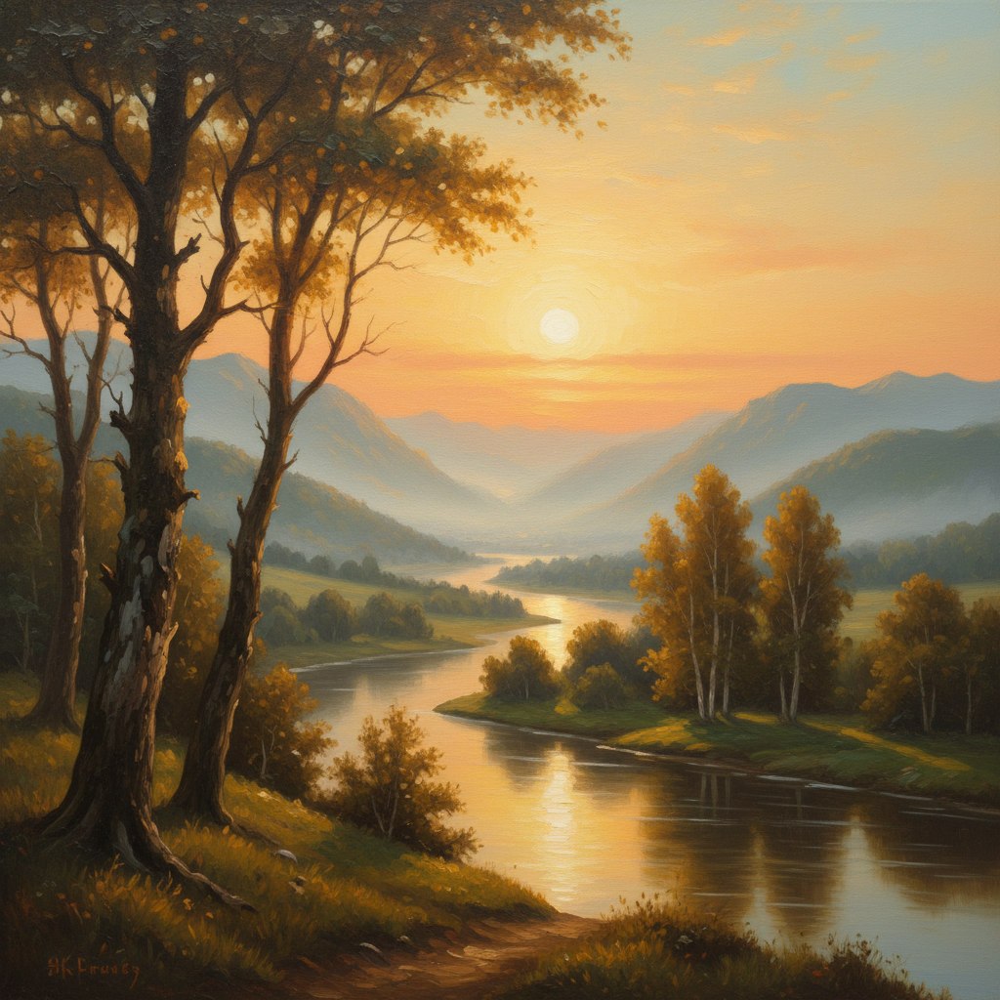

# Landscape Painting 风景画

> **时期：** 古罗马–至今  
> **关键词：** 自然风光、地形描绘、光线氛围、浪漫崇高、户外写生

## 概述

Landscape Painting（风景画）是以自然风光为主题的绘画类型，从古罗马壁画中的田园背景到19世纪成为独立画种。荷兰画家赋予它平凡之美，英国浪漫派赋予它崇高力量，印象派赋予它光线的瞬间——风景画是人类与自然关系的视觉日记，记录着我们如何观看、理解和感受这个世界。

## 风格特征

- **光线研究**：不同时刻、季节的光影变化
- **空间深度**：前景、中景、远景的层次安排
- **氛围营造**：雾气、云彩、天气的情绪表达
- **地形忠实**：对特定地点的记录或理想化
- **色彩和谐**：自然色调的统一与变化

## 代表人物与作品

- 约翰·康斯太勃尔《干草车》
- 卡斯帕·大卫·弗里德里希《雾海上的旅人》
- 克劳德·莫奈《干草堆》系列
- 黄公望《富春山居图》

## 概念图

