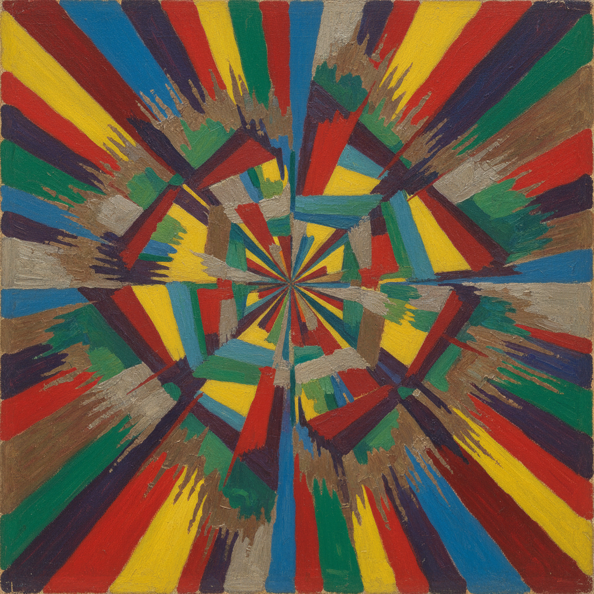

# Larionov Art 拉里奥诺夫艺术

> "We declare: the genius of our days to be: trousers, jackets, shoes, tramways, buses, aeroplanes, railways, magnificent ships." — Mikhail Larionov

## 概述

拉里奥诺夫艺术（Larionov Art）是20世纪初俄罗斯先锋派画家米哈伊尔·费奥多罗维奇·拉里奥诺夫（Mikhail Fyodorovich Larionov, 1881-1964）创立的辐射主义（Rayonism）绑画风格。拉里奥诺夫是俄罗斯先锋派运动的核心组织者和理论家——他与冈察洛娃共同创立了辐射主义，这是俄罗斯最早的抽象艺术理论之一，早于马列维奇的至上主义。

辐射主义的核心理念是：我们看到的不是物体本身，而是物体反射和辐射的光线——绑画应该表现这些光线在空间中的交叉和碰撞。拉里奥诺夫的辐射主义作品以动态的斜线和色彩的交织创造出一种光的振动感。在此之前，他经历了印象主义、新原始主义和未来主义等多个阶段——展现了惊人的风格多变性。他后来移居巴黎，成为俄罗斯芭蕾舞团的重要舞台设计师。

拉里奥诺夫艺术的核心要素包括：1）辐射主义——光线辐射的抽象理论；2）新原始主义——士兵系列的粗犷风格；3）组织能力——先锋派展览的组织者；4）风格多变——从具象到抽象的快速演变；5）舞台设计——芭蕾舞台的视觉创新；6）理论建构——为先锋派提供理论基础；7）反学院——对学院传统的激进反叛。

## 核心特征

| 特征 | 描述 |
|------|------|
| 辐射主义 | 光线辐射抽象理论 |
| 新原始主义 | 士兵系列粗犷风格 |
| 组织能力 | 先锋派展览组织者 |
| 风格多变 | 从具象到抽象快速演变 |
| 舞台设计 | 芭蕾舞台视觉创新 |
| 反学院 | 对学院传统激进反叛 |

## 视觉特征

- **辐射线条**：从中心向外辐射的动态线条
- **色彩交织**：多种色彩的交叉和碰撞
- **光的振动**：光线振动的视觉效果
- **粗犷笔触**：新原始主义时期的粗犷
- **士兵形象**：简化的士兵和军营场景
- **动态构图**：充满运动感的对角线构图

## 代表作品

| 作品 | 年代 | 意义 |
|------|------|------|
| *玻璃* (Glass) | 1912 | 辐射主义代表作 |
| *红色辐射主义* (Red Rayonism) | 1913 | 纯粹辐射主义 |
| *士兵* (Soldier on a Horse) | 1911 | 新原始主义 |
| *理发师* (The Hairdresser) | 1907 | 早期印象主义 |
| *蓝色辐射主义* (Blue Rayonism) | 1912 | 色彩辐射 |
| *狐步舞* (Renard) 舞台设计 | 1922 | 舞台艺术 |

## 历史时间线

| 时期 | 事件 |
|------|------|
| 1881年 | 出生于蒂拉斯波尔 |
| 1898-1910年 | 莫斯科绘画学校学习 |
| 1910-1911年 | 组织"方块J"和"驴尾巴"展览 |
| 1912-1913年 | 创立辐射主义 |
| 1914年 | 为佳吉列夫工作 |
| 1915年 | 移居巴黎 |
| 1964年 | 在巴黎去世 |

## 中国语境

拉里奥诺夫在中国的知名度有限，但他的辐射主义理论在中国美术理论研究中有一定的学术价值。辐射主义作为俄罗斯最早的抽象艺术理论之一——它基于光学原理而非纯粹的精神性——为理解抽象艺术的多元起源提供了重要的案例。拉里奥诺夫作为先锋派运动的组织者——他策划的"方块J"和"驴尾巴"展览是俄罗斯先锋派的里程碑——展示了艺术家作为文化运动组织者的角色。他从新原始主义到辐射主义的快速演变，也反映了20世纪初艺术革命的加速度——这对理解中国当代艺术的快速变化有参考意义。

## 概念图

## 与其他风格的关系

- **Rayonism** → 辐射主义（创始人）
- **Goncharova** → 冈察洛娃（伴侣和合作者）
- **Futurism** → 未来主义
- **Neo-Primitivism** → 新原始主义
- **Malevich** → 马列维奇（至上主义）
- **Ballets Russes** → 俄罗斯芭蕾舞团

---

*浮光艺志 | Chronicle of Artistry*
