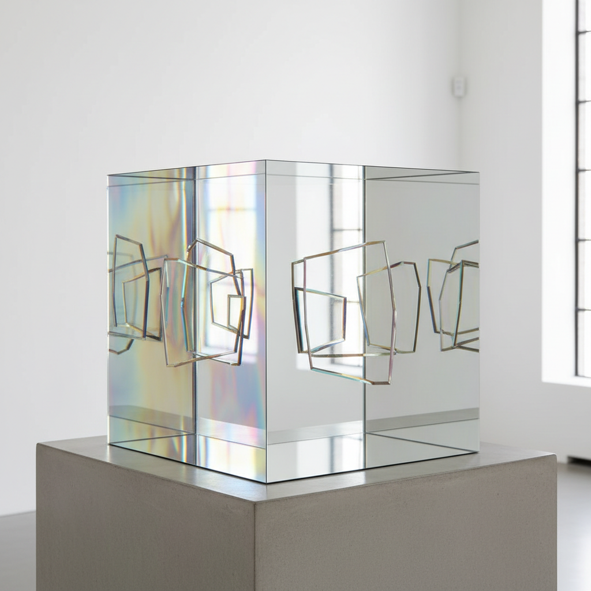

# Larry Bell 拉里·贝尔

> **时期：** 1939–至今  
> **关键词：** 玻璃立方体、真空镀膜、光与空间运动、透明与反射

## 概述

Larry Bell 是美国艺术家，"光与空间"运动的核心成员，以真空镀膜玻璃立方体和大型玻璃板装置闻名。他使用工业真空镀膜技术在玻璃表面沉积极薄的金属膜（铬、铝、金），创造出同时透明和反射的表面，使观者、空间和光线在玻璃中相互叠加和融合。

## 风格特征

- **真空镀膜玻璃**：工业技术创造的半透明/半反射表面
- **立方体形态**：早期标志性的玻璃立方体，如同凝固的光
- **透明与反射的叠加**：观者同时看到穿透和反射的图像
- **色彩渐变**：镀膜厚度的变化创造出微妙的色彩渐变
- **环境融合**：作品将周围环境纳入自身，边界模糊

## 代表作品

- *Cube*系列（1960s–至今）
- *Standing Walls*系列（1970s–至今）
- *Vapor Drawings*系列
- *Pacific Red*（2017）

## 历史意义

Bell 将工业真空技术引入艺术创作，创造了一种前所未有的视觉体验——物质的同时存在与消失。他的玻璃作品是"光与空间"运动最纯粹的物质化表达，影响了后来的建筑玻璃设计和光学艺术。

## 概念图

